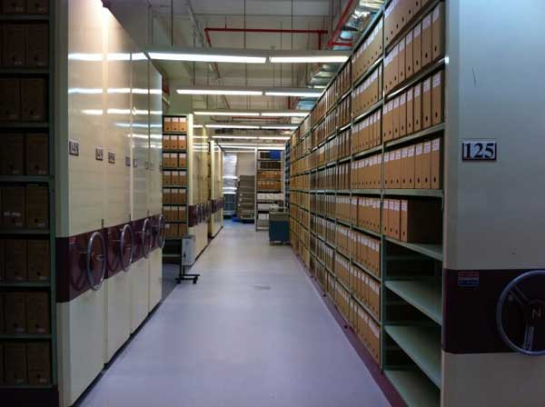
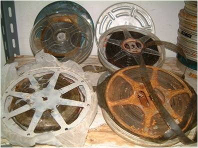

## About the National Archives of Singapore
The National Archives of Singapore (NAS) is the keeper of records of national or historical significance. The records acquired by NAS come from both public agencies and private sources. Records in various mediums and formats are safeguarded and preserved. 

The immensely rich collection continues to grow as NAS fulfils its mission to actively acquire records that will serve as the corporate memory of the Government and the social memory of our people. This memory allows current and future generations of Singaporeans to understand our different cultures, explore our common heritage and appreciate who we are and how we became a nation.  

Some of the departments that support the functions of NAS are: 

### Archives Services 
The Archives Services Department acquires archival records from public agencies, private sources and overseas institutions and archives. These include (a) photographs that are mainly transferred from public offices and their predecessor agencies such as the former Ministry of Information, Communications and the Arts (MICA), Ministry of Culture, Singapore Tourism Board and the Istana (b) maps, charts and building plans (c) posters, (d) ministerial speeches and press releases from public agencies and (e) private records acquired from individuals, clubs and societies, professional bodies, religious organisations, and clan associations. In addition, Archives Services Department also holds records pertaining to British administration of the Straits Settlements together with copies of records acquired from overseas archives and institutions which supplement our records on the important milestones and developments in Singapore’s history. 

To ensure long term preservation, the records are stored in environmentally-controlled repositories. Although records are increasingly created in digital format, NAS still conserves its valuable collection of paper-based records and this is handled by the [Archives Conservation Laboratory](/conservation-and-preservation/archives-conservation-laboratory/). 

Records are also digitised for preservation and access by researchers and members of the public. Research can be conducted through the Archives Online portal as well as the Archives Reading Room (ARR). The ARR services around 300 enquiries a month and the number of records accessed online annually exceeds 400,000. 

 

### Records Management
The Records Management Department of the NAS plays a regulatory role for the Government, by identifying public records of long-term value for safe-keeping and implementing a records management programme for the civil service. It also offers advisory and preservation services to assist government agencies in managing records, as good recordkeeping is essential to good corporate governance. The Records Management Department also trains public officers from government agencies, and shares our experiences with local and overseas recordkeeping practitioners on the management and preservation of public records. Every year, we conduct regular briefings and workshops, as well as host training attachments for our counterparts from overseas archival institutions. The topics covered in our workshops range from digital records management, digitisation standards and best practices, managing repository facilities and archival appraisal. 

 

*A public sector seminar organised to impart records management skills and knowledge* 

### Oral History Centre	 
The Oral History Centre (OHC) was set up in 1979. Using life stories and eye witness accounts of individuals across the spectrum of society, we record, document, preserve and disseminate oral history interviews of national and historical significance. We also acquire oral history interviews from other institutions or individuals, preserving and disseminating them for the benefit of our patrons. These recordings serve as valuable research resources on Singapore.

Our projects are both broad and deep in scope, covering aspects of the social, economic and political history of Singapore.

### Audio Visual Archives
In 1989, the Advisory Council on Culture and the Arts chaired by then Second Deputy Prime Minister Ong Teng Cheong recommended the setting up of an audiovisual archives in Singapore to "*strengthen the national heritage collection in all media to cover sound-and-moving images*".	 

 

*At-risk audiovisual formats* 

In 1997, the Audio Visual Archives Department of the NAS was established to appraise and acquire audiovisual records that are of national, historical and socio-cultural significance to Singapore, and documents such records that are transferred to NAS.  The department also manages the prioritisation and digitisation of at-risk audiovisual formats, so as to ensure that the valuable contents in the moving images and recorded sound heritage remain accessible to future generations.  

### Declassification
The Declassification Department sets up frameworks to increase and govern access to Government Records. The team also curates content, highlight archival resources and develop guides for researchers to discover our collection such as the [Singapore Policy History Project](http://www.nas.gov.sg/archivesonline/policy_history/).

 

### Former Ford Factory

The Former Ford Factory is a museum under NAS and runs a permanent World War 2 exhibition. The NAS collection of audio visual archives, oral history interviews with survivors and various artefacts such as newspaper cuttings help bring to life, the stories and experiences during the war. More information can be found [here](https://corporate.nas.gov.sg/former-ford-factory/overview/).

