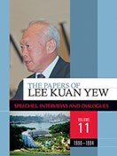
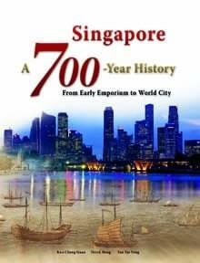
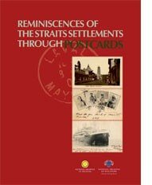
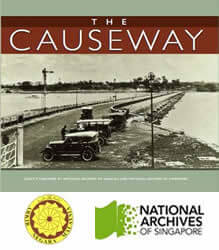
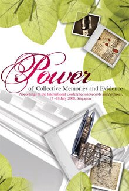
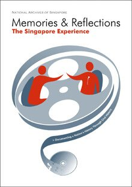
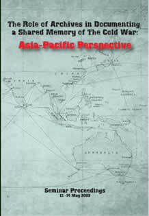

NAS actively promotes awareness of our rich collection through research and publications. Over the years, NAS has produced many notable publications and interactive resources that are anchored on our archival holdings.

 

{:height="200" width="100"}

 The Papers of Lee Kuan Yew: Speeches, Interviews and Dialogues      

​                        

                             

Singapore: A 700-Year History            

​                 

                             

10 Years That Shaped A Nation               

​              

![The 2nd Decade - Nation Building in Progress, 1975-1985 (../images/publications/2nddecade.jpg)]                            

 

 The 2nd Decade - Nation Building in Progress, 1975-1985 (继往开来 - 新加坡建国的第二个十年: 1975 - 1985) 

These publications showcase the rich archival sources of Singapore’s history, ranging from the broad sweeping 700-year history of Singapore, to in-depth explorations of key periods in our shared history, including Singapore’s experience during the Japanese Occupation and our nation-building years. 

                             

  Reminiscences of the Straits Settlements through Postcards     

​                        

​                                The Causeway            

​                 

![Milestones of the China-Singapore Connection: Friendship and Cooperation, Growing from Strength to Strength, 1965-2010 (../images/publications/chinasgconnection.png)]

 

China-Singapore Connection: Friendship and Cooperation, Growing from Strength to S...                             

                             

Nanqiao Jigong: The Extraordinary Story of Nanyang Drivers and Mechanics Who Returned to China Durin... 

​                       

​                     

Some are also fruits of collaboration with overseas archival institutions, such as the National Archives of Malaysia, State Archives Administration of China and the Yunnan Provincial Archives.

 

                             

Power of Collective Memories and Evidence      

​                        

                             

Memories & Reflections: Documenting a Nation's History through Oral History - The Singapore Experience                            

 The Role of Archives in Documenting a Shared Memory of The Cold War: Asia-Pacific Perspective                             

NAS also contributes to the discipline of archival science through publications which contribute to broader methodological and historiographical discussions.

 

To find out more about purchase of our publications, please click [here](http://www.nas.gov.sg/archivesonline/publications). 