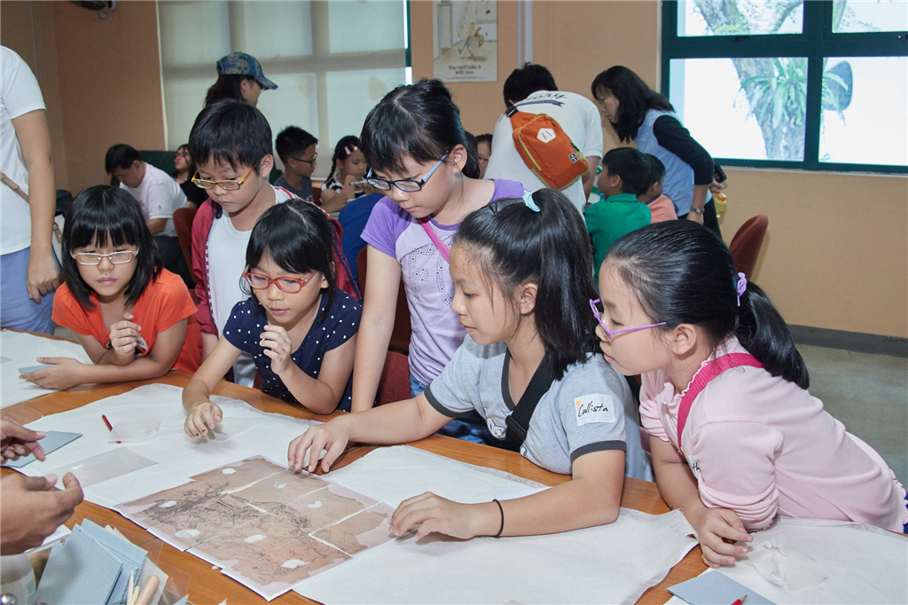
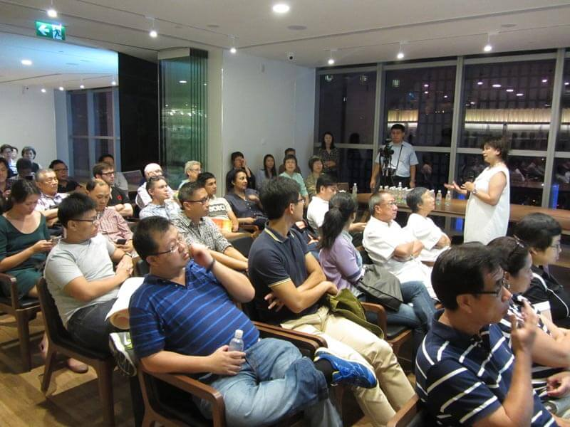
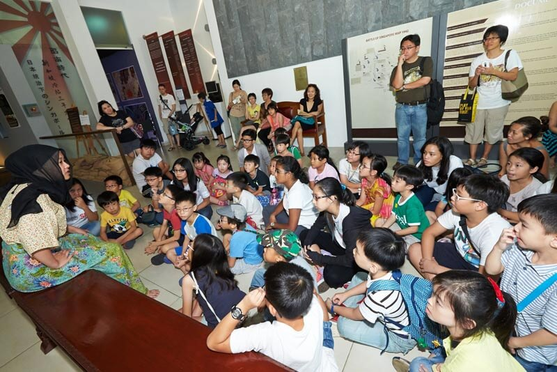
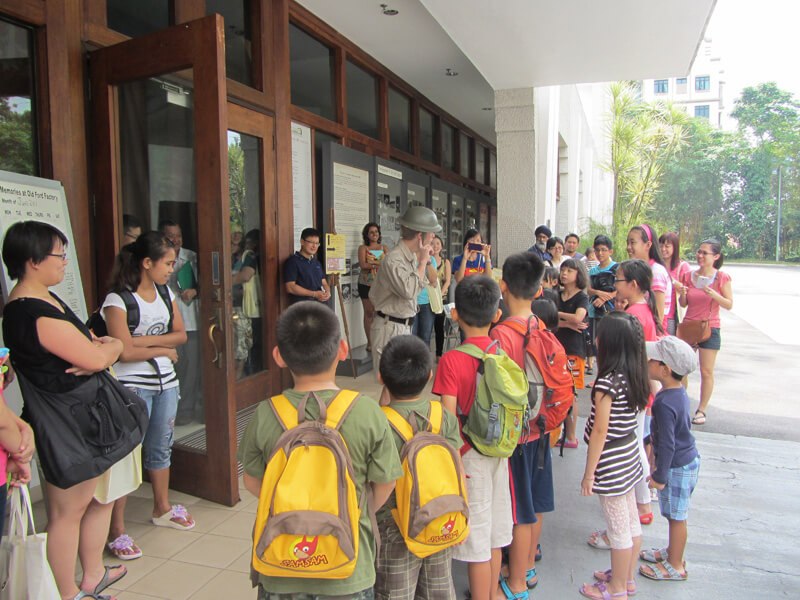
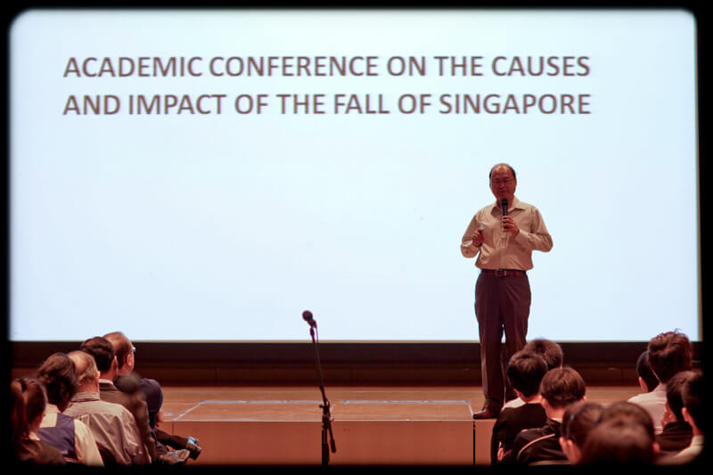
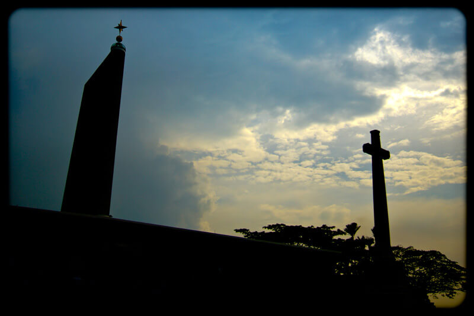

Part of our Outreach efforts involves organising exciting programmes for the public. These programmes are usually organised at a permanent gallery at the Former Ford Factory managed by the National Archives of Singapore which showcases memories of life during the Japanese Occupation. We hope to engage the public through the fun activities we organise and at the same time, educate visitors of Singapore's history during our darkest hours. Who says history can't be engaging? Many participants had told us that the entire family loved joining us in the programmes and had a blast while learning about our shared past!

 Take a look at some of our past public programmes below. Get excited and look out for future programmes under [Calendar of Events!](/outreach/calendar-of-events/)

[                     ](javascript:void(0))                 

### Children's Season 2016 - Little Archivist for a Day

Have you ever wondered what happens to the old maps or documents and photographs of the past? How are they conserved and where are they kept? How do we learn about incidents or events that took place in Singapore's history? On 18 and 19 June 2016, participants aged 9-13 years old got to experience being an archivist through fun and engaging hands-on activities. 

[                     ](javascript:void(0))                 

### “irememberOrchard” Exhibition - 23 October 2014 to 26 April 2015

In conjunction with the “irememberOrchard” exhibition on display at the library@orchard from 23 Oct 2014 - 26 April 2015, NAS organised several programmes pertaining to Orchard Road over the same period. Together with our partners from the Singapore Heritage Society and the Asian Film Archives, a total of four Cakap Heritage (let’s talk about heritage) sessions and two movie screenings with director sharing sessions were arranged. Uploaded are photos across the various programmes where speakers and participants actively share their memories and stories of Orchard Road.

[                     ](javascript:void(0))                 

### Children's Season 14-15 June 2014 – A Race Against Time

Racing against time, the children are brought back to the days of the Japanese Occupation and tasked to help a sick friend acquire medicine. Through challenges, this workshop aims to let participants understand the hardships faced during World War II in a fun and interactive way. 

[                     ](javascript:void(0))                 

### Children’s Season 15 and 29 June 2013 – History Through Drama

History Through Drama presented a fun and stimulating way of learning about Singapore’s history. As the children walked through the historic site of the Former Ford Factory and participated in the organised activities, they learnt about the hardships of war and how our peace and harmony today is hard won.

                                     

### Conference on the Causes and Impact of the Fall of Singapore – 16 February 2012

This conference brought together historians, students, veterans and history enthusiasts to understand, reflect on and remember the fall of Singapore. Six speakers, authorities in the subject of World War II, were invited to speak to the audience and explored in vivid detail the causes of the fall of Singapore, and assessed its multifaceted impact on various Singapore communities and long term consequences on decolonisation, nationhood and regional security.

[                     ](javascript:void(0))                 

### Remembrance Ceremony – 15 February 2012

The National Archives of Singapore organised the Remembrance Ceremony for the 70th anniversary of the fall of Singapore on 15 Feb 2012. This solemn event commemorates the fallen soldiers who had defended Singapore during World War II. Approximately 1000 participants, involving local and international attendees, war veterans and WWII survivors from around the world, observed two minutes of silence for those who had fought for Singapore.

