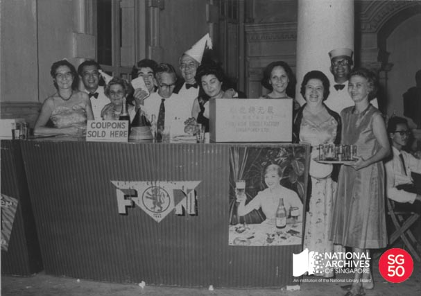

<iframe id="pxcelframe" src="//t.sharethis.com/a/t_.htm?ver=0.345.16984&amp;cid=c010#rnd=1577951594202&amp;cid=c010&amp;dmn=www.nas.gov.sg&amp;tt=t.dhj&amp;dhjLcy=17&amp;lbl=pxcel&amp;flbl=pxcel&amp;ll=d&amp;ver=0.345.16984&amp;ell=d&amp;cck=__stid&amp;pn=%2Fblogs%2Farchivistpick%2Fgirl-sports-clubs-new-years-celebration%2F&amp;qs=na&amp;rdn=www.nas.gov.sg&amp;rpn=%2Fblogs%2Farchivistpick%2F2015%2F01%2F&amp;rqs=na&amp;cc=SG&amp;cont=AS&amp;ipaddr=" style="display: none;"></iframe>

# GIRLS’ SPORTS CLUB’S NEW YEAR’S EVE DANCE AT THE VICTORIA MEMORIAL HALL, 1960

​											Margaret Clarke Collection, National Archives of Singapore

The Goldburn Sports Club was established by a group of 12 young Eurasian ladies in 1929 to encourage and provide an opportunity for Eurasian women to participate in sports. In the 1920s, sports clubs did not admit any women so this club was the first of its kind in Singapore.

The club changed its name to the Girls’ Sports Club in 1930. The members played games such as hockey, netball, badminton, tennis and even football. A 1933 game against the Malacca Girls’ Sports Club, which the Singapore team won 5-1, was probably the first women’s inter-state hockey game.

The club was suspended during the Japanese Occupation but reopened shortly after the war. By 1954, membership was no longer confined to the Eurasian community and was opened to all women.

Over the years, they also competed in tournaments such as at World War I Remembrance Day charity matches; the Netball Challenge Shield competed for between sports clubs, Raffles Girls’ School and the Convent of the Holy Infant Jesus; and at the Pesta Sukan (“Festival of Sports”) that the government began to organise from 1964.

The Girls’ Sports Club New Year’s eve dance was an annual fund-raising event held by the club for members and friends.

To view more details of this image and other records, click [here](http://www.nas.gov.sg/archivesonline/photographs/record-details/b868fa91-1161-11e3-83d5-0050568939ad).