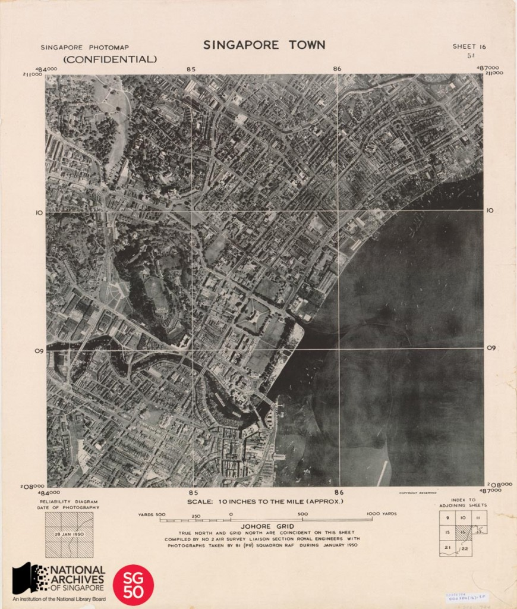

<iframe id="pxcelframe" src="//t.sharethis.com/a/t_.htm?ver=0.345.16984&amp;cid=c010#rnd=1577951276923&amp;cid=c010&amp;dmn=www.nas.gov.sg&amp;tt=t.dhj&amp;dhjLcy=26&amp;lbl=pxcel&amp;flbl=pxcel&amp;ll=d&amp;ver=0.345.16984&amp;ell=d&amp;cck=__stid&amp;pn=%2Fblogs%2Farchivistpick%2Faerial-photomap-of-singapore-town-1950-2%2F&amp;qs=na&amp;rdn=www.nas.gov.sg&amp;rpn=%2Fblogs%2Farchivistpick%2F2015%2F01%2F&amp;rqs=na&amp;cc=SG&amp;cont=AS&amp;ipaddr=" style="display: none;"></iframe>

# AERIAL PHOTOMAP OF SINGAPORE TOWN, 1950

Aerial photographs by the British Royal Air Force between 1940 to 1970s, from a collection held by the National Archives of Singapore. Crown copyright.

Map making through aerial photography was introduced in Singapore post World War II.  This new technique replaced some of the traditional land-based trigonometric surveys as it was a much faster and cost effective way of producing accurate topographic maps. Topographic maps are small-scale general reference maps that usually provide detailed information of a locality, with contour and relief details, thus giving a three-dimensional sense of the space mapped.

In 1950, a photomap series of 20 sheets printed at a scale of 10 inches to a mile was produced to assist colonial government planning for the post-war rehabilitation of Singapore. This photomap of Singapore town, covering the areas around the Singapore River, Fort Canning and the Istana was a portion of the 20 sheet series. The photomap was made by stitching together aerial photographs taken by the British Royal Air Force’s No. 81 Squadron, a photographic reconnaissance unit based at the Seletar and Tengah airbases between 1947 and 1970.

In an oral history interview, Mr Al Taylor, a former engine mechanic with the 81 Squadron from 1955 to 1958, shared that most of the heavy mapping work, in the earlier years, was done using the Mosquito PR34A. However, it was last used in operational service on 15 December 1955 because the plane was not suited for the tropical climate as it was made out of wood and in part glued together and it would delaminate in the humidity. He also describes how reconnaissance photographs contributed to intelligence gathering of communist movements and bombing missions during the Malayan Emergency – the communist armed uprising at the time.

The National Archives of Singapore has a collection of over 10,000 maps and over 50,000 aerial photographs.

To view more details of this photomap and other records, click [here](http://www.nas.gov.sg/archivesonline/maps_building_plans/record-details/f7cf0696-115c-11e3-83d5-0050568939ad).

To listen to the full interview of Mr Al Taylor online, click [here](http://www.nas.gov.sg/archivesonline/oral_history_interviews/record-details/ecc91e7c-1161-11e3-83d5-0050568939ad?keywords=allison+taylor&keywords-type=all).