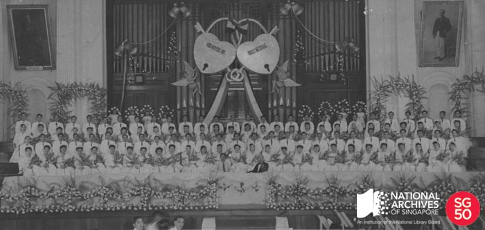

<iframe id="pxcelframe" src="//t.sharethis.com/a/t_.htm?ver=0.345.16984&amp;cid=c010#rnd=1577951939396&amp;cid=c010&amp;dmn=www.nas.gov.sg&amp;tt=t.dhj&amp;dhjLcy=74&amp;lbl=pxcel&amp;flbl=pxcel&amp;ll=d&amp;ver=0.345.16984&amp;ell=d&amp;cck=__stid&amp;pn=%2Fblogs%2Farchivistpick%2Fmass-wedding-at-victoria-memorial-hall-organised-by-the-mayfair-dramatic-and-musical-association-1950%2F&amp;qs=na&amp;rdn=www.nas.gov.sg&amp;rpn=%2Fblogs%2Farchivistpick%2F2015%2F02%2F&amp;rqs=na&amp;cc=SG&amp;cont=AS&amp;ipaddr=" style="display: none;"></iframe>

# MASS WEDDING AT VICTORIA MEMORIAL HALL ORGANISED BY THE MAYFAIR DRAMATIC AND MUSICAL ASSOCIATION, 1950

​												David Ng Collection, National Archives of Singapore

Mass weddings were popular in Singapore from the 1940s to the early 1960s especially with the Chinese community. The weddings were usually organised by associations such as the Mayfair Dramatic and Musical Association, Singapore Chinese Young Men’s Christian Association, Singapore Khek Community Guild and the Hokkien Huay Kuan.

A couple only needed to pay between $30 to $40 to participate in a mass wedding. The fee included venue, decorations, music, light refreshments and a wedding certificate signed by the person officiating the ceremony, who would usually be a high-ranking member of the organizing association or a prominent community figure. The couples could hold their own wedding dinners separately if they wished to do so. The ceremonies were usually held in large halls to accommodate the couples and their families and friends. Members of the public could also attend the weddings by applying for tickets from the organisers. Local mass weddings were said to be a popular tourist attraction and was even filmed for television audiences in Australia, Britain and America.

Ceremonies would vary slightly depending on the organiser. It typically lasted about one to two hours and involved the couples walking down the aisle, exchanging of rings and vows, signing of marriage certificates, speeches from officials and various representatives as well as a photography session.

Due to the size of the event, each participant would usually be assigned a number and was addressed by it throughout the ceremony. The Mayfair Dramatic and Musical Association would also hold a procession after their mass weddings; and the couples would take part in a drive round the main streets of the city in cars headed by a brass band.

After the enactment of the Women’s Charter in 1961, the number of mass weddings dropped drastically as it became compulsory for couples to register their nuptials with the Registry of Marriages (except for Muslim marriages).

To view more details of this image and other records, click [here](http://www.nas.gov.sg/archivesonline/photographs/record-details/b828bf23-1161-11e3-83d5-0050568939ad).