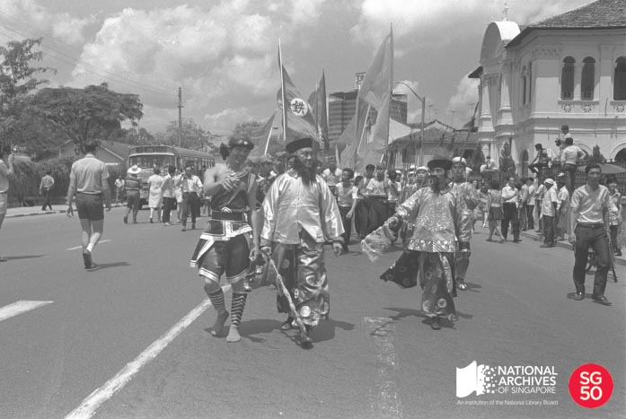

<iframe id="pxcelframe" src="//t.sharethis.com/a/t_.htm?ver=0.345.16984&amp;cid=c010#rnd=1577951786837&amp;cid=c010&amp;dmn=www.nas.gov.sg&amp;tt=t.dhj&amp;dhjLcy=60&amp;lbl=pxcel&amp;flbl=pxcel&amp;ll=d&amp;ver=0.345.16984&amp;ell=d&amp;cck=__stid&amp;pn=%2Fblogs%2Farchivistpick%2Fthe-first-chingay-street-parade-1973%2F&amp;qs=na&amp;rdn=www.nas.gov.sg&amp;rpn=%2Fblogs%2Farchivistpick%2F2015%2F02%2F&amp;rqs=na&amp;cc=SG&amp;cont=AS&amp;ipaddr=" style="display: none;"></iframe>

# THE FIRST CHINGAY STREET PARADE, 1973

Ministry of Information and The Arts Collection, National Archives of Singapore

In Singapore, Chingay is an annual street parade which is held as part of the Chinese New Year celebrations. Newspaper archives show that Chingay processions were already taking place in the late 19th century in Singapore and also in parts of Malaya.

The People’s Association (PA) staged the first formally organised Chingay Parade on 4 February 1973. It was done at the time to add more colour to the Lunar New Year celebrations. This was after firecrackers were banned in 1972, after various incidents of indiscriminate firing led to fires, injuries and even fatalities.

For the 1973 Chingay Parade, PA collaborated with the Singapore National Pugilistic Federation to put on a grand show to usher in the Year of the Ox. Led by a statue of a bull and two giant ornamental firecrackers, the parade started at 11a.m. at Victoria Street where the 2000-strong performers made their way down to North Bridge Road and South Bridge Road before ending the parade at Outram Park. Some of the highlights of the 14-item show included the South and North China lion dancers, a unicycle act, “big head” dolls, jugglers from the Folk Acrobatic Troupe, stilt walkers and the drama troupe from the Kampong Glam Community Centre. Thousands thronged the eight kilometre route to watch the procession unfold.

Although it started as a Chinese street procession, it has since evolved into a multi-cultural event. Today, Singapore’s Chingay Parade is said to be the largest street performance and float parade in Asia.

The photograph shows the procession along Bras Basah Road. The then St. Joseph’s Institution (now the Singapore Art Museum) can be seen to the right. Another important building, the 16-storey tower block of the old Cathay Building can be seen in the background – Singapore’s first skyscraper when built in 1941.

To view more details of this image and other records, click [here](http://www.nas.gov.sg/archivesonline/photographs/record-details/37095c3a-1162-11e3-83d5-0050568939ad).

For a fuller view of the Cathay Building click [here](http://www.nas.gov.sg/archivesonline/photographs/record-details/af83de21-1161-11e3-83d5-0050568939ad).

For a fuller view of St. Joseph’s Institution along Bras Basah Road, click [here](http://www.nas.gov.sg/archivesonline/photographs/record-details/620f4ba6-1162-11e3-83d5-0050568939ad).