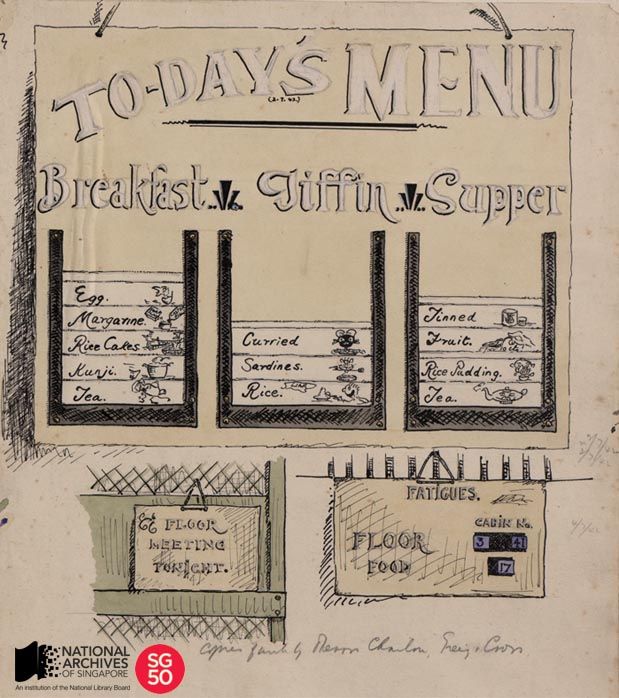

<iframe id="pxcelframe" src="//t.sharethis.com/a/t_.htm?ver=0.345.16984&amp;cid=c010#rnd=1577951734274&amp;cid=c010&amp;dmn=www.nas.gov.sg&amp;tt=t.dhj&amp;dhjLcy=54&amp;lbl=pxcel&amp;flbl=pxcel&amp;ll=d&amp;ver=0.345.16984&amp;ell=d&amp;cck=__stid&amp;pn=%2Fblogs%2Farchivistpick%2Fchangi-prison-internment-camp-menu-by-w-r-m-haxworth-1942%2F&amp;qs=na&amp;rdn=www.nas.gov.sg&amp;rpn=%2Fblogs%2Farchivistpick%2F2015%2F02%2F&amp;rqs=na&amp;cc=SG&amp;cont=AS&amp;ipaddr=" style="display: none;"></iframe>

# CHANGI PRISON INTERNMENT CAMP MENU BY W R M HAXWORTH, 1942

​										W R M Haxworth Collection, National Archives of Singapore

When the British surrendered on 15 February 1942, many British and other European civilians became Prisoners of War (POW) during the Japanese Occupation.

W R M Haxworth was one such POW who was interned at Changi Prison and later at Sime Road Internment Camp. During his imprisonment, Haxworth produced over 300 sketches and paintings from 1942-1945 that depicted life as a POW, such as their living conditions and the food they ate. Though Haxworth’s works are often characterised by his sense of humour, it illustrated how many POWs experienced much hardship due to insufficient food and harsh conditions.

To supplement their meagre food rations, many POWs grew their own food in the camp’s vegetable garden, where sweet potatoes and tapioca could be planted. POWs would also often slip out of their camps (as there were sometimes no proper walls or barricades) to collect food from kind locals who supplied them with items such as tinned sardines, bread, butter and jam.

In an oral history interview, Mr Mohinder Singh, shared how POWs from the Sime Road Internment Camp would obtain tea, milk and green beans from a Sikh temple in Bukit Timah.

Many POWs such as Haxworth returned to civilian life after the war. Haxworth passed away in 1985 and a year later, Mrs Haxworth kindly donated his works to the National Archives of Singapore.

To view more details of this image and other records, click [here](http://www.nas.gov.sg/archivesonline/photographs/record-details/a9acb22b-1162-11e3-83d5-0050568939ad).

To listen to the full interview of Mr Mohinder Singh, click [here](http://www.nas.gov.sg/archivesonline/oral_history_interviews/interview/000546).