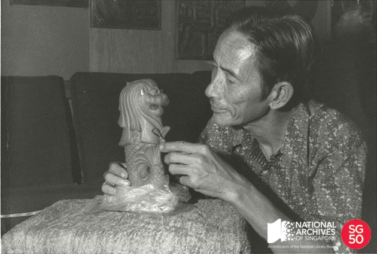

<iframe id="pxcelframe" src="//t.sharethis.com/a/t_.htm?ver=0.345.16984&amp;cid=c010#rnd=1577952223359&amp;cid=c010&amp;dmn=www.nas.gov.sg&amp;tt=t.dhj&amp;dhjLcy=54&amp;lbl=pxcel&amp;flbl=pxcel&amp;ll=d&amp;ver=0.345.16984&amp;ell=d&amp;cck=__stid&amp;pn=%2Fblogs%2Farchivistpick%2Fmr-lim-nang-seng-sculpting-a-miniature-merlion-statue-1972%2F&amp;qs=na&amp;rdn=www.nas.gov.sg&amp;rpn=%2Fblogs%2Farchivistpick%2F2015%2F03%2F&amp;rqs=na&amp;cc=SG&amp;cont=AS&amp;ipaddr=" style="display: none;"></iframe>

# MR LIM NANG SENG SCULPTING A MINIATURE MERLION STATUE, 1972

​											Lim Nang Seng Collection, National Archives of Singapore

Mr Lim Nang Seng, a local sculptor, was commissioned by the then Singapore Tourist Promotion Board to construct the Merlion statue. It used to stand at the mouth of the Singapore River but has been relocated to its present site, adjacent to One Fullerton.

The 8.6 metres high, 3.6 metres wide, 70 tonne half-lion half-fish cement sculpture took Mr Lim several months to complete. Due to its size, it had to be built on-site. Mr Lim’s eight children helped him with the statue; the younger ones worked on its body, while the older children scaled the scaffolding to work on the Merlion’s eyes and mouth.

The Straits Times reported that during the official installation of the Merlion on 15 September 1972, then Prime Minister Mr Lee Kuan Yew said that he hoped the Merlion would be associated with Singapore, just as the Eiffel Tower is with Paris. The statue at Merlion Park remains a tourist attraction and an icon of Singapore.

To view more details of this image and other records, click [here](http://www.nas.gov.sg/archivesonline/photographs/record-details/d365ff22-1161-11e3-83d5-0050568939ad).