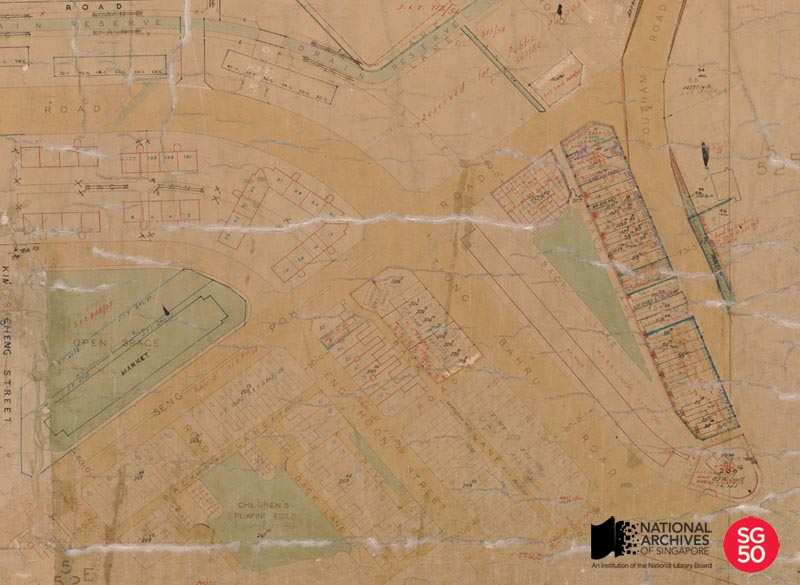

<iframe id="pxcelframe" src="//t.sharethis.com/a/t_.htm?ver=0.345.16984&amp;cid=c010#rnd=1577952185863&amp;cid=c010&amp;dmn=www.nas.gov.sg&amp;tt=t.dhj&amp;dhjLcy=65&amp;lbl=pxcel&amp;flbl=pxcel&amp;ll=d&amp;ver=0.345.16984&amp;ell=d&amp;cck=__stid&amp;pn=%2Fblogs%2Farchivistpick%2Fmap-of-tiong-bahru%2F&amp;qs=na&amp;rdn=www.nas.gov.sg&amp;rpn=%2Fblogs%2Farchivistpick%2F2015%2F03%2F&amp;rqs=na&amp;cc=SG&amp;cont=AS&amp;ipaddr=" style="display: none;"></iframe>

# MAP OF TIONG BAHRU FOR SIT FLATS, c.1920

Survey Department Collection, National Archives of Singapore

The Singapore Improvement Trust (SIT) was formed in 1927 and is the predecessor of the Housing and Development Board (HDB). During its early years, SIT was not given the authority to build housing except for the people who were displaced by its improvement schemes. It was not until 1932 that SIT began to build housing on a large scale, mostly for the lower-income group. By 1959, it had built approximately 23,000 flats. Despite its efforts, SIT was unable to keep up with Singapore’s growing population. It was eventually dissolved and HDB was formed in 1960 to handle the worsening housing problem.

One of the earliest projects by SIT was the construction of the Tiong Bahru housing estate. Developed from 1936 to 1940, the estate was modelled after British towns such as Harlow, Stevenage and Crawley and was designed using the Art Deco style of the 1930s, which emphasised bold lines and curves. The Tiong Bahru housing estate, which consists of 20 blocks of flats and 36 units of shophouses, is also believed to be the only complete and undamaged public housing structure from the pre-war period in Southeast Asia today.

On 1 December 2003, the pre-war flats and shophouses bounded by Seng Poh Road, Outram Road and Tiong Poh Road, were given conservation status by the Urban Redevelopment Authority (URA).

To view more details of this map and other records, click [here](http://www.nas.gov.sg/archivesonline/maps_building_plans/record-details/dd7fddbe-115c-11e3-83d5-0050568939ad).