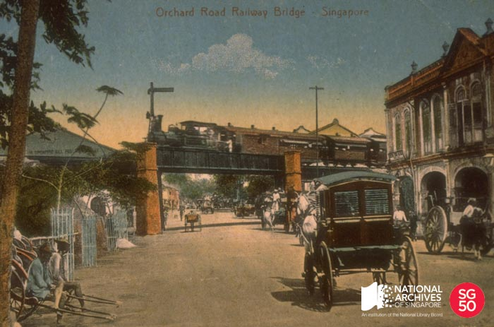

<iframe id="pxcelframe" src="//t.sharethis.com/a/t_.htm?ver=0.345.16984&amp;cid=c010#rnd=1577952120297&amp;cid=c010&amp;dmn=www.nas.gov.sg&amp;tt=t.dhj&amp;dhjLcy=55&amp;lbl=pxcel&amp;flbl=pxcel&amp;ll=d&amp;ver=0.345.16984&amp;ell=d&amp;cck=__stid&amp;pn=%2Fblogs%2Farchivistpick%2Forchard-road-railway-bridge%2F&amp;qs=na&amp;rdn=www.nas.gov.sg&amp;rpn=%2Fblogs%2Farchivistpick%2F2015%2F03%2F&amp;rqs=na&amp;cc=SG&amp;cont=AS&amp;ipaddr=" style="display: none;"></iframe>

# ORCHARD ROAD RAILWAY BRIDGE, c.1913

​																National Archives of Singapore

From 1903 to 1932, trains travelled across Orchard Road via a railway bridge, from Tank Road Railway Station to the Woodlands jetty. From Tank Road, the line ran north-westwards and crossed Orchard Road by a bridge near Emerald Hill west of the Singapore Cold Storage.

Railway, being a new mode of transportation introduced to Singapore, had a significant impact on Orchard Road and other parts of Singapore. There were teething problems, with train delays caused by the discovery of a defect in the ironwork of the Orchard Road railway bridge just months after it began running. Accidents were also not uncommon, especially in the first two decades of the twentieth century, when horse drawn carriages were still a major mode of transport. Crossing a main road used for such carriage traffic, the Orchard Road railway bridge witnessed numerous accidents caused by horses bolting at the sound of trains passing overhead. The construction of the railway line behind Tan Yeok Nee’s iconic mansion at the junction of Penang and Clemenceau Road also meant that the colonial government acquired the stately mansion for use as the residence of the station master of the Tank Road station.

The Tank Road station closed in 1932, with new wayside railway line linking Bukit Panjang at Keppel Road Station. With that diversion, there was no need for the Orchard Road railway bridge either, and it was demolished in 1932. Two years later, the old embankment was removed, making way for a carpark and leaving no trace of this structure.

To view more details of this image and other records, click [here](http://www.nas.gov.sg/archivesonline/photographs/record-details/362b7cba-1162-11e3-83d5-0050568939ad).