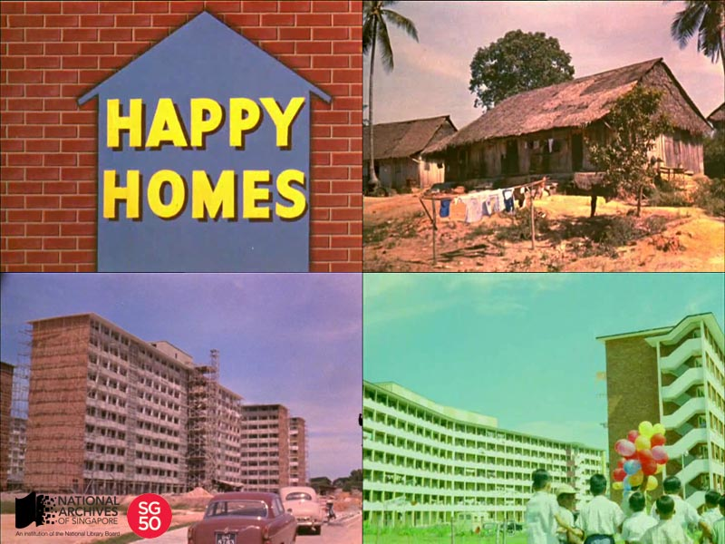

<iframe id="pxcelframe" src="//t.sharethis.com/a/t_.htm?ver=0.345.16984&amp;cid=c010#rnd=1577952715705&amp;cid=c010&amp;dmn=www.nas.gov.sg&amp;tt=t.dhj&amp;dhjLcy=52&amp;lbl=pxcel&amp;flbl=pxcel&amp;ll=d&amp;ver=0.345.16984&amp;ell=d&amp;cck=__stid&amp;pn=%2Fblogs%2Farchivistpick%2Fhappy-homes%2F&amp;qs=na&amp;rdn=www.nas.gov.sg&amp;rpn=%2Fblogs%2Farchivistpick%2F2015%2F04%2F&amp;rqs=na&amp;cc=SG&amp;cont=AS&amp;ipaddr=" style="display: none;"></iframe>

# CATHAY FILM SERVICES MOVIE ENTITLED ‘HAPPY HOMES’, 1964

​					Housing and Development Board, courtesy of the National Archives of Singapore

Happy Homes is a colour film which was produced in 1964 by Cathay Film Services for the Housing and Development Board (HDB). The film showcases the rapid development of low cost housing in Singapore at the time and also documents the changing landscape in 1960s Singapore; from the kampongs that dotted the island, to the high rise buildings at Collyer Quay and Raffles Place, and the construction of new HDB flats. It also shows the exterior and interior views of early HDB flats, and amenities in the neighbourhood.

The film was shown throughout Singapore and Malaysia in the four main languages: English, Mandarin, Malay and Tamil. Over 100 copies in 15 languages were also produced for overseas screenings. Happy Homes was made by New Zealander, Wynona “Noni” Hope Wright, who was an award winning film director and producer at Cathay Film Services and Cathay-Keris Studios of the Cathay Organisation.

The 20-minute film was nominated at the Third International Contest for Planning and Housing Films in Jerusalem, Israel and won the award for best documentary depicting progress in Asia at the 11th Asian Film Festival in Taipei. Unfortunately, an hour after winning the award, Ms Wright was killed in a plane crash near Taichung, Formosa, on 20 June 1964. The tragic accident also took the lives of Dato and Datin Loke Wan Tho. Dato Loke was then Chairman of Cathay Organisation, Malaysian Airways and Malayan Banking.

To watch the video and view more details of this record, click [here](http://www.nas.gov.sg/archivesonline/audiovisual_records/record-details/2e79b24f-43b7-11e4-859c-0050568939ad) (for Part 1 of the film) and [here](http://www.nas.gov.sg/archivesonline/audiovisual_records/record-details/e4e25ab0-43b7-11e4-859c-0050568939ad) (for Part 2 of the film). The audio files can be found separately and you can listen to them [here](http://www.nas.gov.sg/archivesonline/audiovisual_records/record-details/90c0d31f-43b9-11e4-859c-0050568939ad) (for Part 1 of the film) and [here](http://www.nas.gov.sg/archivesonline/audiovisual_records/record-details/0a0b15c7-43ba-11e4-859c-0050568939ad) (for Part 2 of the film).