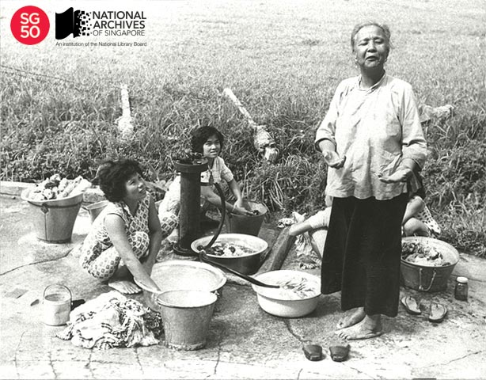

<iframe id="pxcelframe" src="//t.sharethis.com/a/t_.htm?ver=0.345.16984&amp;cid=c010#rnd=1577952656867&amp;cid=c010&amp;dmn=www.nas.gov.sg&amp;tt=t.dhj&amp;dhjLcy=88&amp;lbl=pxcel&amp;flbl=pxcel&amp;ll=d&amp;ver=0.345.16984&amp;ell=d&amp;cck=__stid&amp;pn=%2Fblogs%2Farchivistpick%2Fpublic-standpipe%2F&amp;qs=na&amp;rdn=www.nas.gov.sg&amp;rpn=%2Fblogs%2Farchivistpick%2F2015%2F04%2F&amp;rqs=na&amp;cc=SG&amp;cont=AS&amp;ipaddr=" style="display: none;"></iframe>

# PUBLIC STANDPIPE IN TOA PAYOH VILLAGE,  c.1960

​						Ministry of Information and the Arts Collection, National Archives of Singapore

As Singapore emerged from the Second World War, wells were the main source of water for much of Singapore. This was especially so in the rural areas. As the population of Singapore grew, the supply from wells became inadequate and health risks through pollution increased.  A new means of supplying water was therefore required.

From the early 1950s, the Rural Board began working with the City Water Department to lay water mains along main roads to rural areas. Apart from allowing for the introduction of fire hydrants to help fight fires in remote areas, this development also allowed for standpipes to be laid to provide free potable water. By 1956, the work on water mains neared completion and some 75 standpipes were installed that year. By 1963, a total of 2,426 standpipes had been erected for the convenience of villagers.

People had to stand in line to collect water from public standpipes and carry it home in buckets or pay water carriers to do the laborious job. Some also washed their laundry, [took their baths](http://www.nas.gov.sg/archivesonline/photographs/record-details/9e792e43-1162-11e3-83d5-0050568939ad) and [brushed their teeth](http://www.nas.gov.sg/archivesonline/photographs/record-details/b304ea19-1161-11e3-83d5-0050568939ad) at the standpipes.

The Government started removing public standpipes in the late 1960s as more houses had water piped in directly.  However,  for the sake of hygiene, [public standpipes continued to be provided to hawkers](http://www.nas.gov.sg/archivesonline/photographs/record-details/a33f44f5-1162-11e3-83d5-0050568939ad).

To view more details of this image and other records, click [here](http://www.nas.gov.sg/archivesonline/photographs/record-details/5c8f85c1-1162-11e3-83d5-0050568939ad).