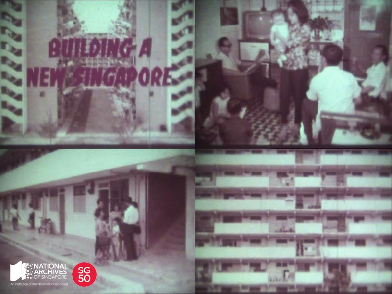

<iframe id="pxcelframe" src="//t.sharethis.com/a/t_.htm?ver=0.345.16984&amp;cid=c010#rnd=1577952581893&amp;cid=c010&amp;dmn=www.nas.gov.sg&amp;tt=t.dhj&amp;dhjLcy=50&amp;lbl=pxcel&amp;flbl=pxcel&amp;ll=d&amp;ver=0.345.16984&amp;ell=d&amp;cck=__stid&amp;pn=%2Fblogs%2Farchivistpick%2Fbuilding-a-new-singapore%2F&amp;qs=na&amp;rdn=www.nas.gov.sg&amp;rpn=%2Fblogs%2Farchivistpick%2F2015%2F04%2F&amp;rqs=na&amp;cc=SG&amp;cont=AS&amp;ipaddr=" style="display: none;"></iframe>

# HDB FILM ENTITLED ‘BUILDING A NEW SINGAPORE’, c.1960

​					Housing and Development Board, courtesy of the National Archives of Singapore

The Housing and Development Board (HDB) was established on 1 February 1960 to solve Singapore’s housing shortage. Chaired by Mr Lim Kim San, who later became the Minister for National Development; HDB built 53,000 flats in the first five years, a remarkable feat considering the colonial government took 32 years to build 23,000 flats. Early HDB flats had simple and utilitarian designs. This was not only to keep costs low, but also to ensure construction was completed quickly.

The housing estates were also designed to ensure common spaces, social amenities and facilities such as community centres, playgrounds, parks, markets, and hawker centres were contained within the neighbourhood to provide opportunities for the neighbours to meet and interact with one another.

It was only in the 1970s and 1980s, when the housing shortage had been largely resolved that greater attention was given to the designs of new flats to give “identities” to the newer estates. The [sloping roof of the housing estate at Potong Pasir](http://www.nas.gov.sg/archivesonline/photographs/record-details/dd7b7de7-cb90-11e4-859c-0050568939ad), and the [circular four-leaf clover-like design of the block of flats at Ang Mo Kio](http://www.nas.gov.sg/archivesonline/photographs/record-details/fe28e565-1161-11e3-83d5-0050568939ad) are examples of the types of flats that were constructed during this period. The quality of flats and facilities in the housing estates also greatly improved.

To watch the film and view more details of the record, click [here](http://www.nas.gov.sg/archivesonline/audiovisual_records/record-details/67911219-1164-11e3-83d5-0050568939ad).