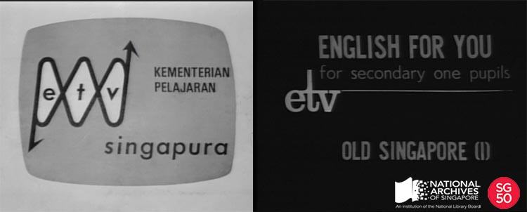

<iframe id="pxcelframe" src="//t.sharethis.com/a/t_.htm?ver=0.345.16984&amp;cid=c010#rnd=1577952367730&amp;cid=c010&amp;dmn=www.nas.gov.sg&amp;tt=t.dhj&amp;dhjLcy=58&amp;lbl=pxcel&amp;flbl=pxcel&amp;ll=d&amp;ver=0.345.16984&amp;ell=d&amp;cck=__stid&amp;pn=%2Fblogs%2Farchivistpick%2Feducational-television-series%2F&amp;qs=na&amp;rdn=www.nas.gov.sg&amp;rpn=%2Fblogs%2Farchivistpick%2F2015%2F04%2F&amp;rqs=na&amp;cc=SG&amp;cont=AS&amp;ipaddr=" style="display: none;"></iframe>

# EDUCATIONAL TELEVISION SERIES’ ENGLISH FOR YOU: OLD SINGAPORE, 1972

Ministry of Education, National Archives of Singapore. To watch a clip from the film, click [ here ](http://www.nas.gov.sg/archivesonline/audiovisual_records/record-details/5c3ce7be-1164-11e3-83d5-0050568939ad).

On 28 January 1967, the [Minister for Education Mr Ong Pang Boon inaugurated Singapore’s Educational Television (ETV) service](http://www.nas.gov.sg/archivesonline/speeches/record-details/7a6ea272-115d-11e3-83d5-0050568939ad) at the ETV studios in the Teachers Training College. On 30 January 1967, the country’s first educational television programme – a 20-minute programme entitled *Mathematics: A New Beginning* from the *World of Mathematics* series – was broadcast over TV Singapura.  Over the next two decades, programmes on a variety of subjects such as science, mathematics, geography, history, civics, English language, Chinese as a second language, literature and health, were broadcasted over national television each weekday from 7:50am to 5:30pm.

A series of pre-recorded programmes on video tape was produced on every subject studied in every grade, from primary one through pre-university two, except for primary six. One series consisted of four to 13 programmes. Each primary and secondary school programme was 15 to 20 minutes long, while a pre-university programme would last about 40 minutes. The full annual broadcasting schedule would be issued to schools before the start of the year so teachers could incorporate the programmes into their lesson plans. Courses and seminars were also held regularly for teachers to learn how to best utilize these programmes for teaching.

Educational television represented a milestone in Singapore’s education system. It introduced a new dynamism in education, and pioneered new learning approaches and fresh teaching ideas for both students and teachers. In embarking on this endeavour, Singapore was also involved in the beginnings of educational broadcasting in South East Asia.

To watch a clip from the film and view more details of the record, click [here](http://www.nas.gov.sg/archivesonline/audiovisual_records/record-details/5c3ce7be-1164-11e3-83d5-0050568939ad).