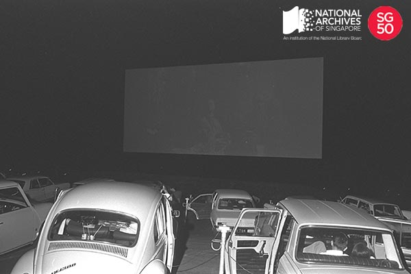

<iframe id="pxcelframe" src="//t.sharethis.com/a/t_.htm?ver=0.345.16985&amp;cid=c010#rnd=1577953545114&amp;cid=c010&amp;dmn=www.nas.gov.sg&amp;tt=t.dhj&amp;dhjLcy=52&amp;lbl=pxcel&amp;flbl=pxcel&amp;ll=d&amp;ver=0.345.16985&amp;ell=d&amp;cck=__stid&amp;pn=%2Fblogs%2Farchivistpick%2Fjurong-drive-in-cinema%2F&amp;qs=na&amp;rdn=www.nas.gov.sg&amp;rpn=%2Fblogs%2Farchivistpick%2F2015%2F05%2F&amp;rqs=na&amp;cc=SG&amp;cont=AS&amp;ipaddr=" style="display: none;"></iframe>

# OPENING OF THE JURONG DRIVE-IN CINEMA, 1971

Ministry of Information and The Arts Collection, National Archives of Singapore

The Jurong drive-in cinema was established by Cathay Organisation. It was opened on 14 July 1971 by then Minister of Culture, Mr Jek Yuen Thong. A charity premiere of *Doctor in Trouble*, a comedy film directed by Ralph Thomas and produced by Betty E. Box, raised approximately $20,000 that night. The proceeds went to the Jurong Town Crèche and Jurong Community Centre.

The $1.5 million cinema was located at Yuan Ching Road on land leased from the Jurong Town Corporation. The largest drive-in cinema in Asia at the time, the 5.6-hectare site could take up to 900 vehicles and 300 walk-in patrons. The cinema was equipped with a 14-metre by 33-metre screen elevated 25 feet off the ground and special car speaker systems with adjustable volumes for each individual car. It also had an air-conditioned cafeteria and a children’s playground.

The drive-in cinema screened two shows nightly at 7pm and 9pm, with a midnight screening on Saturdays. Tickets were sold at $2 for adults and $1 for children under 12 years old. At the peak of its popularity in the 1970s, the drive-in was fully packed every night. However, due to the growth of video piracy, cinema attendance dropped to an average of only 200 a night by the 1980s. The cinema closed on 30 September 1985.

To view more details of this image and other records, click [here](http://www.nas.gov.sg/archivesonline/photographs/record-details/d999f0b5-1161-11e3-83d5-0050568939ad).