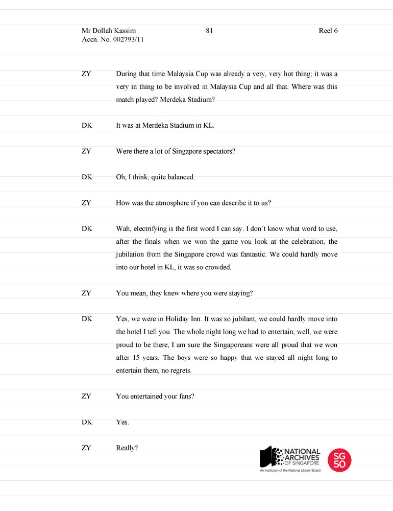

<iframe id="pxcelframe" src="//t.sharethis.com/a/t_.htm?ver=0.345.16985&amp;cid=c010#rnd=1577953302911&amp;cid=c010&amp;dmn=www.nas.gov.sg&amp;tt=t.dhj&amp;dhjLcy=26&amp;lbl=pxcel&amp;flbl=pxcel&amp;ll=d&amp;ver=0.345.16985&amp;ell=d&amp;cck=__stid&amp;pn=%2Fblogs%2Farchivistpick%2Fdollah-kassim%2F&amp;qs=na&amp;rdn=www.nas.gov.sg&amp;rpn=%2Fblogs%2Farchivistpick%2F2015%2F05%2F&amp;rqs=na&amp;cc=SG&amp;cont=AS&amp;ipaddr=" style="display: none;"></iframe>

# ORAL HISTORY INTERVIEW WITH DOLLAH KASSIM ON 1977 MALAYSIA CUP WIN, RECORDED IN 2003

​															National Archives of Singapore

The 1977 Malaysia Cup final was held at the Merdeka Stadium in Kuala Lumpur, Malaysia on 28 May in front of 40,000 spectators. The Singapore team beat Penang 3-2 in extra time to win the Malaysia Cup after 12 long years.

Coach Choo Seng Que admitted amid tears after the game that he was thankful he took a gamble during the second half of the game which paid off. This was the replacement of skipper Samad Alapitchay with Lim Teng Sai, and “banana kick” specialist S. Rajagopal with Nasir Jalil. Vice-captain Dollah Kassim was also promoted to Captain during the second half of the match.

The game was tied at 2-2 when Quah Kim Song scored Singapore’s winning goal 15 minutes into extra time. As the last few minutes ticked away, the Singapore fans at the stadium sang the song *Que Sera Sera (What Ever Will Be Will Be)*.

The young lions received a heroes’ welcome at Paya Lebar Airport from the Minister for Social Affairs, Mr Othman Wok and more than 1,000 fans when they returned to Singapore after their triumphant win.

After 1977, Singapore won the Malaysia Cup two more times until it withdrew from the competition in 1995. In 2011, the football associations of Malaysia and Singapore agreed on the return of a Singapore team, the LIONSXII, to the Malaysian domestic scene.

To read the transcript or listen to the full interview online, click [here](http://www.nas.gov.sg/archivesonline/oral_history_interviews/record-details/5aabb532-1160-11e3-83d5-0050568939ad?keywords=dollah kassim&keywords-type=all).