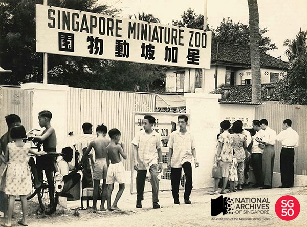

<iframe id="pxcelframe" src="//t.sharethis.com/a/t_.htm?ver=0.345.16985&amp;cid=c010#rnd=1577953121516&amp;cid=c010&amp;dmn=www.nas.gov.sg&amp;tt=t.dhj&amp;dhjLcy=72&amp;lbl=pxcel&amp;flbl=pxcel&amp;ll=d&amp;ver=0.345.16985&amp;ell=d&amp;cck=__stid&amp;pn=%2Fblogs%2Farchivistpick%2Fminiature-zoo%2F&amp;qs=na&amp;rdn=www.nas.gov.sg&amp;rpn=%2Fblogs%2Farchivistpick%2F2015%2F05%2F&amp;rqs=na&amp;cc=SG&amp;cont=AS&amp;ipaddr=" style="display: none;"></iframe>

# SINGAPORE MINIATURE ZOO, 1950s-1960s

​										Tong Seng Mun Collection, National Archives of Singapore

The Singapore Miniature Zoo was opened on 25 January 1957 at Pasir Panjang. Founded by animal dealer, Mr Tong Seng Mun, the two hectare zoo located on 189 West Coast Road featured animals such as lions, sun bears, panthers, camels, sea lions, penguins, tapirs, a rhinoceros, a baby elephant, baby orang utans, and a variety of birds and fishes. The zoo was opened daily from 9am to 7pm and visitors had to pay an admission fee of 50 cents for adults and 20 cents for children.

The enforcement of international wildlife trade regulation as well as trade sanctions during Konfrontasi led to the zoo’s closure in the early 1960s. Mr Tong later served as a consultant in the establishment of the Van Kleef Aquarium, Jurong Bird Park and the Singapore Zoo.

It is believed that there were at least five other menageries in Singapore in the past namely, the Whampoa Gardens Private Zoo set up in the mid-1800s, the Singapore Botanical Gardens’ Miniature Zoo established towards the end of the 19th century, the Punggol Zoo opened in 1928, the Tampines Zoo started in 1954 and a second Punggol Zoo founded in 1963.

In 2014, the Tong family donated a set of digital copies of the images of the zoo to the National Archives of Singapore.

To view more details of this image and other records, click [here](http://www.nas.gov.sg/archivesonline/photographs/record-details/5519872b-2c42-11e4-9ee2-0050568939ad).