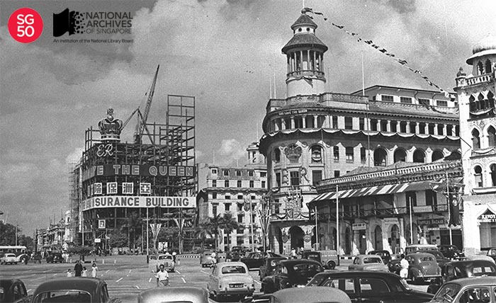

<iframe id="pxcelframe" src="//t.sharethis.com/a/t_.htm?ver=0.345.16984&amp;cid=c010#rnd=1577952859742&amp;cid=c010&amp;dmn=www.nas.gov.sg&amp;tt=t.dhj&amp;dhjLcy=51&amp;lbl=pxcel&amp;flbl=pxcel&amp;ll=d&amp;ver=0.345.16984&amp;ell=d&amp;cck=__stid&amp;pn=%2Fblogs%2Farchivistpick%2Fcoronation-celebrations%2F&amp;qs=na&amp;rdn=www.nas.gov.sg&amp;rpn=%2Fblogs%2Farchivistpick%2F2015%2F05%2F&amp;rqs=na&amp;cc=SG&amp;cont=AS&amp;ipaddr=" style="display: none;"></iframe>

# QUEEN ELIZABETH II’S CORONATION CELEBRATIONS, 1953

​															National Archives of Singapore

Upon her father’s death in 1952, Princess Elizabeth ascended to the throne and was formally crowned Queen Elizabeth II on 2 June 1953. The coronation took place in London’s Westminster Abbey.

Singapore joined the rest of the Commonwealth to celebrate the Queen’s accession to the throne. Over 1,000 men were employed to put up decorations around the city for the coronation celebrations: buildings were adorned with lights and buntings; arches were erected on main roads; and paper mache crowns, coat of arms, and signs bearing the words “God Save The Queen” and “Long May She Reign” were put up. In an oral history interview, Mr Vincent Gabriel, [recalled how the Asia Insurance Building was beautifully decorated and lit up for the coronation](http://www.nas.gov.sg/archivesonline/oral_history_interviews/record-details/f64ee81a-115e-11e3-83d5-0050568939ad?keywords=GABRIEL%2C Vincent &keywords-type=all).

Celebrations in Singapore started with the opening of Queen Elizabeth Walk and the Esplanade Gardens by Mrs T.P.F. McNiece, wife of the City Council President, on 30 May 1953. Other highlights of the week-long festivities included a coronation parade at the Padang on 2 June; a coronation ball held at the Government House (now the Istana); and a parade at the Padang on 6 June in honour of Queen Elizabeth II’s birthday. It was estimated that approximately $6 million was spent on the coronation celebrations in Singapore.

To view more details of this image and other records, click [here](http://www.nas.gov.sg/archivesonline/photographs/record-details/b087770b-1161-11e3-83d5-0050568939ad).