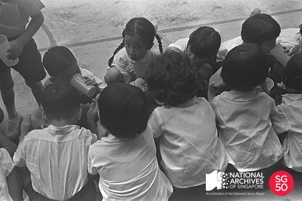

<iframe id="pxcelframe" src="//t.sharethis.com/a/t_.htm?ver=0.345.16985&amp;cid=c010#rnd=1577953698780&amp;cid=c010&amp;dmn=www.nas.gov.sg&amp;tt=t.dhj&amp;dhjLcy=65&amp;lbl=pxcel&amp;flbl=pxcel&amp;ll=d&amp;ver=0.345.16985&amp;ell=d&amp;cck=__stid&amp;pn=%2Fblogs%2Farchivistpick%2Fteeth-brushing%2F&amp;qs=na&amp;rdn=www.nas.gov.sg&amp;rpn=%2Fblogs%2Farchivistpick%2F2015%2F06%2F&amp;rqs=na&amp;cc=SG&amp;cont=AS&amp;ipaddr=" style="display: none;"></iframe>

# TEETH BRUSHING EXERCISE, 1969

​						Ministry of Information and The Arts Collection, National Archives of Singapore

A teeth brushing campaign was launched on 4 February 1969 by Health Minister Mr Chua Sian Chin at Telok Ayer Primary School. In his speech, Mr Chua shared that one out of two Singaporeans at the time, did not brush his or her teeth and approximately 250,000 school children or half of the student population either did not own a toothbrush or had it but did not use it properly. According to Mr Chua, the poor standard of dental hygiene in Singapore was evident from the state of the National Servicemen’s teeth during their medical examination for entry into service.

Organised by the dental branch of the Ministry of Health, the campaign aimed to inculcate the habit of good dental hygiene in the general population, particularly school children, by teaching them the proper way of brushing their teeth and encouraging them to do it regularly.

Supplied with a 10-cent toothbrush and a 15-cent plastic mug, students in most schools, had to line up, squat side by side over the school drain and brush their teeth usually in the morning before class or after recess.

By December 1969, the campaign had reached 439 primary schools and benefitted a total of 367,000 children. The exercise was introduced in kindergartens in 1973.

To view more details of this image and other records, click [here](http://www.nas.gov.sg/archivesonline/photographs/record-details/329693cc-1162-11e3-83d5-0050568939ad).