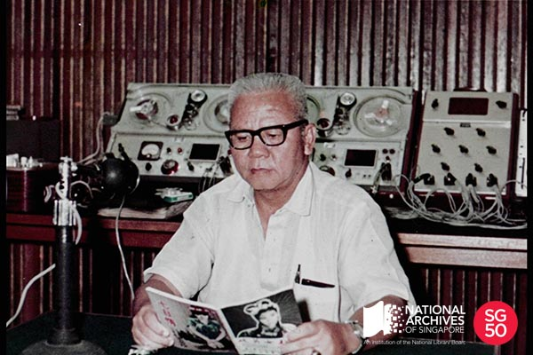

<iframe id="pxcelframe" src="//t.sharethis.com/a/t_.htm?ver=0.345.16985&amp;cid=c010#rnd=1577955565710&amp;cid=c010&amp;dmn=www.nas.gov.sg&amp;tt=t.dhj&amp;dhjLcy=60&amp;lbl=pxcel&amp;flbl=pxcel&amp;ll=d&amp;ver=0.345.16985&amp;ell=d&amp;cck=__stid&amp;pn=%2Fblogs%2Farchivistpick%2Flee-dai-soh%2F&amp;qs=na&amp;rdn=www.nas.gov.sg&amp;rpn=%2Fblogs%2Farchivistpick%2F2015%2F07%2F&amp;rqs=na&amp;cc=SG&amp;cont=AS&amp;ipaddr=" style="display: none;"></iframe>

# POPULAR STORYTELLER LEE DAI SOH TELLING STORIES ON AIR, 1966

​												Lee Dai Soh Collection, National Archives of Singapore

Lee Dai Soh whose real name is Lee Fook Hong was a very popular Cantonese storyteller who hosted programmes weekly for Rediffusion, Singapore’s first commercial and cable-transmitted radio station. He told tales of Chinese folklore, sword fighting and historical epics which made him a household name among listeners young and old, during the 1950s and 1960s.

Lee was born in Singapore and grew up in the Tanjong Pagar area. Despite only receiving a primary school education, he was a voracious reader and had an abiding love for Chinese culture and history.

Lee’s career as a storyteller started in 1938 with Radio Malaya and in 1949, he joined Rediffusion. With the advent of television in the 1960s and the Speak Mandarin Campaign in 1979, his career waned. His last broadcast for Rediffusion was in 1982 and Lee went on to work for Radio Australia until his death in 1989.

Lee was an accomplished opera actor who also took on female roles on stage. He was also active in clan association work and told stories weekly at the *Tung On Wai Kun* association in Chinatown.

[A selection of Rediffusion audio recordings](http://www.nas.gov.sg/archivesonline/highlights) can be heard at the NAS Archives Reading Room.

To view more details of this image and other records, click [here](http://www.nas.gov.sg/archivesonline/photographs/record-details/94e6ef18-1162-11e3-83d5-0050568939ad).