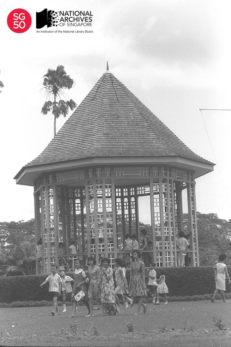
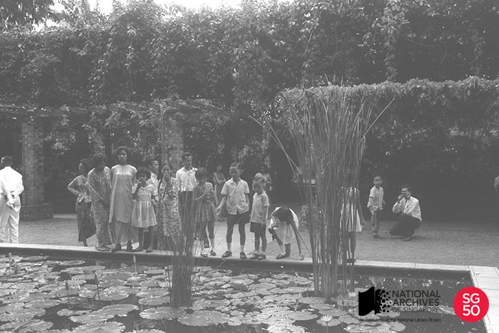
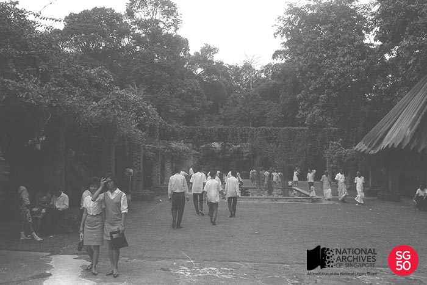
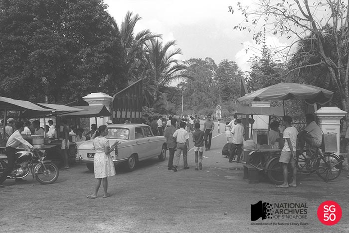
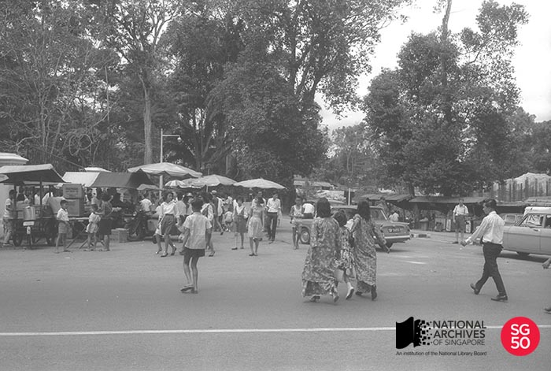

<iframe id="pxcelframe" src="//t.sharethis.com/a/t_.htm?ver=0.345.16985&amp;cid=c010#rnd=1577955358692&amp;cid=c010&amp;dmn=www.nas.gov.sg&amp;tt=t.dhj&amp;dhjLcy=163&amp;lbl=pxcel&amp;flbl=pxcel&amp;ll=d&amp;ver=0.345.16985&amp;ell=d&amp;cck=__stid&amp;pn=%2Fblogs%2Farchivistpick%2Fhari-raya-puasa%2F&amp;qs=na&amp;rdn=www.nas.gov.sg&amp;rpn=%2Fblogs%2Farchivistpick%2F2015%2F07%2F&amp;rqs=na&amp;cc=SG&amp;cont=AS&amp;ipaddr=" style="display: none;"></iframe>

# SCENE AT SINGAPORE BOTANIC GARDENS DURING HARI RAYA PUASA, 1965

Ministry of Information and the Arts Collection, National Archives of Singapore

*Hari Raya Puasa,* also known as *Hari Raya Aidilfitri,* is the religious festival celebrated by Muslims worldwide. It is celebrated on the first day of *Syawal*, or the tenth month of the Islamic calendar, to mark the end of the fasting month of *Ramadan*. Festivities last up to a month and many Muslim families would host an “open house” during this period where friends and relatives are invited to visit.

In 1965, there was a coincidence of two festivals, *Hari Raya Puasa* on 3 February and Chinese New Year on 2 February. This happens roughly every 30 years and the two festivals then stay in close proximity for two or three years. The last time this happened was from 1996 to 1998.

Photographs from the archives show that many Singaporeans of all races congregated at the Singapore Botanic Gardens as part of the festivities in that year. The featured photograph shows the iconic octagonal bandstand that still draws the crowds today. Built in the 1930s, it was previously used for outdoor musical performances and was declared a conserved heritage structure in 2009 by the Urban Redevelopment Authority.

Ministry of Information and the Arts Collection, National Archives of Singapore

Ministry of Information and the Arts Collection, National Archives of Singapore

While the scenes within the ever pristine Botanic Gardens may look very much the same apart from the fashions of that time, a different picture  can be seen at the entrances.

Ministry of Information and the Arts Collection, National Archives of Singapore

Ministry of Information and the Arts Collection, National Archives of Singapore

The vibrant street hawker scene then is very much in evidence from the photographs; enticing the crowds with their drinks or delicacies. At the time, there were as many as 18,000 hawkers operating on the streets.

The archival holdings include the [oral history interview of Rasidah Ali](http://www.nas.gov.sg/archivesonline/oral_history_interviews/record-details/b5f8d670-1161-11e3-83d5-0050568939ad?keywords=botanic gardens&keywords-type=all –) who was born in 1958 in the Botanic Gardens’ workers quarters and lived there. She spoke in Malay of her life and work at the Botanic Gardens including how *Hari Raya Puasa* was celebrated when she was a child.

To view more details of the first image and other records, click [here](http://www.nas.gov.sg/archivesonline/photographs/record-details/2cc22594-1162-11e3-83d5-0050568939ad).