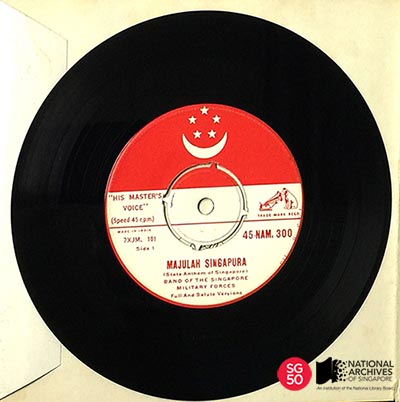

<iframe id="pxcelframe" src="//t.sharethis.com/a/t_.htm?ver=0.345.16985&amp;cid=c010#rnd=1577953963227&amp;cid=c010&amp;dmn=www.nas.gov.sg&amp;tt=t.dhj&amp;dhjLcy=50&amp;lbl=pxcel&amp;flbl=pxcel&amp;ll=d&amp;ver=0.345.16985&amp;ell=d&amp;cck=__stid&amp;pn=%2Fblogs%2Farchivistpick%2Fmajulah-singapura%2F&amp;qs=na&amp;rdn=www.nas.gov.sg&amp;rpn=%2Fblogs%2Farchivistpick%2F2015%2F07%2F&amp;rqs=na&amp;cc=SG&amp;cont=AS&amp;ipaddr=" style="display: none;"></iframe>

# EARLY VERSION OF MAJULAH SINGAPURA PERFORMED BY THE SINGAPORE MILITARY FORCES BAND, 1959

​																National Archives of Singapore

*Majulah Singapura* means “Onward Singapore”. It was originally composed by [Encik Zubir Said](http://www.nas.gov.sg/archivesonline/photographs/record-details/cace8d37-1161-11e3-83d5-0050568939ad) as the anthem for the City Council to commemorate the opening of a refurbished Victoria Theatre in 1958. The composer was the music director for Cathay-Keris Film Productions and in [his oral history interview](http://www.nas.gov.sg/archivesonline/oral_history_interviews/record-details/e3efd43b-115d-11e3-83d5-0050568939ad), he recalled that he was approached to write the piece by then Mayor Ong Eng Guan through an intermediary.

When Singapore achieved self-government in 1959, Dr Toh Chin Chye, the Deputy Prime Minister, led the search for a national anthem for Singapore. He revealed in [his oral history interview](http://www.nas.gov.sg/archivesonline/oral_history_interviews/record-details/9c06f865-115f-11e3-83d5-0050568939ad) that he was introduced to Encik Zubir Said and the City Council anthem by Mr Ong Eng Guan. When he first saw the lyrics, he however thought that it was too long and asked for modifications to make it “brief, to the point; which people can easily remember, and can be sung”. So the original song was eventually shortened and words that were more difficult were replaced with simpler ones so as to make it more understandable to all races.

When asked whether he was paid a fee for the composition, Encik Zubir said he did not need to be paid for the work. He shared in [his oral history interview](http://www.nas.gov.sg/archivesonline/oral_history_interviews/record-details/47221d03-115f-11e3-83d5-0050568939ad) that he was from Sumatra, Indonesia and had emigrated to Singapore to live and work. He applied a lesson from a proverb – “Di mana bumi di pijak di situ langit di junjung” which calls for adaptation to the customs and traditions of where one is situated. In this light, he felt that he had to “give…your goodwill to that place” and he did so through his composition.

*Majulah Singapura* was launched as the state national anthem on 3 December 1959 on the first day of National Loyalty Week that was celebrated that year. This was a very significant occasion which also saw the inauguration of [Encik Yusof Ishak as Singapore’s first Malayan-born Yang Di-Pertuan Negara](http://www.nas.gov.sg/archivesonline/photographs/record-details/b7d8ee7e-1161-11e3-83d5-0050568939ad) (Head of State), replacing the first Yang Di-Pertuan Negara and last colonial Governor of Singapore, Sir William Goode. Singapore’s other state symbols, the flag and crest, were also launched on that day before a crowd of some 25,000 at the Padang. In 1959, there was a telephone service people could call to hear the national anthem.

Upon independence in 1965, the *Majulah Singapura* became the national anthem of the Republic of Singapore. The version we hear today is a 2001 rearrangement.

The National Archives of Singapore holds a copy of the first vinyl pressing of the Majulah Singapura produced by the Gramophone Company Ltd in 1959. This copy was the one presented to the Minister for Culture Mr S. Rajaratnam. Side 1 features the full and salute versions played by the Band of the Singapore Military Forces and Side 2 contains the version sung by the Ministry of Education Choir.

To listen to how the national anthem would have sounded in 1965, and view more details of the record, click [here](http://www.nas.gov.sg/archivesonline/audiovisual_records/record-details/571db690-1164-11e3-83d5-0050568939ad).