# Introducing the NAS Map Collection

Grace Ho 4 years ago 19 min. read

This essay, originally published in **‘Visualising Space: Maps of Singapore and the Region – Collections from the National Library and National Archives of Singapore’** (National Library Board, 2014) provides an overview of the National Archives of Singapore’s map collection which is presently the largest available public  collection of Singapore maps.

An introduction to a collection of maps should perhaps begin with this most basic question: What are maps? There has been a substantial broadening of the definition of the map by scholars in the past few decades.[[1\]](http://www.nas.gov.sg/blogs/offtherecord/introduction-to-the-national-archives-of-singapore-map-collection/#_ftn1) The traditional geographer defined maps as visual representations of objects in space, graphics that objectively corresponded with reality.[[2\]](http://www.nas.gov.sg/blogs/offtherecord/introduction-to-the-national-archives-of-singapore-map-collection/#_ftn2) Newer definitions are more embracing, covering as J.B. Harley defines, all ‘graphic representations that facilitate a spatial understanding of things, concepts, conditions, processes, or events in the human world’.[[3\]](http://www.nas.gov.sg/blogs/offtherecord/introduction-to-the-national-archives-of-singapore-map-collection/#_ftn3) This could include religious diagrams, drawings of mythic or imagined landscapes and even mind-maps.[[4\]](http://www.nas.gov.sg/blogs/offtherecord/introduction-to-the-national-archives-of-singapore-map-collection/#_ftn4)

The more expansive definition may well inform future archival collection and appraisal policies, but the some 10,000 maps currently under the care of the National Archives of Singapore (NAS) fall clearly into the traditional category. This is no surprise as these maps were created to serve highly pragmatic ends such as land and sea navigation, establishing property boundaries, tax assessments, urban and transportation planning, and military defence. Thus precision and accuracy, in other words, correspondence with physical reality, was of paramount concern to both the users and makers of the maps. In addition, the earliest maps archived at NAS are mostly of early 19th century British origin, by which time the ideas and methods of rational empirical science, upon which the correspondence theory of maps rested, were plainly in the ascendancy especially in Britain.[[5\]](http://www.nas.gov.sg/blogs/offtherecord/introduction-to-the-national-archives-of-singapore-map-collection/#_ftn5)

By the time the British came to Singapore in 1819, they were using geometric mapping techniques developed from the empirical sciences. This trend would continue and indeed accelerate through the rest of the 19th and much of the 20th century as western science gradually displaced many traditional non-scientific modes of understanding. As the British colonial authorities drafted and approved maps of Singapore up into the 1960s, and trained the local cartographers who inherited their work in the western empirical cartographic tradition, virtually all maps with NAS have emerged from that milieu.

## **Types of Maps**

The maps in the NAS collection fall into these broad categories.

**General Reference Maps:** These are maps which show a variety of different physical features at a given location, such as coastlines, water bodies, vegetation, hills and mountains, roads, commercial, industrial, residential and recreational areas. These maps are produced either in small-scale covering large geographical areas such as whole countries or regions or in large-scale covering a small geographical area but providing much more detail on local physical features.[[6\]](http://www.nas.gov.sg/blogs/offtherecord/introduction-to-the-national-archives-of-singapore-map-collection/#_ftn6) Examples of small-scale general reference maps in the NAS collection include maps of Asia and Southeast Asia, and maps of Malaysia. Examples of large-scale general reference maps include maps of Singapore town, various street maps and district/precinct maps. There are presently around 3,800 general reference maps in the NAS collection.

*A section from a six-part large-scale general reference map, ‘Map of Singapore City, 1954’, covering Bugis, Kallang and Geylang. Source: Singapore Land Authority Collection, Survey Department, Courtesy of National Archives of Singapore Ref: SP002068_2*

**Topographic Maps:** Topographic maps are a particular kind of small-scale general reference map which include contour and relief details providing users with a three-dimensional sense of the space mapped. They typically provide highly detailed information of the local environment and are generally the most comprehensive type of small-scale general reference map. The first complete set of topographic map of Singapore was published in 1924 and many subsequent small-scale general reference maps of Singapore included topographic detail. There are presently around 1,300 topographic maps in the NAS collection.

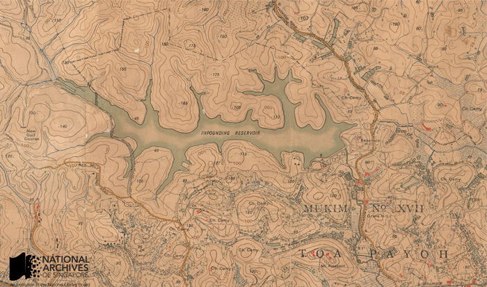

*A section from the 1924 topographic map of Singapore covering the area around the Macritchie Reservoir (then known as the ‘impounding reservoir’). Source: Singapore Land Authority, Survey Department, Courtesy of National Archives of Singapore Ref: TM000747*

**Cadastral Maps:** Cadastral maps are drawn up by state land-use authorities to document and demarcate parcels of physical property claimed by different property owners. These maps are used to establish property boundaries and legal claim over property, in estimating land values and also to assess property tax. As cadastral maps were used by government in tax collection, they were also sometimes referred to as ‘revenue maps’. Historically, cadastral maps are one of the earliest forms of official maps, with origins tracing back thousands of years to the first human civilizations in ancient Mesopotamia and Egypt.[[7\]](http://www.nas.gov.sg/blogs/offtherecord/introduction-to-the-national-archives-of-singapore-map-collection/#_ftn7) Traditionally, cadastral maps were kept in a ‘cadastre’ or a comprehensive official list of property owners and their property holdings, which are typically kept today in computerised databases. There are presently about 3,300 cadastral maps in the NAS collection.

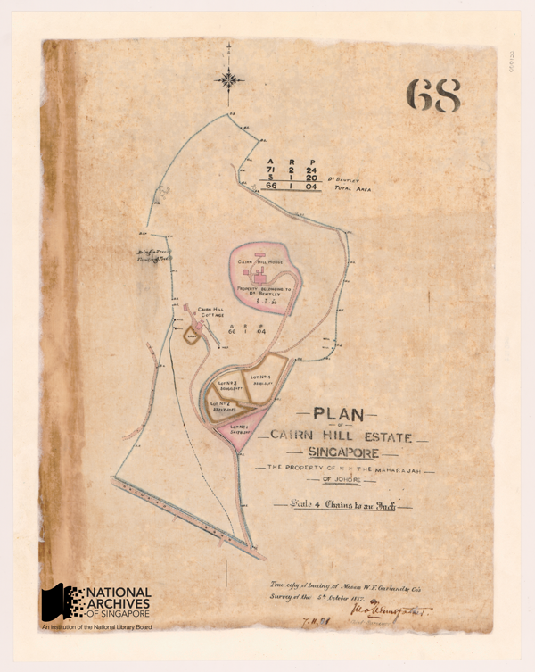

*Cadastral map showing the boundaries of the Cairn Hill Estate owned by the then Maharaja of Johore, 1887 Source: Survey Department, Courtesy of National Archives of Singapore Ref: SP000052*

**Hydrographic Charts:** These are sea navigation charts used by mariners to sail through open or near-shore waters. Such charts display features such as soundings (i.e. depth of water at a given location), shoal waters, lights, key landmarks such as lighthouses and buoys, harbour approaches and anchorages, a compass rose to orientate the map and other information that may aid navigation. Such maps are referred to as ‘charts’ as they are not only meant to be looked at but also to be marked and worked on by navigators in the course of their work. There are presently about 700 hydrographic charts in the NAS collection.

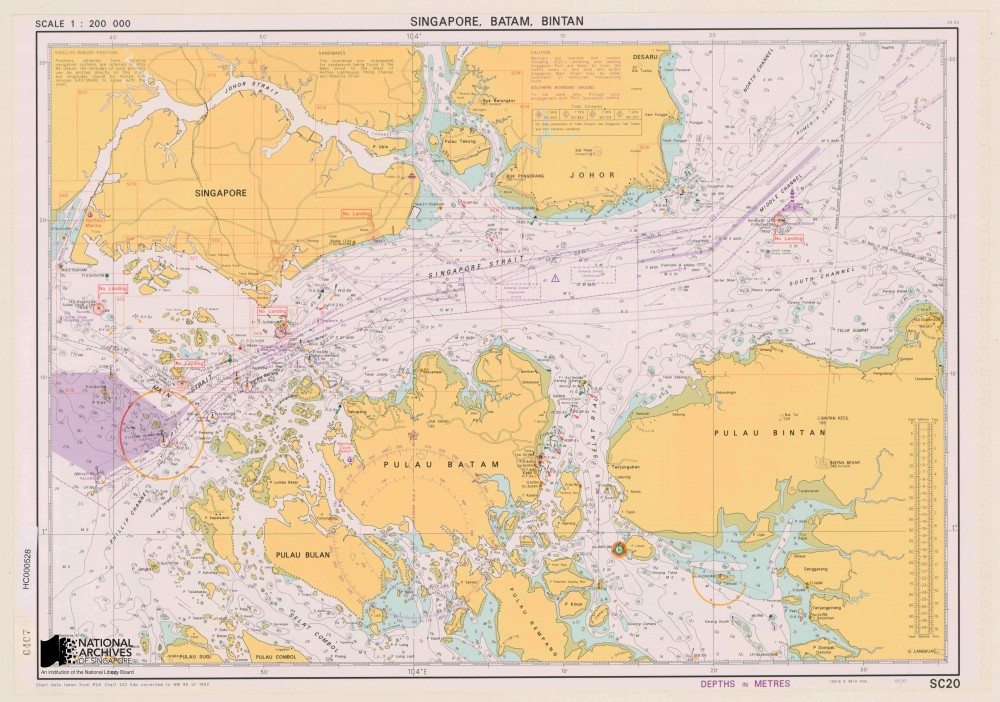*Modern hydrographic chart for small-craft navigating the waters around Singapore, Batam and Bintan islands. 1993 Source: Port of Singapore Authority, Courtesy of National Archives of Singapore Ref: HC000528* 

**Aviation Charts:** There is also a handful of less than 10 aviation charts kept in the NAS collection. They function as navigation charts for pilots and contain vital information such as on flight paths, runways, layouts and approaches at airports, and potentially hazardous obstructions.

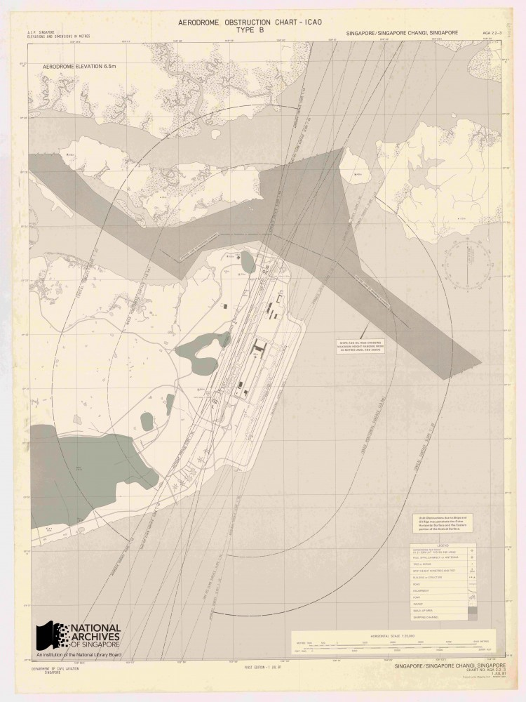*Aviation obstruction chart of Changi Airport, showing among other things the location of potentially hazardous obstructions around the aerodrome. This chart was published on 1 July 1981, the day the airport turned operational. Source: Survey Department, Courtesy of National Archives of Singapore Ref: AC000001*

**Thematic Maps:** These are special purpose made maps typically overlaid with details specific to the concerns of the user, e.g. mining, urban and transportation planning, soil and environmental information, flood and disease control, and military planning. NAS has a small collection of under 100 of such maps. However many more thematic maps can be found embedded within government reports, files and publications where they are frequently used as supporting and illustrative documents.

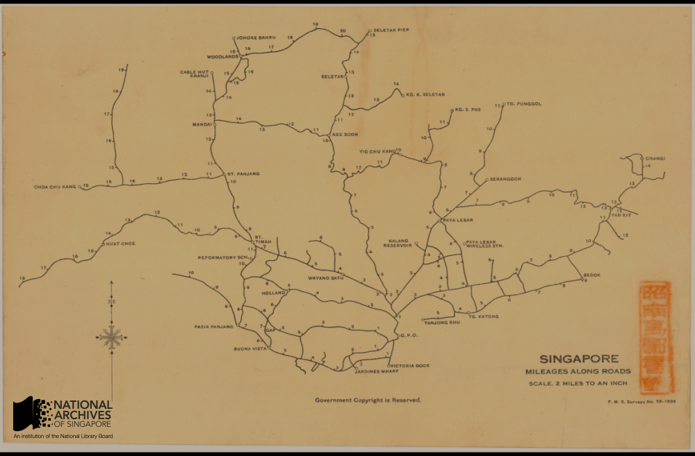*“Singapore, Mileages Along Roads”. Printed by the Federated Malay States Survey department in 1936, this map measured the distance of key landmarks and districts across Singapore island, taking the General Post Office in the Fullerton Building at Empress Place as its ‘zero-point’ Source: Singapore Land Authority, Survey Department, Courtesy of National Archives of Singapore Ref: SP001403*

## **Geographical Variety**

Of the maps in the NAS collection, the vast majority numbering over 8,000 are geographic maps of Singapore. This includes maps of the whole Singapore island and its surrounding waters and maps of particular areas and districts of the island, notably of the heavily populated town centre as well as outlying precincts like Katong, Jurong and Changi, among other areas. Maps of the larger islands surrounding Singapore such as Pulau Tekong and Sentosa (known as Pulau Blakang Mati before 1972[[8\]](http://www.nas.gov.sg/blogs/offtherecord/introduction-to-the-national-archives-of-singapore-map-collection/#_ftn8)) are also available. In addition, the collection contains a significant number of maps of Malaya, numbering around 900, of both the Malayan peninsular, the seas around it and of particular places such as the capital Kuala Lumpur, major towns such as Penang, Malacca and Johor Bahru as well as maps of British Borneo. The sizable number of Malaya maps in the collection reflects historical circumstances. Penang, Malacca and Singapore were, of course, once administered by the British collectively as the Straits Settlements for almost 120 years between 1826 and 1945. A less known fact is that the surveying authorities in Malaya and Singapore were amalgamated for long periods between 1920 and 1965.[[9\]](http://www.nas.gov.sg/blogs/offtherecord/introduction-to-the-national-archives-of-singapore-map-collection/#_ftn9) In addition there are a small number of maps of Southeast Asia and wider Asia in the collection. The total number is negligible, around 10 in total, though this includes a digital copy of a 16th century map of Asia by the famed Flemish cartographer Abraham Ortelius who published what was likely the first world atlas, as well as a copy of a 16th century Portuguese map of Southeast Asia.[[10\]](http://www.nas.gov.sg/blogs/offtherecord/introduction-to-the-national-archives-of-singapore-map-collection/#_ftn10) The copy of the Ortelius map was obtained from the former Singapore Maritime Museum, while the copy of the Portuguese map was acquired from a private collector.[[11\]](http://www.nas.gov.sg/blogs/offtherecord/introduction-to-the-national-archives-of-singapore-map-collection/#_ftn11)

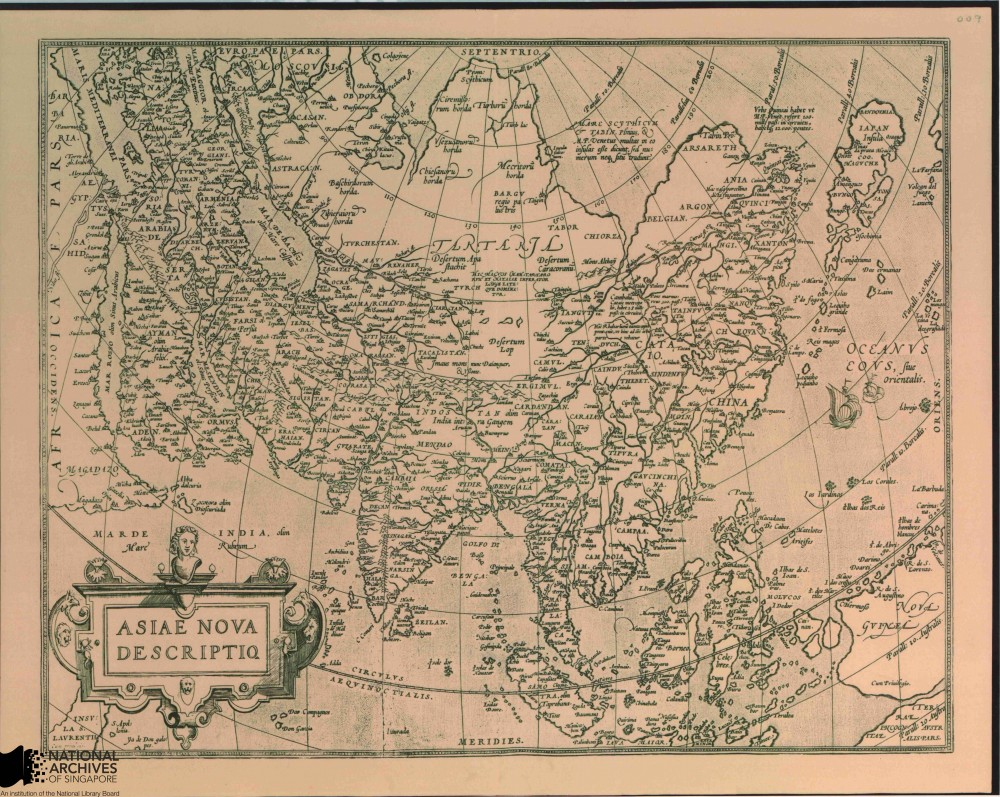*A Map of Asia by the Abraham Ortelius, c.1570s. The map was published as part of Ortelius’ Theatrum Orbis Terrarum, believed to be the first modern world atlas Source: Singapore Maritime Museum, Courtesy of National Archives of Singapore Ref: HC000402*

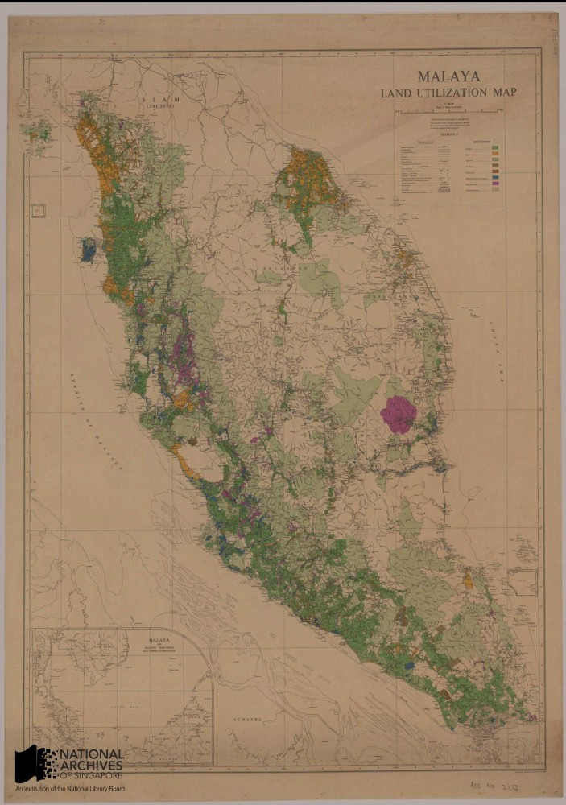

*1953 map showing land utilization on the Malayan Peninsular and Singapore*
*Source: Survey Department, Courtesy of National Archive of Singapore*
*Ref: GM000323*

## 

## **Chronology**

As for the chronology of the NAS map collection, just under 40 maps come from the pre-1819 (pre-Raffles) period. Most of these maps are dated from the late 18th century to the early 1800s and are of British as well as Dutch and Portuguese origin. The oldest map of Singapore in the NAS collection is a black and white reproduction of a map by Dutch cartographer Joannes Theodore de Bry dated 1603 depicting a battle between Dutch and Portuguese naval ships in 1602 off the eastern Singapore coastline. This map is one of the oldest known surviving maps on Singapore.[[13\]](http://www.nas.gov.sg/blogs/offtherecord/introduction-to-the-national-archives-of-singapore-map-collection/#_ftn13) Other antique pre-Raffles maps of interest include maps of Malacca from 1604 when the town was under Portuguese rule, as well as the 16th to early 18th century maps of Asia, Southeast Asia and the Straits of Malacca and Singapore.

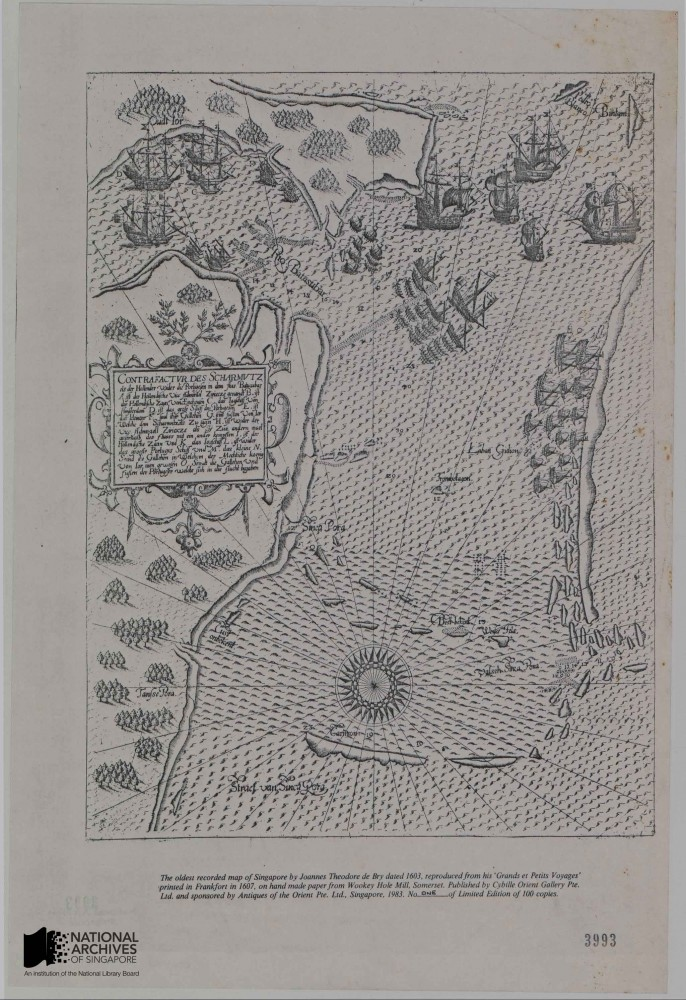

*Among the oldest maps known depicting Singapore, the map records a battle occurring in 1602 between Dutch & Portuguese naval ships off Singapore’s eastern coast. Source: Prime Minister’s Office, Courtesy of National Archives of Singapore Ref: HC000308*

NAS holds about 190 maps from the early colonial period (1819-1866) when Singapore was administered with Penang and Malacca under the British East India Company and subsequently the British India government based in Calcutta. The period marked the beginning of more precise mapping of the physical environment of Singapore. The first map which accurately traced the outline of Singapore island emerged around 1822, sketched by Captain James Franklin, a visiting Bengal military surveyor. Detailed maps of the rapidly developing Singapore town as well as hydrographic charts of its surrounding waters also emerged. Notable among maps of this period in the NAS collection is an 1819 British hydrographic map detailing the shape and depth of the harbour off the Singapore River. Captain Daniel Ross, a hydrographer of the East India Company who accompanied Raffles and William Farquhar to Singapore, prepared the map while Raffles was negotiating with the Tememggong to establish a trading post. An important map of this period is John Turnbull Thomson’s 1846 map of Singapore town and its suburbs. Thomson was the first Government Surveyor of the Eastern Settlements, with overall responsibility for surveying of the three Straits Settlements, and his map is the most detailed of Singapore town available of this period and an invaluable historical resource. Thomson also conducted meticulous hydrographic surveys of the Singapore Straits and published them in 1846. The quality of Thomson’s hydrographic charts was highly regarded and he was honoured by having some of them incorporated into the sea-charts of the British Admiralty.[[15\]](http://www.nas.gov.sg/blogs/offtherecord/introduction-to-the-national-archives-of-singapore-map-collection/#_ftn15) Another notable map by Thomson is a copy of an 1850 British survey map detailing the development of Singapore’s interior. This map is the earliest in the NAS collection furnishing such detail and the copy was acquired from the National Archives of the United Kingdom (NAUK).

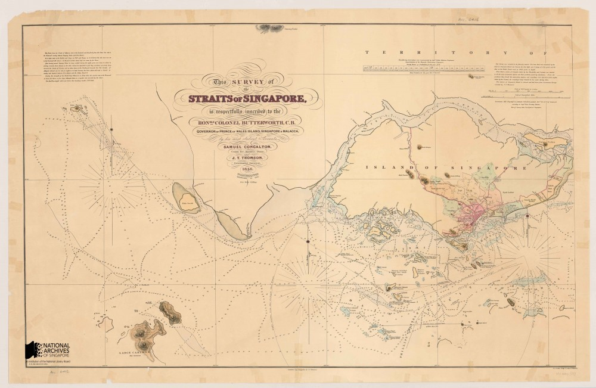*Portion of J.T. Thomson’s 1846 Survey Map of the Straits of Singapore showing the western entrance into the straits Source: Urban Redevelopment Authority, Courtesy of National Archives of Singapore Ref: HC000533*

NAS has about 530 maps covering the next 50 years of Singapore’s history, starting in 1867 when the Straits Settlements was elevated to a British Crown Colony administered directly by the Colonial Office in London to the end of the First World War in 1918. Relatively few maps of Singapore were produced during this period due to limited funding and chronic manpower shortages. As part of efforts to streamline government administration, the survey department, responsible for drafting local maps, was placed under the supervision of the Straits Settlements’ Public Works Department (PWD’s) from 1872. As their talents were redirected towards supporting the PWD’s functions, fewer maps could be produced. Nonetheless, the NAS collection does contain several important maps which were published in this period. One of the most important in the collection is a ‘Map of the Island of Singapore and its Dependencies’ published in 1898 under Colonial Engineer Colonel Andrew Murray. This map was published after a gap of almost 14 years over the previous 1885 edition and was a major update capturing many new developments across the whole island at the turn of the 19th century.

*The 1898 Map of the Island of Singapore and Its Dependencies was a highly detailed map showing names of major buildings, districts, hills, islands and other landmarks, in addition to major transportation arteries around the island at the turn of the century*
 *Source: Survey Department, Courtesy of National Archives of Singapore Ref: TM000012*

NAS has a rich collection of about 1,700 maps covering the inter-war period 1919-1938, between the end of the First World War and the outbreak of the Second World War. This was an important period for cartography in Singapore which saw successful efforts to improve the quality of local maps through better funding and staff for the survey department. The survey departments of the British controlled Federated Malay States (F.M.S.) and Straits Settlements (S.S.) were merged allowing for greater flexibility in allocating funding and manpower. In 1920, a decision was made, after decades of delays, by the newly merged F.M.S. & S.S. Survey department to initiate a modern trigonometrical survey of the Straits Settlements that would greatly enhance the accuracy of subsequent maps. One of the results of this effort was a comprehensive 16-part modern, coloured topographic map of Singapore published in 1924. This was the first proper topographical map of Singapore ever made and represented a considerable improvement in accuracy over previous Singapore maps. Other topographical maps of Singapore followed, including the publication of a single-sheet topographical map of Singapore Island in 1932.

*1932 single-sheet topographic map of Singapore showing the island divided by*
 *Mukim (or Civil Parish) districts.*
 *Source: Survey Department, Courtesy of National Archives of Singapore Ref: TM000244_1* 

NAS has about 700 maps from the Second World War period (1939-1945), covering the tense years following the outbreak of war in Europe but prior to the Japanese invasion, the battles for Malaya and Singapore, and the Japanese Occupation. Collection highlights include British topographical maps of Malaya and Singapore from 1939 drafted as part of war preparation. Also of interest are reproduction copies of British and Japanese military maps capturing troop movements during the course of the Malayan and Singapore campaigns, as well as British military planning maps drawn up as part of Allied preparations to recapture Malaya and Singapore later in the war. Most of these British military maps were obtained from the National Archives of the United Kingdom (NAUK) and the British Library, while the Japanese maps were reproduced or acquired from private collections. Maps of Singapore produced locally during the Japanese occupation can also found in the NAS collection. These maps were based on earlier maps produced by the British Survey Department of the F.M.S. and S.S. but bear markings of the Japanese administration, for example the re-titling of Singapore as ‘Syonan’ (Light of the South) and the inclusion of Japanese inscriptions on some maps.

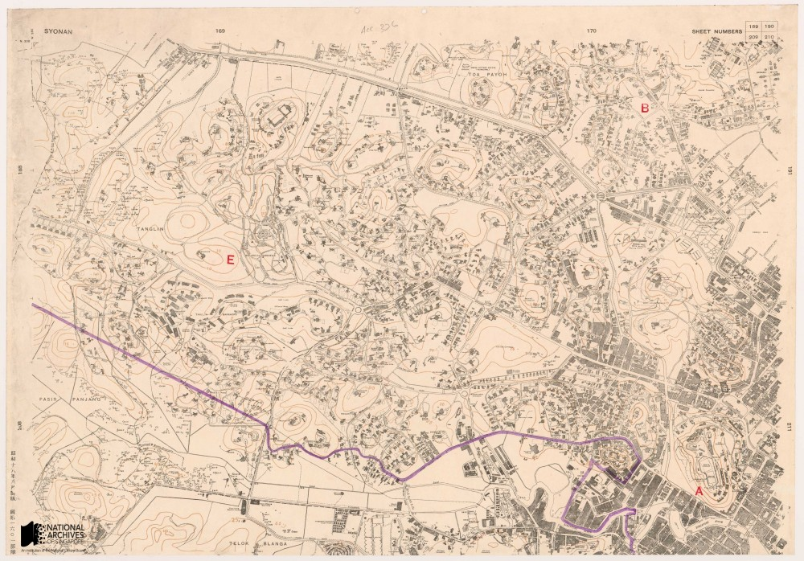*Segment of the Town Plan series map printed by the Japanese during the Occupation, 1943.The map is labelled “Syonan” on the top left corner, and Japanese inscriptions can be seen on the bottom left corner of the map Source: Survey Department, Courtesy of National Archives of Singapore Ref: SP001565_1*

*Allied military topographic map of Singapore, 1945*
*Source: Survey Production Centre Southeast Asia, Colin Mortimer, Courtesy of National Archives of Singapore*
*Ref: TM000984*

NAS has a collection of over 2,200 maps covering the period from the restoration of British rule at the end of the Second World War to Singapore’s emergence as a sovereign republic (1945–1965). A notable development in the cartography of this period is the introduction of aerial photography which led to the production of the first aerial maps of Singapore in the 1940s. Aerial photography replaced traditional trigonometric surveys in the post-war period as a much faster and cost effective way of producing accurate topographic maps. These aerial photographs are available for viewing in NAS’s image database, together with a selection of stitched aerial photomaps of the central parts of Singapore kept under NAS’s map collection. Political changes which progressively saw Singapore transform from a British colony into first a self-governing and then an independent state, led to the first elections in Singapore from 1948 and the drafting of the first electoral maps. The first urban masterplan maps, which provided comprehensive information of land usage patterns across Singapore, were also published during this period in 1958.

*Aerial map of Singapore town, 1950. These maps were made by stitching together*
 *aerial photographers taken by the British airforce’s 81 squadron, an air reconnaissance unit*
 *based at the Seletar and Tengah airbases between 1947 and 1970.*
 *Source: Survey Department, Courtesy of National Archives of Singapore*
 *Ref: SP000794*

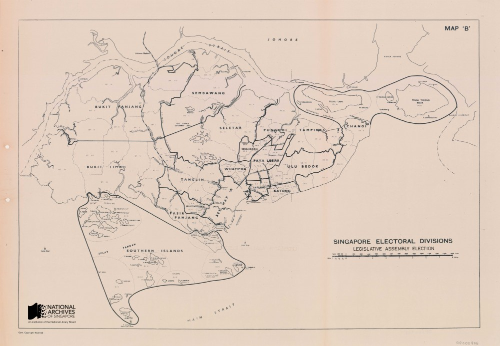*Electoral divisions map for the 1955 Legislative Assembly elections. This was a landmark event in Singapore political history in which the majority of members in the governing Legislative Assembly would be elected rather than appointed by the British colonial authorities. It set the stage for Singapore’s achievement of self-government in 1959. Source: Singapore Land Authority, Survey Department, Courtesy of National Archives of Singapore Ref: SP000906*

Finally, the NAS collection has about 4,200 maps published between August 1965, when Singapore gained independence, to 2009, the date of the latest maps deposited with NAS at the current time.  Important developments that took place in this period include the establishment of the Singapore Armed Forces Mapping Unit (SAFMU) under Singapore’s Ministry of Defence in 1970. The SAFMU took over responsibility for the nation’s topographic mapping, allowing the Survey Department to concentrate solely on creating cadastral and other survey maps. Notably in 1971, SAFMU published the first topographic map created under the Republic of Singapore. From the 1980s, an accelerating trend towards the computerisation and digitization of mapping emerged as new digital mapping technologies gradually displaced analogue techniques. The first topographic map produced using digital techniques – a map of the island of Singapore – was published in 1993. A copy the map is kept in the NAS collection. The NAS collection also contains a number of modern hydrographic maps created by the Maritime and Port Authority (MPA) and its predecessor Port of Singapore Authority (PSA), the most recent of which was published in 2010.

*This was the first map of Singapore Island produced by the Singapore Armed Forces Mapping Unit. Established in 1970, the unit took over the topographical mapping work previously performed by the British Army stationed in Singapore. Source: Source: Singapore Land Authority, Courtesy of National Archives of Singapore Ref: TM001021*

Looking to the future where maps are increasingly created using digital techniques, NAS expects a growing proportion of the maps it receives to come in digital rather than physical format. The change in format has important implications for the archivist as advances in digital technology have transformed maps from static physical documents to documents which are increasingly interactive and can be updated in real time. This emerging trend has brought about new challenges in properly archiving digital maps to maintain their provenance and integrity. On other hand, the sheer richness of content that can now be digitally captured in maps has enhanced their value as social and historical records that document the development of a place and society.

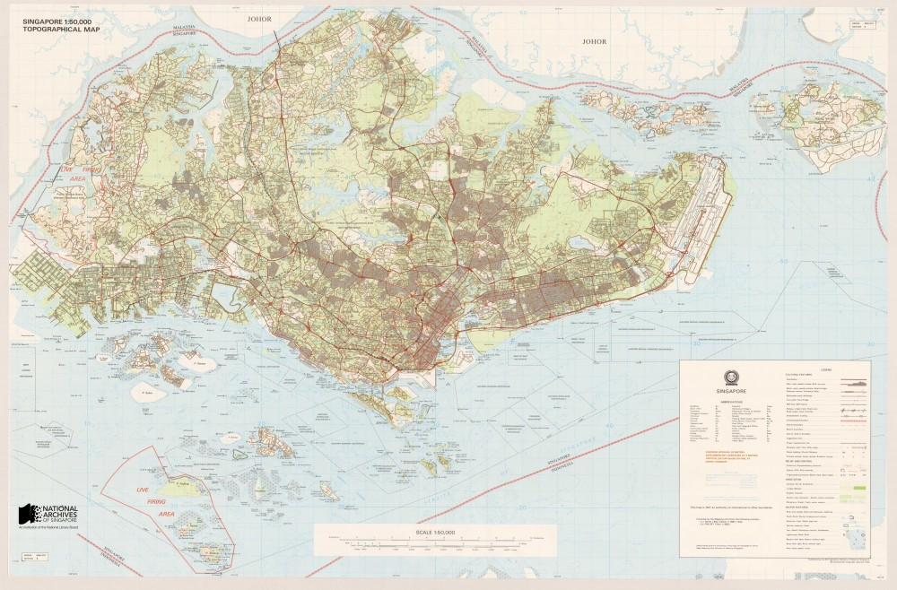*This topographical map of Singapore was the first map produced in Singapore using computerised techniques. It was published in 1993.*
*Source: Singapore Land Authority, Courtesy of National Archives of Singapore*
*Ref: TM000987*

**The National Archives of Singapore Map Collection can be viewed and accessed on our public database Archives Online at this link:**

**http://www.nas.gov.sg/archivesonline/maps_building_plans/**

**With around 10,000 maps, the National Archives of Singapore holds possibly the largest collection of Singapore maps publicly available, including an extensive collection of survey and topographic maps produced from the British colonial era into modern times.**

## 

## **Bibliography**

[[1\]](http://www.nas.gov.sg/blogs/offtherecord/introduction-to-the-national-archives-of-singapore-map-collection/#_ftnref1) Peter Borschberg, ‘Singapura in Early Modern Cartography:  A Sea of Challenges’ p.1-2; see also Evelyn Edson, “Bibliographic Essay: History of Cartography”, CHOICE: current reviews for academic libraries, Middletown, CT: Association of College and Research Libraries, July/August 2001, Vol. 38, No.11/12, pp. 1899-1900 and J.B. Harley, ‘The Map and the Development of the History of Cartography’, The History of Cartography, v.1, University of Chicago: Chicago, 1987, pp.2-5

[[2\]](http://www.nas.gov.sg/blogs/offtherecord/introduction-to-the-national-archives-of-singapore-map-collection/#_ftnref2) (ed.) Robinson, Morrison, Muehrcke, Kimerling and Guptill, Elements of Cartography (Sixth Edition), p.9 and Evelyn Edson, “Bibliographic Essay: History of Cartography”, CHOICE: current reviews for academic libraries, pp. 1899

[[3\]](http://www.nas.gov.sg/blogs/offtherecord/introduction-to-the-national-archives-of-singapore-map-collection/#_ftnref3) J.B. Harley & David Woodward, ‘Preface’, The History of Cartography, v.1, University of Chicago: Chicago, 1987, pp.xv-xvi

[[4\]](http://www.nas.gov.sg/blogs/offtherecord/introduction-to-the-national-archives-of-singapore-map-collection/#_ftnref4) Evelyn Edson, “Bibliographic Essay: History of Cartography”, CHOICE: current reviews for academic libraries, pp. 1899-1909

[[5\]](http://www.nas.gov.sg/blogs/offtherecord/introduction-to-the-national-archives-of-singapore-map-collection/#_ftnref5) Matthew H. Edney, Mapping an Empire: The Geographical Construction of British India, 1765-1843, University of Chicago Press: Chicago, 1997, pp.294-318

[[6\]](http://www.nas.gov.sg/blogs/offtherecord/introduction-to-the-national-archives-of-singapore-map-collection/#_ftnref6) (ed.) Robinson, Morrison, Muehrcke, Kimerling and Guptill Elements of Cartography (Sixth Edition), John Wiley & Sons, 1995, p.12

[[7\]](http://www.nas.gov.sg/blogs/offtherecord/introduction-to-the-national-archives-of-singapore-map-collection/#_ftnref7) Roger J.P. Kain, The Cadastral Map in the Service of the State, University of Chicago Press: Chicago, 1992 p.1

[[8\]](http://www.nas.gov.sg/blogs/offtherecord/introduction-to-the-national-archives-of-singapore-map-collection/#_ftnref8) ‘6 Lesser Known Facts About Sentosa’, The Straits Times, 16 Aug 2014; ‘Pulau Blakang Mati’ means ‘the island after death’ in Malay. Following the Singapore government’s decision to develop the island into a tourist attraction, the island was given a more friendly name, Sentosa, which means ‘peace and tranquility’ in Malay.

[[9\]](http://www.nas.gov.sg/blogs/offtherecord/introduction-to-the-national-archives-of-singapore-map-collection/#_ftnref9)  See Mok Ly Yng’s discussion in his essay, ‘Mapping Singapore:1819-2014’

[[10\]](http://www.nas.gov.sg/blogs/offtherecord/introduction-to-the-national-archives-of-singapore-map-collection/#_ftnref10) “Asiac Nova Descriptio” by Abraham Ortelius.  Reprinted by J E Bushmann, Singapore Maritime Museum, National Archives of Singapore, Acc. HC000402 & “Exacta accurata delineatio cum orarum maritimarum…regionibus, China, Cauchinchina, Camboja…Japan”,  derived from portolan chart compiled in 1573 by Fernao Vaz Dourado, Portuguese Cartographer, published in 1598, National Archives of Singapore, Acc. GM000394

[[11\]](http://www.nas.gov.sg/blogs/offtherecord/introduction-to-the-national-archives-of-singapore-map-collection/#_ftnref11) The NLB map collection has a coloured copy of the same map

[[12\]](http://www.nas.gov.sg/blogs/offtherecord/introduction-to-the-national-archives-of-singapore-map-collection/#_ftnref12) ‘Mapping the Mysterious East’, in Mapping New Worlds: The Cartography of European Exploration & Colonization: 1450-1750 an online exhibition by Bryn Mawr College: <http://www.brynmawr.edu/library/exhibits/maps/asia1.shtml#ortelius> (Last Accessed: 20 Oct 2014)

[[13\]](http://www.nas.gov.sg/blogs/offtherecord/introduction-to-the-national-archives-of-singapore-map-collection/#_ftnref13) “Schematic map of the naval battle between Dutch Vice-Admiral Pietersz and Portuguese Captain Estevao Teixeira de Matos. On 6 October 1602, reproduced in Joannes Theodore de Bry’s “Grands et Petits Voyages” printed in Frankfort in 1607. National Archives of Singapore, Acc. HC000308

[[14\]](http://www.nas.gov.sg/blogs/offtherecord/introduction-to-the-national-archives-of-singapore-map-collection/#_ftnref14) The National Library Board map collection also has a copy of this map

[[15\]](http://www.nas.gov.sg/blogs/offtherecord/introduction-to-the-national-archives-of-singapore-map-collection/#_ftnref15) John Hall-Jones and Christopher Hooi, An Early Surveyor in Singapore: John Turnbull Thomson in Singapore 1841-1853, National Museum of Singapore, 1979, p.7