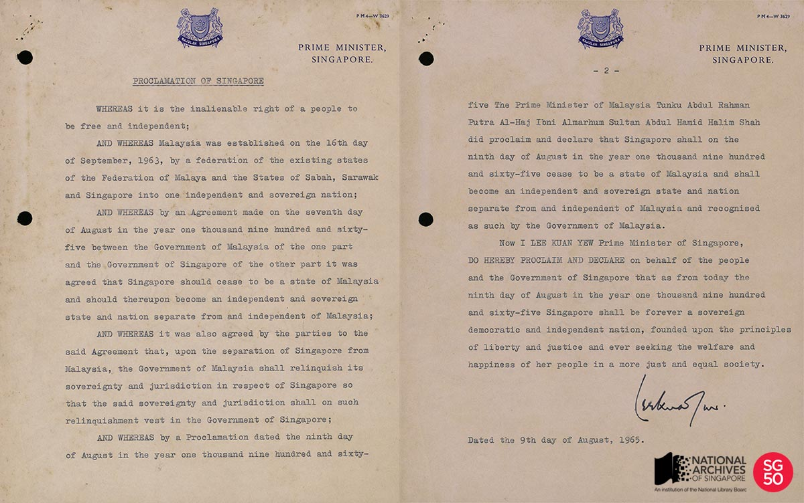
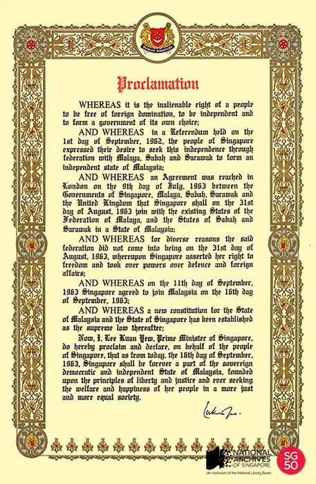

<iframe id="pxcelframe" src="//t.sharethis.com/a/t_.htm?ver=0.345.16984&amp;cid=c010#rnd=1577951100368&amp;cid=c010&amp;dmn=www.nas.gov.sg&amp;tt=t.dhj&amp;dhjLcy=422&amp;lbl=pxcel&amp;flbl=pxcel&amp;ll=d&amp;ver=0.345.16984&amp;ell=d&amp;cck=__stid&amp;pn=%2Fblogs%2Farchivistpick%2Fproclamation-of-singapore%2F&amp;qs=na&amp;rdn=www.nas.gov.sg&amp;rpn=%2Fblogs%2Farchivistpick%2F&amp;rqs=na&amp;cc=SG&amp;cont=AS&amp;ipaddr=" style="display: none;"></iframe>

# PROCLAMATION OF SINGAPORE, 1965

​                                                                   National Archives of Singapore

The Proclamation of Singapore was drafted by then [Minister for Law Mr E W Barker](http://www.nas.gov.sg/archivesonline/photographs/record-details/c1572ff0-1161-11e3-83d5-0050568939ad). In his [oral history interview](http://www.nas.gov.sg/archivesonline/oral_history_interviews/record-details/cda5c816-1160-11e3-83d5-0050568939ad?keywords=barker&keywords-type=all), Mr Barker recalled being summoned in mid-July 1965 by then Prime Minister Lee Kuan Yew and was asked if the Attorney-General could draft an agreement for the separation of Singapore from Malaysia and whether the matter could be kept secret. Mr Barker replied that the Attorney-General was the best man for the job but was uncertain whether the information could be contained. Mr Barker was thus entrusted with the personal task.

Mr Barker did his research in the law library of the University of Singapore and found a precedent concerning the breakup of the Federation of the West Indies. Three documents were drafted: an agreement to separate, an amendment to the Malaysian Constitution as it then only had provisions to allow for states to join Malaysia but not to leave and a proclamation of independence.

*“In order to keep the proposal as secret as possible, the numbers of those in the know were kept to a bare minimum. They were the Prime Minister; Dr Goh Keng Swee, the Minister for Finance; Mr Stanley Stewart, Head of the Civil Service; Mr George Bogaars, Head of the Special Branch; and Mr Wong Chooi Sen, Cabinet Secretary, to whom I dictated and who typed the documents for me.”*  

The secrecy surrounding the negotiations and hurried nature of the separation is reflected in the plain presentation of the Proclamation of Singapore on the common letterhead of the Prime Minister, Singapore. A close inspection will show the rust stains from staples and how the document was punched with holes and literally filed amongst other documents rather than being handled with pomp and great care.

This is in marked contrast with the celebratory nature reflected in the elaborately designed Proclamation of Malaysia when Singapore became part of Malaysia in 1963 and it was declared that “Singapore shall be forever a part of the sovereign democratic and independent State of Malaysia, founded upon the principles of liberty and justice and ever seeking the welfare and happiness of her people in a more just and equal society”.

Ministry of Information and the Arts Collection, National Archives of Singapore

The Proclamation of Singapore was eventually to be read over Radio Singapura on 9 August 1965 at 10 a.m. Only the recording of the original Malay announcement has so far been found among the surviving Radio Singapura archives. You can hear the announcement [here](http://www.nas.gov.sg/archivesonline/audiovisual_records/record-details/4d2cc138-1164-11e3-83d5-0050568939ad).

To view more details of the first image and other records, click [here](http://www.nas.gov.sg/archivesonline/photographs/record-details/72ffcf37-b8b1-11e3-927b-0050568939ad).