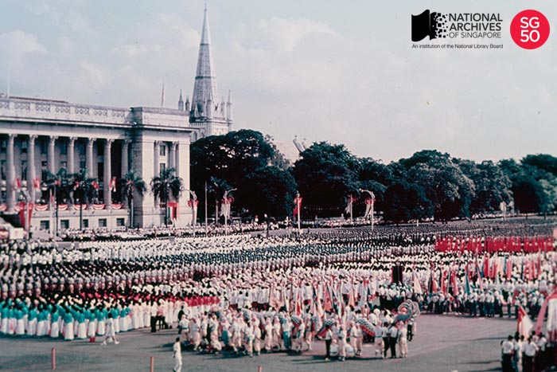
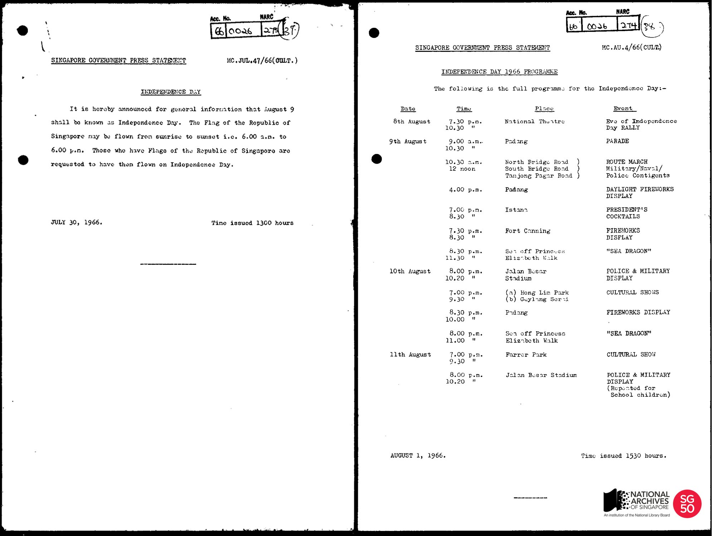
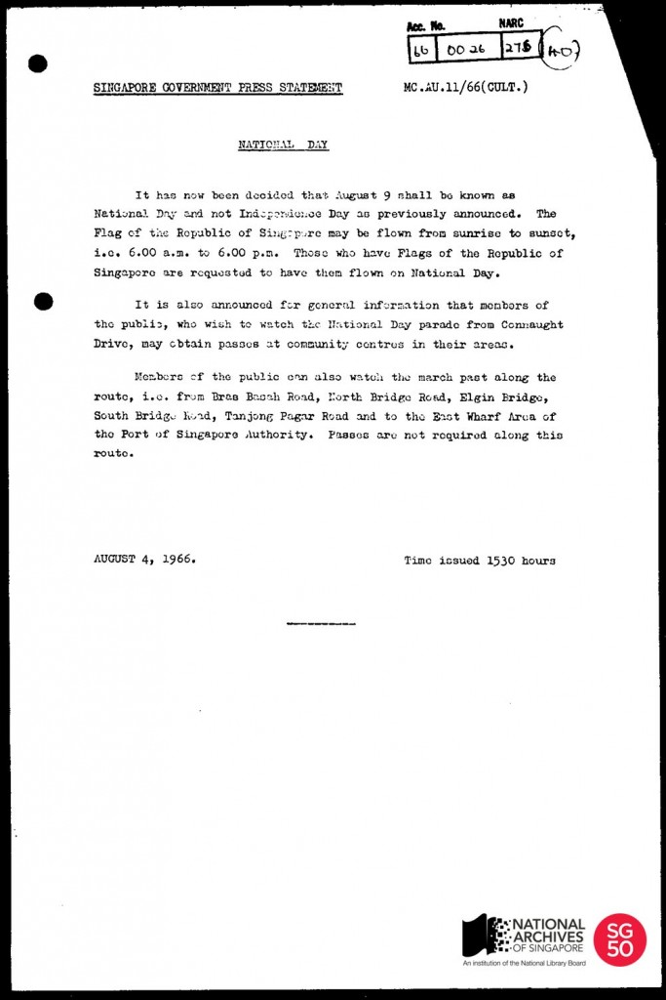

<iframe id="pxcelframe" src="//t.sharethis.com/a/t_.htm?ver=0.345.16984&amp;cid=c010#rnd=1577951038449&amp;cid=c010&amp;dmn=www.nas.gov.sg&amp;tt=t.dhj&amp;dhjLcy=59&amp;lbl=pxcel&amp;flbl=pxcel&amp;ll=d&amp;ver=0.345.16984&amp;ell=d&amp;cck=__stid&amp;pn=%2Fblogs%2Farchivistpick%2Findependence-day%2F&amp;qs=na&amp;rdn=www.nas.gov.sg&amp;rpn=%2Fblogs%2Farchivistpick%2F&amp;rqs=na&amp;cc=SG&amp;cont=AS&amp;ipaddr=" style="display: none;"></iframe>

# INDEPENDENCE DAY?

Yusof Ishak Collection, National Archives of Singapore

The photograph of the first National Day celebrations (in 1966) is from the Yusof Ishak Collection. Singapore’s first President, [Encik Yusof Ishak, was a keen photographer](http://www.nas.gov.sg/archivesonline/photographs/record-details/b374b268-1162-11e3-83d5-0050568939ad) and his wife, [Puan Noor Aishah](http://www.nas.gov.sg/archivesonline/photographs/record-details/b489d6d8-1162-11e3-83d5-0050568939ad), donated over 9,000 photographs taken or collected by them to the National Archives of Singapore. The photographs provide an invaluable record of their lives as well as a broader recollection of the events that took place during our early years of independence.

The photograph carries the description “National Day Parade 1966 at the Padang – Bird’s eye view of parade” but press release records show that the important day was very close to being called something else. As late as 30 July 1966, a Singapore Government Press Statement “announced for general information that 9 August shall be known as Independence Day” and this was how the press referred to it throughout much of 1966.

National Archives of Singapore

Then with just 5 days to go, a final decision was made to call 9 August what we have known it to be for the last 49 years – National Day.

National Archives of Singapore

To view more details of the first image and other records, click [here](http://www.nas.gov.sg/archivesonline/photographs/record-details/a66ff2f7-1162-11e3-83d5-0050568939ad).