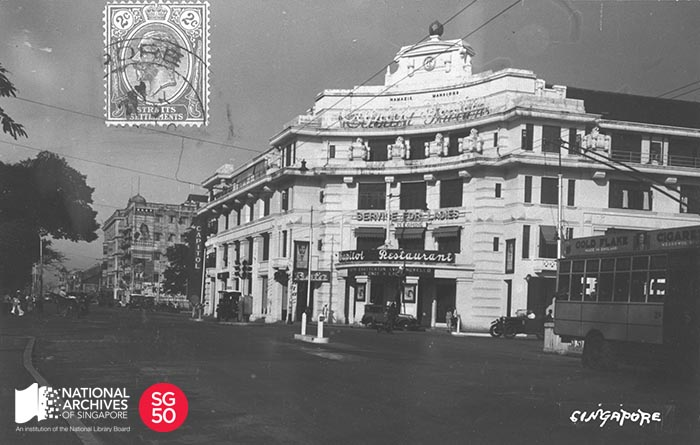

<iframe id="pxcelframe" src="//t.sharethis.com/a/t_.htm?ver=0.345.16984&amp;cid=c010#rnd=1577950940773&amp;cid=c010&amp;dmn=www.nas.gov.sg&amp;tt=t.dhj&amp;dhjLcy=14&amp;lbl=pxcel&amp;flbl=pxcel&amp;ll=d&amp;ver=0.345.16984&amp;ell=d&amp;cck=__stid&amp;pn=%2Fblogs%2Farchivistpick%2Fcapitol-theatre%2F&amp;qs=na&amp;rdn=www.nas.gov.sg&amp;rpn=%2Fblogs%2Farchivistpick%2F&amp;rqs=na&amp;cc=SG&amp;cont=AS&amp;ipaddr=" style="display: none;"></iframe>

# CAPITOL THEATRE, 1930s

​																	National Archives of Singapore

Capitol Theatre was built by Mr Mirza Mohamed Ali Namazie, a well-known Persian merchant and property owner. It opened to much fanfare on 22 May 1930 with the screening of the film, *Rio Rita*. The theatre’s seating arrangement and lighting system are believed to have been modelled after the Roxy Theatre in New York City and it was one of few air-conditioned theatres in Singapore at the time. One of its notable features was its retractable domed ceiling. On nights with good weather, the ceiling opened and movies were screened under the night sky. It was one of the first cinemas in Singapore and movie stars such as Charlie Chaplin and Douglas Fairbanks visited to promote their movies when they were in Singapore.

During the Japanese Occupation, Capitol Theatre was renamed *Kyo-Ei Gekkyo* and served as a food depot for the Japanese and also operated as a cinema screening Japanese propaganda films. This was until the building was damaged by anti-Japanese bombing in 1944.

In 1946, Capitol Theatre was bought by Shaw Organisation for $3 million and became the cinema company’s flagship movie theatre. The 1,686-seat cinema not only showed movies but was also the venue for live entertainment such as dance revues, beauty contests as well as musicals and variety shows by local performers like Sakura Teng and Rita Chao. The first ice-skating show in Malaya was also performed there in 1951. The zodiac decor featured on the cinema’s domed ceiling and the statues of the pair of maidens on winged horses were installed in the mid-1960s.

In 1987, the building was acquired by the government but the cinema was leased to Shaw until 29 December 1998, when operations ceased. After 17 years, Capitol Theatre re-opened its doors on 19 May 2015 as part of an integrated luxury lifestyle development, Capitol Singapore – which comprises a hotel, residences, mall and the theatre.

To view more details of this image and other records, click [here](http://www.nas.gov.sg/archivesonline/photographs/record-details/ae591869-1161-11e3-83d5-0050568939ad).