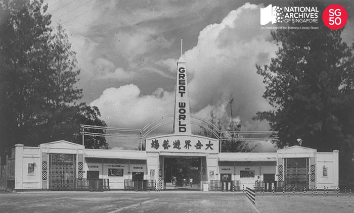

<iframe id="pxcelframe" src="//t.sharethis.com/a/t_.htm?ver=0.345.16984&amp;cid=c010#rnd=1577950866980&amp;cid=c010&amp;dmn=www.nas.gov.sg&amp;tt=t.dhj&amp;dhjLcy=68&amp;lbl=pxcel&amp;flbl=pxcel&amp;ll=d&amp;ver=0.345.16984&amp;ell=d&amp;cck=__stid&amp;pn=%2Fblogs%2Farchivistpick%2Fgreat-world%2F&amp;qs=na&amp;rdn=www.nas.gov.sg&amp;rpn=%2Fblogs%2Farchivistpick%2F&amp;rqs=na&amp;cc=SG&amp;cont=AS&amp;ipaddr=" style="display: none;"></iframe>

# GREAT WORLD AMUSEMENT PARK, 1950s

​												Wong Kwan Collection, National Archives of Singapore

Amusement parks were very popular venues for entertainment in Singapore from the 1920s. The three most well-known amusement parks were Great World, [New World](http://www.nas.gov.sg/archivesonline/photographs/record-details/879275a5-1162-11e3-83d5-0050568939ad), and [Happy World](http://www.nas.gov.sg/archivesonline/photographs/record-details/d4ba43c8-1161-11e3-83d5-0050568939ad) (later renamed Gay World). Boasting a carnival-like atmosphere, they had a wide array of fun and games for the whole family. Their bright lights, restaurants, cinemas, gaming booths, and stalls which sold everything from trinkets to groceries, drew large crowds.

Although largely similar, each park had its own unique attractions. [Great World bounded by Kim Seng Road, River Valley Road and Zion Road](http://www.nas.gov.sg/archivesonline/maps_building_plans/record-details/f8d36646-115c-11e3-83d5-0050568939ad) and owned by Shaw Brothers was known for its attractions like the *Wall of Death* used for daredevil motorcycling stunts. Happy World which was set up by George Lee Geok Eng (founder of *Nanyang Siang Pau* newspaper and brother of Lee Kong Chian) and situated on Mountbatten Road had an indoor sports stadium. Once said to be the greatest covered stadium in Southeast Asia, it hosted sporting events such as wrestling, boxing, basketball, badminton and table-tennis. New World located on Kitchener Road, was famous for its cabarets. The most popular cabaret girl was Rose Chan, who was known as the *Queen of Striptease*.

However, the popularity of these parks gradually declined from the 1960s as more people turned to other forms of entertainment. All the parks have been closed and demolished.

To view more details of this image and other records, click [here](http://www.nas.gov.sg/archivesonline/photographs/record-details/d40af13f-1161-11e3-83d5-0050568939ad).