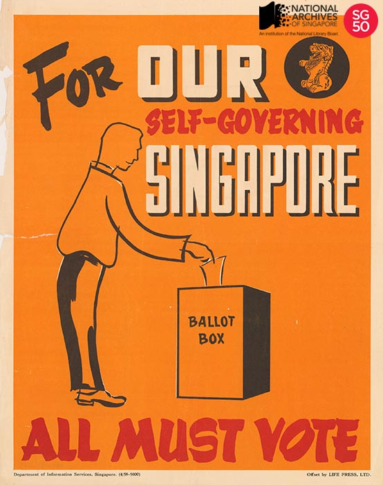
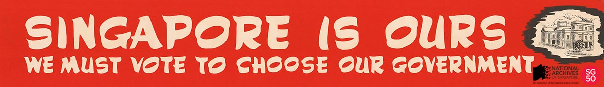
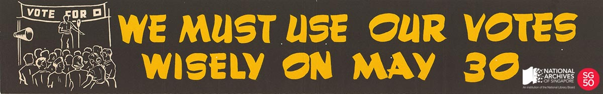

<iframe id="pxcelframe" src="//t.sharethis.com/a/t_.htm?ver=0.345.16984&amp;cid=c010#rnd=1577950711705&amp;cid=c010&amp;dmn=www.nas.gov.sg&amp;tt=t.dhj&amp;dhjLcy=22&amp;lbl=pxcel&amp;flbl=pxcel&amp;ll=d&amp;ver=0.345.16984&amp;ell=d&amp;cck=__stid&amp;pn=%2Fblogs%2Farchivistpick%2Fall-must-vote%2F&amp;qs=na&amp;rdn=www.nas.gov.sg&amp;rpn=%2Fblogs%2Farchivistpick%2F&amp;rqs=na&amp;cc=SG&amp;cont=AS&amp;ipaddr=" style="display: none;"></iframe>

# ALL MUST VOTE, 1959

Department of Information Services Collection, National Archives of Singapore

The end of World War II saw an uprising of decolonisation across the whole British Empire. For Singapore, the first formal effort took place in 1956 and it was led by Singapore’s first Chief Minister, [Mr David Marshall](http://www.nas.gov.sg/archivesonline/photographs/record-details/b4533947-1161-11e3-83d5-0050568939ad). It was an all-party effort and the Singapore delegation included members from the Democratic Party, the Progressive Party, the Labour Front, the Singapore Alliance and the People’s Action Party. Before departing for London, Mr Marshall declared that he would step down if he did not secure full political freedom and independence. The talks were to break down, particularly in relation to control over defence and security matters. Soon after returning to Singapore, Mr Marshall resigned on 7 June 1956.

[Mr Lim Yew Hock](http://www.nas.gov.sg/archivesonline/photographs/record-details/618bdf90-1162-11e3-83d5-0050568939ad), who was Minister for Labour and Welfare, succeeded Mr Marshall as Chief Minister and led the next rounds of talks in 1957 and 1958. At these talks, London agreed to grant Singapore self-government status; while still controlling foreign relations and defence matters. Mr Lee Kuan Yew was to call it *tiga suku merdeka* (literally – three quarters independence).

Department of Information Services Collection, National Archives of Singapore

The general election for the first fully elected government was held on 30 May 1959 and the importance of voting was emphasised through colourful posters. The first cabinet of self-government was sworn in on 5 June 1959.

Ministry of Information, Communications and the Arts Collection, National Archives of Singapore

Ministry of Information, Communications and the Arts Collection, National Archives of Singapore

To hear Mr David Marshall’s oral history interview, click [here](http://www.nas.gov.sg/archivesonline/oral_history_interviews/record-details/2061b323-1160-11e3-83d5-0050568939ad?keywords=MARSHALL%2C David Saul&keywords-type=all).

