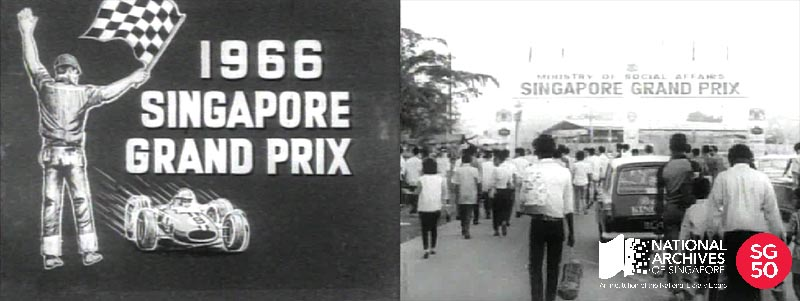

<iframe id="pxcelframe" src="//t.sharethis.com/a/t_.htm?ver=0.345.16984&amp;cid=c010#rnd=1577950625489&amp;cid=c010&amp;dmn=www.nas.gov.sg&amp;tt=t.dhj&amp;dhjLcy=59&amp;lbl=pxcel&amp;flbl=pxcel&amp;ll=d&amp;ver=0.345.16984&amp;ell=d&amp;cck=__stid&amp;pn=%2Fblogs%2Farchivistpick%2Fsingapore-grand-prix%2F&amp;qs=na&amp;rdn=www.nas.gov.sg&amp;rpn=%2Fblogs%2Farchivistpick%2F&amp;rqs=na&amp;cc=SG&amp;cont=AS&amp;ipaddr=" style="display: none;"></iframe>

# BERITA SINGAPURA: SINGAPORE GRAND PRIX, 1966

Ministry of Culture Collection, National Archives of Singapore. To watch a clip from the event, click [ here ](http://www.nas.gov.sg/archivesonline/audiovisual_records/record-details/457cf916-1164-11e3-83d5-0050568939ad).

Long before the glitzy Formula 1 Singapore Grand Prix night race in the heart of town, there was the Singapore Grand Prix that was first held on 17 September  1961. It was also a street circuit and was at Upper Thomson Road-Old Upper Thomson Road and was sponsored by the Ministry of Culture. It was called the Malaysian Grand Prix from 1962 – 1965 but reverted to Singapore Grand Prix by 1966 after independence.

The 1966 race was organized at a cost of about $166,000. The race was sponsored by the Ministry of Social Affairs and donations were received from companies such as Omega, the official timekeeper of the race, and Rothmans. The Singapore Grand Prix was also given official recognition by the Federation of International Automobiles (FIA) which meant that all FIA-registered drivers were allowed to take part. The event was [graced by Singapore’s first President Encik Yusof Ishak and First Lady, Puan Noor Aishah](http://www.nas.gov.sg/archivesonline/photographs/record-details/5a672f8a-1162-11e3-83d5-0050568939ad).

At the time the Singapore Grand Prix consisted of a mix of vintage car, sports car and motorcycle races. The main winner of the 1966 Singapore Grand Prix was a Singaporean, [Lee Han Seng](http://www.nas.gov.sg/archivesonline/photographs/record-details/c63a9b2f-1161-11e3-83d5-0050568939ad) who emerged victorious despite the presence of leading professional drivers like Australia’s Greg Cusack and Hong Kong’s Albert Poon. Lee received an Omega Challenge Trophy and a $5,000 cash prize. Approximately $30,670 worth of cash prizes and 51 trophies were given out throughout the three-day event.

The Singapore Grand Prix went through 7 more editions before the [last race in 1973](http://www.nas.gov.sg/archivesonline/photographs/record-details/5bbfa45c-1162-11e3-83d5-0050568939ad). The cancellation was announced by the Singapore Sports Council in October 1973 and was said to be for safety reasons. Over the years, there had been fatalities – 4 drivers, 2 riders and a marshal. It was the premier motor-sports event in Southeast Asia in its day.

To watch a clip from the 1966 Singapore Grand Prix and view more details of the record, click [here](http://www.nas.gov.sg/archivesonline/audiovisual_records/record-details/457cf916-1164-11e3-83d5-0050568939ad).