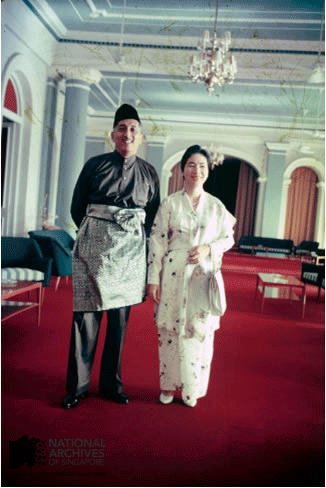
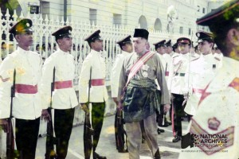
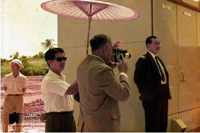

# The Inche Yusof Ishak Collection

Grace Ho 4 years ago 2 min. read

*Portrait photograph of President Yusof Ishak, late 1960s Yusof Ishak collection, courtesy of NAS Ref: 20060001779 – 0030*

Inche Yusof bin Ishak was the first President of the Republic of Singapore and between 1965 and 1970 headed the nation during its tumultuous early history. His widow, Puan Noor Aishah Bte Md Salim donated an valuable collection of photographs belonging to the late President to the National Archives of Singapore in 2008, and was honored as a patron of heritage by the National Heritage Board.

A distinguished journalist who founded the Utusan Melayu in 1939, Inche Yusof bin Ishak (1910 -1970) became Chairman of the Public Service Commission of Singapore in 1959 at the invitation of Mr Lee Kuan Yew, then Prime Minister. After the PAP won the 1959 election and Singapore achieved self-government, he was appointed the Yang di-Pertuan Negara of Singapore, or Head of State, and when Singapore gained independence on 9 August 1965, he became the first President of the Republic of Singapore.

Inche Yusof bin Ishak was President during one of the most tumultuous periods in Singapore’s history, when the young Singapore nation struggled for economic survival and was divided by racial conflicts. Yusof bin Ishak contributed significantly to containing the latter challenge by steadfastly promoting multi-racialism in Singapore. He made special efforts to interact with people of all races to help restore trust and confidence among the different ethnic groups during the 1964 race riots. His appointment as President also convinced Singaporeans of different races that citizenship did not depend on their ethnicity, but on their contributions to their shared homeland and their merit as individuals. President Ishak passed away in November 1970 and was buried at the Kranji State Cemetary.

### Why is this Collection Valuable?

Close to 9,000 photographs belonging to Inche Yusof bin Ishak were donated to the National Archives of Singapore by his spouse Puan Noor Aisha.  The photo provide invaluable personal information about Yusof bin Ishak’s life and reveal some of his personal interests and aesthetic tastes. They tell us about the places President Ishak visited and the people he met. More broadly they document the development of Singapore and the life of its people in the 1950s and 1960s. They are thus of great potential use to future biographers of and to historians of Singapore’s development and society in general.

### Collection Highlights

\1. Photograph of Yang di-Pertuan Yusof bin Ishak and his wife Puan Noor Aishah at the Istana, early 1960s. The Yusof Ishak collection includes rare high quality colour photographs of President Yusof Ishak from as early as 1957.

*Source: Yusof Ishak Collection, Courtesy of National Archives of Singapore Ref: 20060001795 – 0002*

\2. Yang di-Pertuan Negara Yusof Ishak inspecting the guard of honor at the opening of the Legislative Assembly, November 1963.

*Source: Yusof Ishak Collection, Courtesy of National Archives of Singapore Ref: 20060001795 – 0092*

\3. This picture was taken during a visit by President Yusof Ishak to the Jurong Industrial Estate in the 1960s, and reflects the President’s avid interest in photography.

*Source: Yusof Ishak Collection, Courtesy of National Archives of Singapore Ref: 20060001790 – 0039*

\4. Pictures that were personally taken by President Yusof Ishak during his pilgrimage to Mecca in 1963. The Yusof Ishak collection contains many photographs that the President shot himself.

*Source: Courtesy of Yusof Ishak Collection, Courtesy of National Archives of Singapore Ref: 20060001785 – 0015*

Check out the rest of the collection [here](http://www.nas.gov.sg/archivesonline/photographs/source-details/638)!