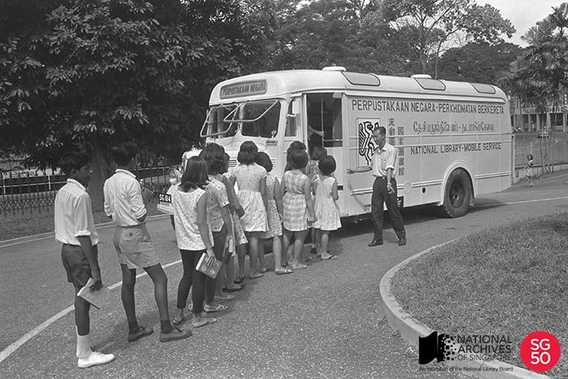

<iframe id="pxcelframe" src="//t.sharethis.com/a/t_.htm?ver=0.345.16984&amp;cid=c010#rnd=1577950561211&amp;cid=c010&amp;dmn=www.nas.gov.sg&amp;tt=t.dhj&amp;dhjLcy=209&amp;lbl=pxcel&amp;flbl=pxcel&amp;ll=d&amp;ver=0.345.16984&amp;ell=d&amp;cck=__stid&amp;pn=%2Fblogs%2Farchivistpick%2Fmobile-library%2F&amp;qs=na&amp;rdn=www.nas.gov.sg&amp;rpn=%2Fblogs%2Farchivistpick%2F&amp;rqs=na&amp;cc=SG&amp;cont=AS&amp;ipaddr=" style="display: none;"></iframe>

# MOBILE LIBRARY, 1965

Ministry of Information and the Arts Collection, National Archives of Singapore

A Mobile Library Service was first introduced by the National Library in September 1960 to expand its outreach, particularly to rural areas. The service was administered by the Library Extension Section which was originally situated at the basement of the National Library building at Stamford Road, before moving to the Toa Payoh Branch Library.

A modified van and two trailers were used to deliver the service and it was run by a librarian, library clerk and a driver. For many in the rural areas, it was the first time that they ever had easy access to books. Initially, library goers would enter the van to browse and borrow books. However, [as shared by Mrs Hedwig Anuar](http://www.nas.gov.sg/archivesonline/oral_history_interviews/record-details/393e0000-1160-11e3-83d5-0050568939ad?keywords=Hedwig Anuar mobile library&keywords-type=all), director of the National Library for nearly 30 years before retiring in 1988, the van was soon not able to accommodate the large number of readers and mobile library service points had to be set up at community centres across the island. By 1969, there were 12 service points namely at Tanjong Pagar, Pasir Panjang, Yishun, Bukit Panjang, Chong Pang, Kaki Bukit, Kampong Tengah, Bukit Timah, Changi, Paya Lebar, Kampong Cheng San and Taman Jurong.

The community centres provided shelves for temporary book displays and the mobile library team would set up a counter to record loans and returns. The team visited the community centres on a specific day and time according to a roster and each visit lasted between two to three hours. At the end of each day, the books would be packed up and returned to the National Library building which was equipped with parking bays and packing rooms for the mobile libraries.

Ministry of Information and the Arts Collection, National Archives of Singapore

With the construction of more public libraries around Singapore, such mobile library services were gradually phased out and the last few service points were closed in 1991.

To view more details of the first image and other records, click [here](http://www.nas.gov.sg/archivesonline/photographs/record-details/c3e05914-1161-11e3-83d5-0050568939ad). To watch a video clip of the mobile library service and other public services, click [here](http://www.nas.gov.sg/archivesonline/audiovisual_records/record-details/457a5f1f-1164-11e3-83d5-0050568939ad).