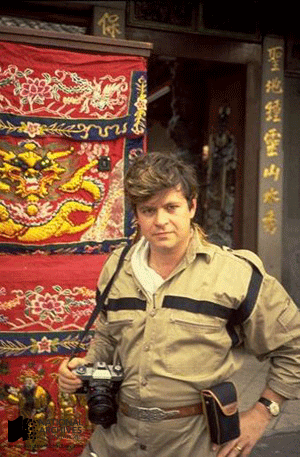
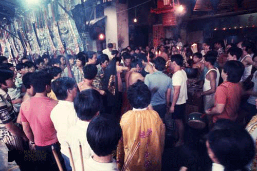
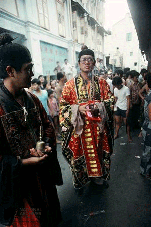
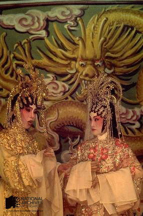
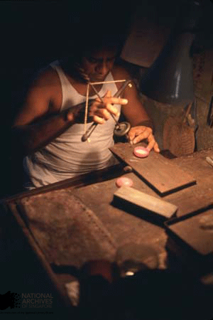
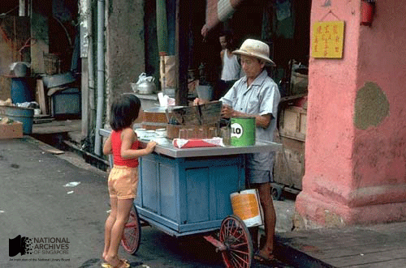
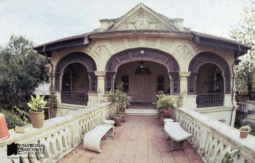
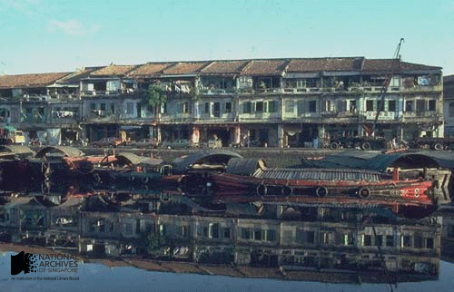
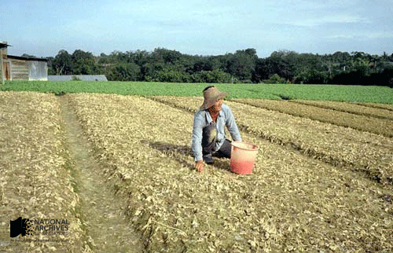

# The Ronni Pinsler Collection

Grace Ho 4 years ago 4 min. read

Mr Ronni Pinsler is an independent photographer who has made invaluable contributions to Singapore heritage by documenting the nation’s changing landscape between the 1970s and 1990s. He is best known for his extraordinary efforts recording the multifaceted practices of local Taoism and has captured many valuable images of Singapore, focusing on vanishing local street scenes and people portraits. He received the prestigious Supporter of Heritage award from the National Heritage Board in April 2010 in honour of his generous permanent loan of a comprehensive collection of his work to the National Archives of Singapore.

*Mr Ronni Pinsler at the Thian Hock Kheng Temple at Telok Ayer Street, 1980* *Source: Ronni Pinsler Collection, Courtesy of National Archives of Singapore Ref: 19990007471 – 056*

Mr Pinsler is best known for his extraordinary efforts in recording the multifaceted Taoist religion of Singapore and Malaysia, with its pantheon of deities and myriad rituals. He has also devoted much effort in capturing other striking images of Singapore society and landscape from the 1970s and 1980s, much of which has since vanished, like , from changing street scenes, vanishing trades, to Chinese funeral rites, traditional Chinese Opera and other cultural practices.

Mr Pinsler’s interest in Singapore’s culture began in the early 1970s, when he began exploring the streets of Singapore, befriending local people from all walks of life- shopkeepers, hawkers, Chinese opera actors, secret society members, and Taoist temple priests, to discover more about their everyday lives. This interaction led him to take a special interest in Taoist practices. He sought and gained access to various local Taoist temples, whose officials allowed him to document their customs, and he was eventually invited to sit on the committees of several of these temples like the then Leng Hiang Twa Temple at Clarke Quay. Today, he is respected as an authority on Taoist practices and for his insights into the local culture of Singapore in the 1970s and 1980s. His photography was showcased in An Illustrated Cycle of Chinese Festivals in Malaysia and Singapore a book written by CS Wong and published by Jack Chia-MPH in 1987

Of particular importance is Mr Pinsler’s extensive photography on Taoist rituals and deities. Many Taoist rites have been captured step by step in his work, allowing them to be seen in sequence. Mr Pinsler’s annotations in which he names many of the deities in the extensive Taoist pantheon are a great value-add to his images.

*Mr Ronni Pinsler (right) posing in a photograph backstage with a Chinese Opera performer, 1979 Source: Ronni Pinsler Collection, Courtesy of National Archives of Singapore Ref: 19990007487 – 0018*

The National Archives of Singapore (NAS) extends its warmest thanks and congratulations to Mr Ronni Pinsler who was honoured as a Supporter of Heritage at the National Heritage Board’s prestigious Patron of Heritage Awards, held on 23 April 2010 at the Asian Civilisations Museum. Over 15,000 images personally taken by Mr Pinsler have been entrusted with NAS on permanent loan. 30 of Mr Pinsler’s self-made films have also been deposited with NAS.

## **Collection Highlights:**

\1. The collection contains many images of Taoist priests and devotees engaged in religious rites and prayers, as well as figurines of Taoist deities, with accompanying captions giving their names.

*This picture captures devotees at the entrance of the former Leng Hiang Twa Temple at Clarke Quay during a religious festival, 1976. Source: Ronni Pinsler Collection, Courtesy of National Archives of Singapore Ref: 19990008747 – 0032*

*This picture shows Taoist priests officiating at a public rite at Hokkien Street in the 1970s. Source: Ronni Pinsler Collection, Courtesy of National Archives of Singapore Ref: 19990008736 – 0001*

\2. The collection also contains many valuable photographs of Chinese opera actors in Singapore both onstage and backstage. The photos below show a pair of Chinese opera actors in elaborate costumes (1978), and an actor backstage applying his makeup and his traditional makeup kit (1979).

*Source: Ronni Pinsler Collection, Courtesy of National Archives of Singapore Ref: 19990007483 – 0062*

*Source: Ronni Pinsler Collection, Courtesy of National Archives of Singapore Ref: 19990007488 – 0091*

\3. Other vanishing trades are also captured by Mr Pinsler, for instance, the images below of a traditional Indian goldsmith (top) and a roadside soy bean vendor (bottom) from the late 1970s.

*Source: Ronni Pinsler Collection, Courtesy of National Archives of Singapore Ref: 19990007465 – 098*

*Source: Ronni Pinsler Collection, Courtesy of National Archives of Singapore Ref: 19990007085 – 006*

 \4. The collection also includes valuable photos of old street and rural scenes that have vanished from Singapore. The first photo below shows a colonial-era house at Wilkie Road (1977). The centre photo shows shop houses along the Singapore River (1977). The last shows a farmer at work in Chua Chu Kang. (1978).

Source: Ronni Pinsler Collection, Courtesy of National Archives of Singapore Ref:[ 19990007462 – 082](http://www.nas.gov.sg/archivesonline/photographs/record-details/8625ad12-1162-11e3-83d5-0050568939ad)

Source: Ronni Pinsler Collection, Courtesy of National Archives of Singapore Ref: [19990007095 – 036](http://www.nas.gov.sg/archivesonline/photographs/record-details/859f6750-1162-11e3-83d5-0050568939ad)

Source: Ronni Pinsler Collection, Courtesy of National Archives of Singapore Ref:[19990007464 – 048](http://www.nas.gov.sg/archivesonline/photographs/record-details/86551ef8-1162-11e3-83d5-0050568939ad)