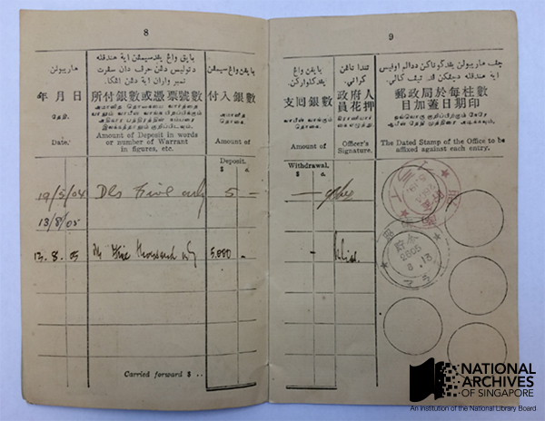
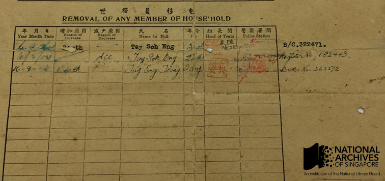

# Personal records of war and Occupation

Fiona Tan 4 years ago 4 min. read

In conjunction with the upcoming revamp of Memories at Old Ford Factory, which houses an exhibition gallery examining life under the Japanese Occupation, the National Archives of Singapore (NAS) is conducting a public call for archives. This post takes a look at a selection of our private records from the Japanese Occupation period.

> **[T]he Japanese Occupation lacked documentation***…*Thus in 1981, we embarked on a project to collect oral recordings and to look for documents, photographs and all kinds of paraphernalia related to the war and the occupation…We appeal to all Singaporeans to come forward if they have stories to tell, photographs, documents or articles to add to our collection.
>
> *– Mrs Lily Tan (Director, National Archives of Singapore from 1978-2001), in 1985*

When then Director of National Archives of Singapore made this comment in a foreword to a publication on the Japanese Occupation back in 1985[[1\]](http://www.nas.gov.sg/blogs/offtherecord/personal-records-of-war-and-occupation/#_ftn1), she might not have expected that the materials collected subsequently would become the basis for many subsequent publications and exhibitions on the topic.

Three decades later, in preparation for the upcoming revamp of the Memories at Old Ford Factory, we have been systematically going through boxes of such materials collected since the 1980s. From these personal records, we have gleaned interesting information about the historical and social context in which people lived. This is what makes these private records such a historically significant collection as they help us understand our past through the diverse experiences as reflected by these records.

## **Of things to come**

In 1941, it was compulsory for all non-military residents of Singapore to carry identity cards under the Defence (Security Registration) Regulations. This was to ensure that the British Administration was able to screen the population and such cards were among the first ominous signs of the looming war.

Identity Card (Population Census). *Acc Number 20/1992. Microfilm No.: NA 1835. A. J. Tyler collection, courtesy of NAS.*

 

## **On Inflation**

By 1944 and 1945, Malaya experienced massive inflation due to the combination of the collapse of the export industry, the lack of revenue-generating economic activities and the Japanese administration’s policy of issuing currency notes to meet expenses.[[2\]](http://www.nas.gov.sg/blogs/offtherecord/personal-records-of-war-and-occupation/#_ftn2) From depositing five dollars in 19 May 1944 to five thousand dollars in 13 August 1945; this Syonan Post Office Passbook belonging to Mr Lee Hiok Khuang reveals the extent of inflation and the drop in value of the Japanese currency during this period. In many oral histories, stories are told of how the Japanese currency became valueless and people had to shop with bags of notes.  An egg could cost as much as $100 and a used towel could be sold for $300.[[3\]](http://www.nas.gov.sg/blogs/offtherecord/personal-records-of-war-and-occupation/#_ftn3)

Syonan Post Office Savings Bank passbook. *Acc No.: 25 / 1992. Microfilm No.: NA 1834. Lee Siew Hong collection, courtesy of NAS.*

## **Of births and deaths**

Harsh living conditions and serious shortages of basic food items were among the reasons why the death rate in 1945 was double that of the pre-war period.[[4\]](http://www.nas.gov.sg/blogs/offtherecord/personal-records-of-war-and-occupation/#_ftn4) Census-taking lists, like the one shown below, reflected these difficult living conditions. These documents were also a record of a new system introduced by the Japanese administrators to keep track of the population under their control, as each household had to register their family members with the administration. Changes to the household composition were registered and recorded. Despite the mundane nature of such administrative documents, upon closer examination, some of them reveal heartwrenching stories. This particular one of the family of Mr Tay Yew Hoon shows how Tay Soh Eng, was born (“Birth” under “Reason of increase”) on 4 September 1943 and but by the next census check on 6 May 1944, had been recorded as a decrease (“die” under “Reason of Decrease”). She was only two months old.

Census-Taking List. *Acc No.: 20/2. Microfilm No.: NA 1135. Tay Yen Hoon collection, courtesy of NAS.*

 

# **Public Call for Archives**

Do you or your family have items which reflect such personal experiences of life under the Japanese Occupation? Would you like to ensure such archival materials are well-preserved and documented for the sake of posterity and so future researchers have a chance of drawing out relatable narratives from these personal threads? The National Archives of Singapore is organising a public call for archives on 12 March, 10am to 4pm, at Level 10 of the National Library Building, where we will be collecting such materials. More details can be found here:

We look forward to seeing you there!

------

[[1\]](http://www.nas.gov.sg/blogs/offtherecord/personal-records-of-war-and-occupation/#_ftnref1) *The Japanese Occupation: Singapore, 1942–1945* (Singapore: Archives & Oral History Department, 1985)

[[2\]](http://www.nas.gov.sg/blogs/offtherecord/personal-records-of-war-and-occupation/#_ftnref2) Paul Kratoska, *The Japanese Occupation of Malaya* (London: Hurst & Company, 1998), pp. 212-213.

[[3\]](http://www.nas.gov.sg/blogs/offtherecord/personal-records-of-war-and-occupation/#_ftnref3) Lee Geok Boi, *The Syonan Years: Singapore under Japanese Rule, 1942 – 1945* (Singapore: National Archives of Singapore and Epigram, 2005), p. 149.

[[4\]](http://www.nas.gov.sg/blogs/offtherecord/personal-records-of-war-and-occupation/#_ftnref4) *Colony of Singapore Annual Report, 1946* (Singapore: Government Printing Office, 1947), p. 36.