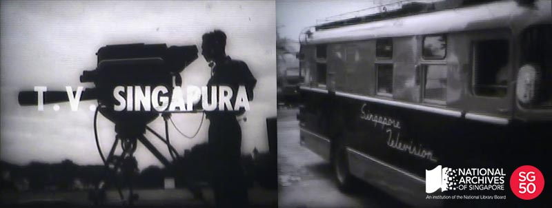

<iframe id="pxcelframe" src="//t.sharethis.com/a/t_.htm?ver=0.345.16984&amp;cid=c010#rnd=1577950394434&amp;cid=c010&amp;dmn=www.nas.gov.sg&amp;tt=t.dhj&amp;dhjLcy=124&amp;lbl=pxcel&amp;flbl=pxcel&amp;ll=d&amp;ver=0.345.16984&amp;ell=d&amp;cck=__stid&amp;pn=%2Fblogs%2Farchivistpick%2Ftelevision-singapura%2F&amp;qs=na&amp;rdn=www.nas.gov.sg&amp;rpn=%2Fblogs%2Farchivistpick%2F&amp;rqs=na&amp;cc=SG&amp;cont=AS&amp;ipaddr=" style="display: none;"></iframe>

# BERITA SINGAPURA: LAUNCH OF TELEVISION SINGAPURA, 1960s

Ministry of Culture Collection, National Archives of Singapore. To watch the video clip, select ‘Television Singapore’ from the options available [ here ](http://www.nas.gov.sg/archivesonline/audiovisual_records/record-details/58f29c96-1164-11e3-83d5-0050568939ad).

Feasibility studies and test transmissions were carried out as early as 1956 to prepare for the introduction of television broadcasting in Singapore. On 15 February 1963, Singapore’s first television station, Television Singapura was [launched at the Victoria Memorial Hall](http://www.nas.gov.sg/archivesonline/photographs/record-details/bb3807d8-1161-11e3-83d5-0050568939ad). 300 guests were invited to watch the monochrome pilot broadcast service, that lasted for 1 hour and 40 minutes, on 17 television sets placed around the hall. [More television sets](http://www.nas.gov.sg/archivesonline/photographs/record-details/bb1948bc-1161-11e3-83d5-0050568939ad) were also placed [outside the hall](http://www.nas.gov.sg/archivesonline/photographs/record-details/bb195aaf-1161-11e3-83d5-0050568939ad), along Queen Elizabeth Walk, and at community centres where thousands gathered to watch this momentous occasion.

The [first person to appear on screen was Minister for Culture, Mr S. Rajaratnam](http://www.nas.gov.sg/archivesonline/photographs/record-details/296589f9-1162-11e3-83d5-0050568939ad). Immediately after his speech, a documentary entitled *TV looks at Singapore* was aired, followed by 10 minutes of cartoon featuring popular animated characters Heckle and Jeckle, a five minutes newsreel, a comedy show starring English comedian Tony Hancock, and a variety show *Rampaian Malaysia* (translated as “Malaysia Mixture” in a Straits Times article dated 14 February 1963).

[On 2 April 1963](http://www.nas.gov.sg/archivesonline/photographs/record-details/c2011e57-43c7-11e4-859c-0050568939ad), the [Yang Di-Pertuan Negara, Encik Yusof Ishak](http://www.nas.gov.sg/archivesonline/photographs/record-details/bb39ed42-43c7-11e4-859c-0050568939ad) inaugurated Television Singapura’s regular service, which consisted of a daily four-hour transmission on Channel 5, from 7:15pm to 11:15pm. A second channel, Channel 8, was introduced in November 1963.

After Singapore’s separation from Malaysia in August 1965, Television Singapura merged with Radio Singapura to form Radio and Television Singapore (RTS).

To watch a clip on the launch and view more details of the record, select **‘Television Singapore’** from the options available [here](http://www.nas.gov.sg/archivesonline/audiovisual_records/record-details/58f29c96-1164-11e3-83d5-0050568939ad).