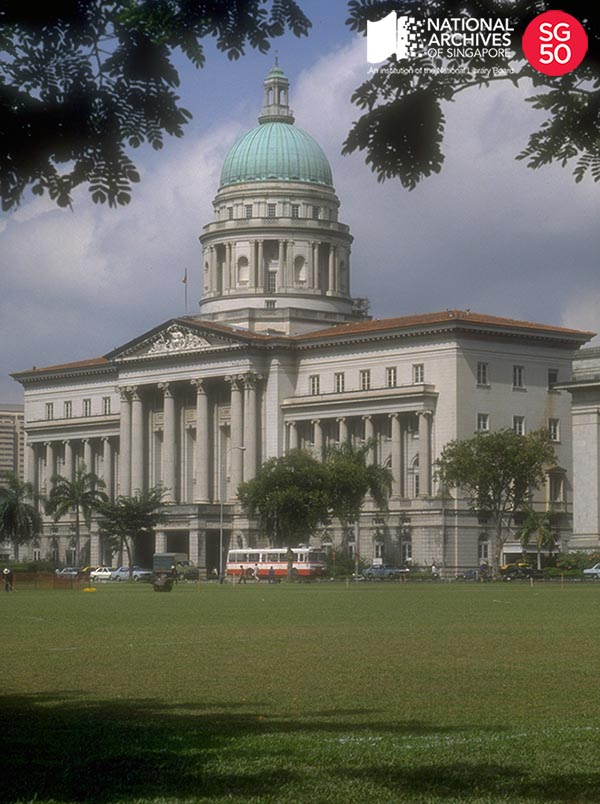

<iframe id="pxcelframe" src="//t.sharethis.com/a/t_.htm?ver=0.345.16984&amp;cid=c010#rnd=1577950317015&amp;cid=c010&amp;dmn=www.nas.gov.sg&amp;tt=t.dhj&amp;dhjLcy=58&amp;lbl=pxcel&amp;flbl=pxcel&amp;ll=d&amp;ver=0.345.16984&amp;ell=d&amp;cck=__stid&amp;pn=%2Fblogs%2Farchivistpick%2Fsupreme-court%2F&amp;qs=na&amp;rdn=www.nas.gov.sg&amp;rpn=%2Fblogs%2Farchivistpick%2F&amp;rqs=na&amp;cc=SG&amp;cont=AS&amp;ipaddr=" style="display: none;"></iframe>

# FORMER SUPREME COURT BUILDING, 1984

Ministry of Information and the Arts Collection, National Archives of Singapore

Colonial houses once stood on the site of the Former Supreme Court building. The houses later made way for the [Grand Hotel de l’Europe](http://www.nas.gov.sg/archivesonline/photographs/record-details/d38817c4-1161-11e3-83d5-0050568939ad), which was said to be one of the most palatial hotels in the region at the time, comparable to the [Raffles Hotel](http://www.nas.gov.sg/archivesonline/photographs/record-details/ae2598ab-1161-11e3-83d5-0050568939ad). However in 1932, poor business caused the hotel to shut down. It was eventually demolished to make way for the Former Supreme Court building.

The Former Supreme Court building was opened on 3 August 1939 by Governor Sir Shenton Thomas. It cost 1.75 million Straits dollars to build and was designed by the Public Works Department chief architect, Frank Dorrington Ward. Construction by United Engineers Limited took approximately three and a half years and it was to be the last colonial classical building. The building’s most notable features; the Ionic and [Corinthian columns](http://www.nas.gov.sg/archivesonline/photographs/record-details/8a2c4c28-1162-11e3-83d5-0050568939ad) and the 14-ton frieze of the [allegory of justice](http://www.nas.gov.sg/archivesonline/photographs/record-details/5e07648b-1162-11e3-83d5-0050568939ad) was produced by  Milan-born sculptor, [Rodolfo Nolli](http://www.nas.gov.sg/archivesonline/photographs/record-details/ae9c9a94-1161-11e3-83d5-0050568939ad) in his workshop at 47 Scotts Road.

Gazetted as a national monument in 1992, the building was vacated in 2005 when the Supreme Court moved to its new premises along Supreme Court Lane. In early 2011, a ground-breaking ceremony was held to mark the start of refurbishment works together with the adjacent City Hall building. The two buildings will re-open on 24 November 2015 as the National Gallery Singapore.

To view more details of this image and other records, click [here](http://www.nas.gov.sg/archivesonline/photographs/record-details/ed8225d7-1161-11e3-83d5-0050568939ad).

