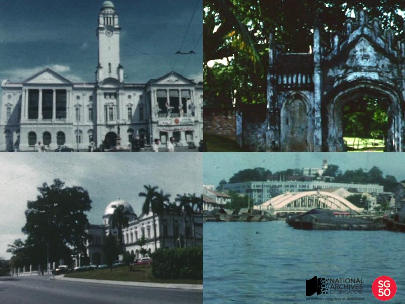

<iframe id="pxcelframe" src="//t.sharethis.com/a/t_.htm?ver=0.345.16984&amp;cid=c010#rnd=1577950194479&amp;cid=c010&amp;dmn=www.nas.gov.sg&amp;tt=t.dhj&amp;dhjLcy=79&amp;lbl=pxcel&amp;flbl=pxcel&amp;ll=d&amp;ver=0.345.16984&amp;ell=d&amp;cck=__stid&amp;pn=%2Fblogs%2Farchivistpick%2Fstreet-scenes%2F&amp;qs=na&amp;rdn=www.nas.gov.sg&amp;rpn=%2Fblogs%2Farchivistpick%2F&amp;rqs=na&amp;cc=SG&amp;cont=AS&amp;ipaddr=" style="display: none;"></iframe>

# VIDEO OF SINGAPORE STREET SCENES, 1960

John Christianse Collection, National Archives of Singapore. To watch the video clip, click [ here ](http://www.nas.gov.sg/archivesonline/audiovisual_records/record-details/5b00d128-1164-11e3-83d5-0050568939ad).

This is a silent home video of Singapore street scenes which was filmed in 1960 by Mr John Christianse before he returned to the Netherlands. It features a list of local landmarks that can still be seen today though some of them have since been demolished.

Urban renewal was one of the main priorities in post-independence Singapore. To meet the new nation’s housing, infrastructure and economic needs, a Master Plan was formulated in 1958, and a Concept Plan in 1971, to ensure optimal use of Singapore’s limited land resources. As a result colonial buildings, shop houses, private residences, and villages made way for public housing flats, factories and expressways.

Fortunately, preservation and conservation programmes have been put in place to ensure that historically significant buildings and areas are protected. The enactment of the Preservation of Monuments Act and the formation of the Preservation of Monuments Board (now known as the Preservation of Sites & Monuments) in January 1971 has since identified and preserved 70 national monuments. The Urban Redevelopment Authority (URA), Singapore’s land use planning and conservation authority, was set up in 1974.  In 1986, URA unveiled its Conservation Master Plan for the city’s historic areas. To date, URA has conserved over 7,000 buildings in more than 100 areas.

To celebrate Singapore’s 50 years of independence and further commemorate some of these iconic historical sites, the [Jubilee Walk](http://www.nhb.gov.sg/places/trails/jubilee-walk/jubilee-walk) will be launched on 29 November 2015. This eight-kilometre trail will start from the National Museum of Singapore and end at the Marina Barrage.

To watch the silent home video and view more details of the record, click [here](http://www.nas.gov.sg/archivesonline/audiovisual_records/record-details/5b00d128-1164-11e3-83d5-0050568939ad).