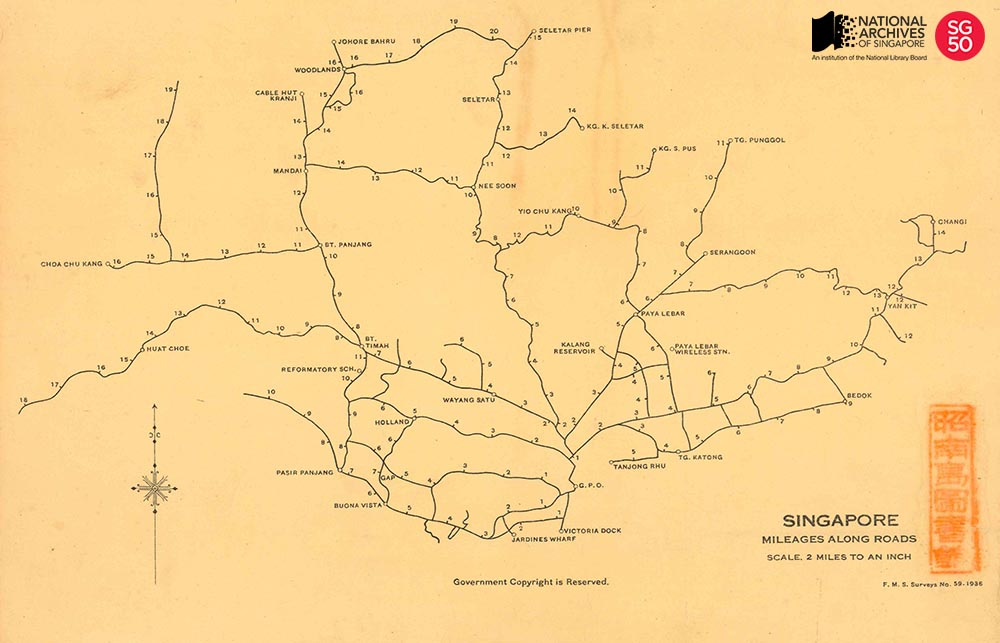

<iframe id="pxcelframe" src="//t.sharethis.com/a/t_.htm?ver=0.345.16984&amp;cid=c010#rnd=1577949980158&amp;cid=c010&amp;dmn=www.nas.gov.sg&amp;tt=t.dhj&amp;dhjLcy=53&amp;lbl=pxcel&amp;flbl=pxcel&amp;ll=d&amp;ver=0.345.16984&amp;ell=d&amp;cck=__stid&amp;pn=%2Fblogs%2Farchivistpick%2Fmileages%2F&amp;qs=na&amp;rdn=www.nas.gov.sg&amp;rpn=%2Fblogs%2Farchivistpick%2F&amp;rqs=na&amp;cc=SG&amp;cont=AS&amp;ipaddr=" style="display: none;"></iframe>

# SINGAPORE, MILEAGES ALONG ROADS, 1936

Survey Department Collection, National Archives of Singapore

This map was published by the Straits Settlements and Federated Malay States Survey department in 1936. It measured the distance of key landmarks and districts across Singapore’s main roads, taking the [General Post Office at the Fullerton Building](http://www.nas.gov.sg/archivesonline/photographs/record-details/444e3d7f-1162-11e3-83d5-0050568939ad) at [Empress Place](http://www.nas.gov.sg/archivesonline/photographs/record-details/ae968e85-1161-11e3-83d5-0050568939ad) as its ‘zero-point’.

The points indicated on the map were physically represented by actual milestones, which were installed by the colonial government. These were widely used by both the government and public as reliable markers of location at a time where there was an absence of prominent landmarks or regularised system of addresses, particularly in the rural areas. [Postmen](http://www.nas.gov.sg/archivesonline/photographs/record-details/b8a2c768-1161-11e3-83d5-0050568939ad) for example, would deliver mail with reference to the milestones which had a function similar to modern postal codes. The milestones were also used by transportation providers like [bus drivers](http://www.nas.gov.sg/archivesonline/photographs/record-details/b55e2ffc-1162-11e3-83d5-0050568939ad) and [trishaw riders](http://www.nas.gov.sg/archivesonline/photographs/record-details/4695fe67-1162-11e3-83d5-0050568939ad); and commuters, to estimate fares.

As the use of milestones became widespread and entrenched, the milestone came to influence perceptions of space and language. People in Singapore and Malaya thought of distance in terms of milestones. It was common up to the 1960s for people to refer to places by milestone along a particular road, for example [7 Milestone Bukit Timah Road](http://www.nas.gov.sg/archivesonline/photographs/record-details/5b8e635e-1162-11e3-83d5-0050568939ad) or [5 ½ Milestone Changi Road](http://www.nas.gov.sg/archivesonline/photographs/record-details/b4a7219f-1161-11e3-83d5-0050568939ad). The widespread use of the milestones is believed to have resulted in the use of the word *batu* (meaning stone) to refer to miles in the Malay language.

The construction of the [General Post Office](http://www.nas.gov.sg/archivesonline/photographs/record-details/d31e5208-1161-11e3-83d5-0050568939ad) was completed in 1928. Now known as [The Fullerton Hotel](http://www.nas.gov.sg/archivesonline/photographs/record-details/8418b27e-1162-11e3-83d5-0050568939ad), the building was officially gazetted as Singapore’s 71st national monument by the National Heritage Board on 7 December 2015.

To view more details of this image and other records, click [here](http://www.nas.gov.sg/archivesonline/maps_building_plans/record-details/f90855b8-115c-11e3-83d5-0050568939ad).