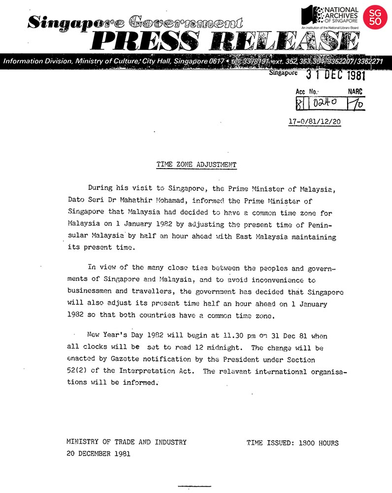

<iframe id="pxcelframe" src="//t.sharethis.com/a/t_.htm?ver=0.345.16984&amp;cid=c010#rnd=1577949898478&amp;cid=c010&amp;dmn=www.nas.gov.sg&amp;tt=t.dhj&amp;dhjLcy=61&amp;lbl=pxcel&amp;flbl=pxcel&amp;ll=d&amp;ver=0.345.16984&amp;ell=d&amp;cck=__stid&amp;pn=%2Fblogs%2Farchivistpick%2Ftime-zone-adjustment%2F&amp;qs=na&amp;rdn=www.nas.gov.sg&amp;rpn=%2Fblogs%2Farchivistpick%2F&amp;rqs=na&amp;cc=SG&amp;cont=AS&amp;ipaddr=" style="display: none;"></iframe>

# PRESS RELEASE ON TIME ZONE ADJUSTMENT, 1981

​                                           Ministry of Culture Collection, National Archives of Singapore

At the International Meridian Conference in 1884, the world was divided into 24 standard time zones and Singapore came to be seven hours ahead of the Greenwich Mean Time (GMT). When the daylight saving feature was instituted here in 1941, Singapore went seven and a half hours ahead of GMT. Time had to be adjusted again during the Japanese Occupation with the introduction of Tokyo time and Singapore became nine hours ahead of GMT. After the war, Singapore went back to the pre-war GMT plus seven and a half hours, making it one of the few places with the odd half or quarter hour in its time difference with the rest of the world.

The Malaysian Government announced in December 1981 that it would adjust Peninsular Malaysia’s time by 30 minutes on 1 January 1982 in order to keep common time with East Malaysia. In view of Singapore’s close relations with Malaysia and also to prevent confusion for travellers and businessmen, the Singapore Government made a very quick decision to follow suit. The change placed Singapore eight hours ahead of GMT. The decision was generally welcomed by most Singaporeans, especially the business community.

On 31 December 1981, Singapore celebrated New Year’s Day half an hour earlier at 11.30pm, when all clocks were set forward to 12 midnight.

To view more details of this press release and other records, click [here](http://www.nas.gov.sg/archivesonline/speeches/record-details/7b34212e-115d-11e3-83d5-0050568939ad).