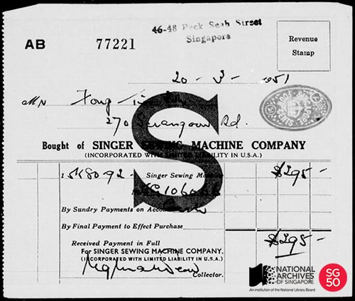
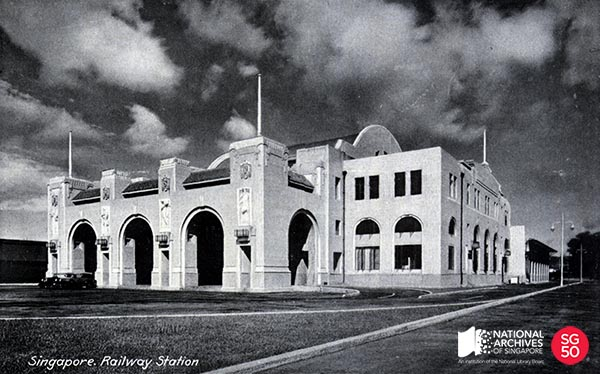
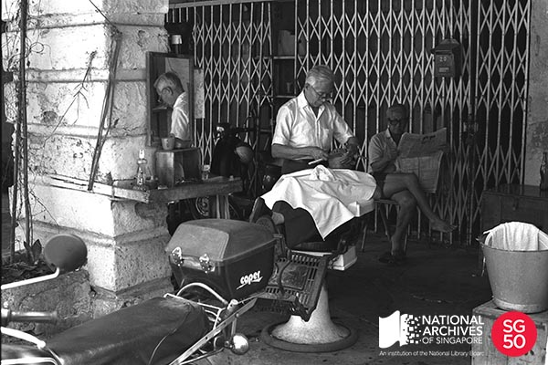
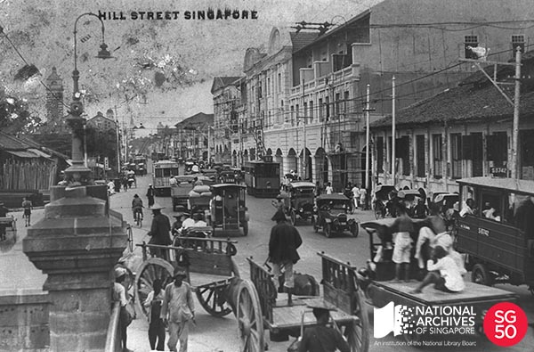

<iframe id="pxcelframe" src="//t.sharethis.com/a/t_.htm?ver=0.345.16984&amp;cid=c010#rnd=1577947335884&amp;cid=c010&amp;dmn=www.nas.gov.sg&amp;tt=t.dhj&amp;dhjLcy=139&amp;lbl=pxcel&amp;flbl=pxcel&amp;ll=d&amp;ver=0.345.16984&amp;ell=d&amp;cck=__stid&amp;pn=%2Fblogs%2Farchivistpick%2Flittle-red-dot%2F&amp;qs=na&amp;rdn=www.nas.gov.sg&amp;rpn=%2Fblogs%2Farchivistpick%2F&amp;rqs=na&amp;cc=SG&amp;cont=AS&amp;ipaddr=" style="display: none;"></iframe>

# LITTLE RED DOT, 2015

As Singapore celebrates its 50th National Day, the use of archives has reached record levels. An unprecedented number of books, exhibitions, film or television productions and other heritage projects on Singapore have been created and published using photographs, audio-visual recordings, oral history interviews, maps, posters and other materials from the National Archives of Singapore (NAS).

NAS has been a happy part of this creative output as Singaporeans have looked for the things that they remember, searched for things forgotten and made surprising new discoveries. Here at Archivist Pick of the Week, we have attempted to celebrate everyday things familiar to Singaporeans by highlighting some archival records in the past year.

Shortly before the start of 2015, NAS was approached to do something creative with a difference. [Supermama](http://www.supermama.sg/), an award-winning Singapore design label, proposed the exciting possibility of working with a collective of 50 designers, architects, artists and illustrators coming together in a single project. Their artwork would be presented within hand-crafted porcelain artefacts and the inspiration would be found in archives.

Courtesy of Supermama

We were delighted to agree to this artistic engagement – something totally new for NAS.  A set of 50 archival records, some of which you can view here, was selected by Supermama and they ranged from plans of national monuments to everyday things such as bus tickets and receipts for sewing machines. It was then intriguing to see the creative re-interpretations and imaginings as they started to come in. Some were anchored on shared collective memories we can all identify with, others on deep personal recollections; some took on serious tones while others were quirky and lively.

Tuck Sing Loong Laundry and Dry Cleaning Collection, National Archives of Singapore

This is a receipt from the purchase of a sewing machine from the Singer Sewing Machine Company in 1951.

Singapore Harbour Board Collection, National Archives of Singapore

This is a map of the Singapore Harbour in 1904 showing major buildings and street names. The proposed area for land reclamation beyond Raffles Quay is highlighted in the map.

National Archives of Singapore Collection, National Archives of Singapore

This is a view of the former Tanjong Pagar Railway Station at Keppel Road. It was officially opened by then Governor of Singapore, Sir Cecil Clementi on 2 May 1932.

National Archives of Singapore Collection, National Archives of Singapore

Street barbers started on the five-foot-way and roadsides before moving their businesses to shops and makeshift awnings. Apart from haircuts, the traditional street barbers also provide neck massages and ear cleaning services to their patrons.

Building Control Authority Collection, National Archives of Singapore

This is the building plan for the St Joseph’s Institution. Due to a lack of funds, the school was only completed 12 years later. It was opened in 1867.

Tay Swee Lan Collection, National Archives of Singapore

This is a ration card issued by the Rationing Office of the Food Control Department in 1947.

Paul Yap Collection, National Archives of Singapore

This is a view of Hill Street taken from Coleman Bridge circa 1920. The lookout tower of the Hill Street Fire Station, erected in 1909, can be seen in the background on the left.

Tay Swee Lan Collection, National Archives of Singapore

This is an official ticket to the 1961 State of Singapore National Day issued by the Director of Education.

We hope you have enjoyed reading these interesting facts and trivia about the records we have picked this past year, and that you will continue to explore our holdings through [Archives Online](http://www.nas.gov.sg/archivesonline/) for your own research and projects beyond SG50.