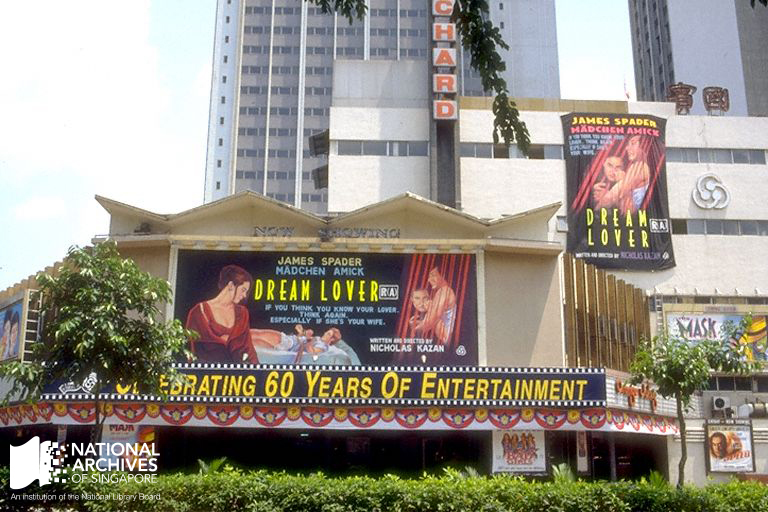

# Orchard Theatre

Fiona Tan 4 years ago 1 min. read

Orchard Theatre (pictured here in 1994) was the second cinema owned by Cathay but boasted several firsts. *Courtesy of NAS*. Ref: [19980007383 – 0113](http://www.nas.gov.sg/archivesonline/photographs/record-details/516f2a0b-1162-11e3-83d5-0050568939ad)

***This was published as part of a series of posts based on irememberOrchard, an exhibition organised by the National Archives of Singapore at library@Orchard from 23 October 2014 to 26 April 2015.***

Despite a fateful 1964 air crash in Taiwan leading to the deaths of Cathay Organisation’s chairman, its chief executive and one of its noted film directors and producers,[[1\]](http://www.nas.gov.sg/blogs/offtherecord/orchard-theatre/#_ftn2) Cathay continued strong and even opened a second cinema in the heart of Orchard Road. In 1965, Cathay Organisation opened the $6 million dollar Orchard Theatre, providing not only an enjoyable and modern cinematic experience to audiences, but also a bowling alley and an escalator, making it the first cinema in Malaya to have these amenities. [[2\]](http://www.nas.gov.sg/blogs/offtherecord/orchard-theatre/#_ftn3) Tan Wee Him, who spent his youth in the Orchard Road area, recalls what a novelty the escalator was:

> Yes, there was a theatre [in Orchard]. And if I’m not mistaken, either the first or the second bowling alley in Singapore, called Jackie’s Bowl at the ground level. Orchard Cinema was upstairs, Jackie’s Bowl was downstairs. Yeah I think that was the very first bowling alley in Singapore. And also the first escalator in Singapore. I remember on its opening day, a lot of people would, for no reason, just step onto this automated staircase, and go all the way up, and then walk to the other side and take the staircase down, and then walk up again…
>
> Oral history interview with Tan Wee Him, by Chew Hui Min, 9 June 2006, [003058/2](http://www.nas.gov.sg/archivesonline/oral_history_interviews/record-details/c5b8d5ce-1160-11e3-83d5-0050568939ad) [transcript available]

Orchard Theatre was home to Singapore’s first commercial bowling alley, meshing film-watching with other forms of leisure activities.

In 1997, Cathay upped the ante by launching Cineleisure on the site of the old Orchard Theatre. The new nine-storey $160 million entertainment centre consisted of a six-screen multiplex, retail outlets, a food court, a night entertainment spot, an indoor amusement theme park and a themed restaurant.[[3\]](http://www.nas.gov.sg/blogs/offtherecord/orchard-theatre/#_ftn4)

*This is a series of posts on Orchard Road, part of the NAS’ exhibition irememberOrchard, which was on display at library@Orchard from  23 October 2014 to 26 April 2015*

### References

[[1\]](http://www.nas.gov.sg/blogs/offtherecord/orchard-theatre/#_ftnref2) King cables ‘sincere condolences’, The Straits Times, 22 June 1964, Page 1

[[2\]](http://www.nas.gov.sg/blogs/offtherecord/orchard-theatre/#_ftnref3) Cathay organisation’s $6mil. entertainment centre opens, The Straits Times, 7 January 1965, Page 9

[[3\]](http://www.nas.gov.sg/blogs/offtherecord/orchard-theatre/#_ftnref4) Cathay to open $160m leisure centre by year-end, The Straits Times, 28 January 1997, Page 38

