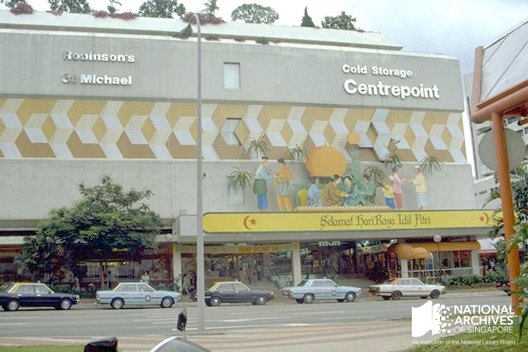
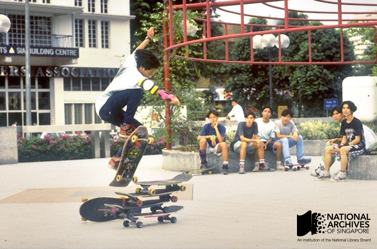

# Centrepoint Kids

Fiona Tan 4 years ago 1 min. read

Centrepoint, a shopping centre synonymous with youth culture of the 1980s. *Courtesy of NAS.* Ref: [19980006564 – 0081](http://www.nas.gov.sg/archivesonline/photographs/record-details/fafb6cce-1161-11e3-83d5-0050568939ad)

***This was published as part of a series of posts based on irememberOrchard, an exhibition organised by the National Archives of Singapore at library@Orchard from 23 October 2014 to 26 April 2015.***

Centrepoint, a shopping centre along Orchard Road, used to worry parents of angst-ridden teenagers, especially when its name was used in conjunction with ‘kids’. The terms ‘Centrepoint kids’, ‘Daimaru kids’, ‘Far East kids’ were bandied about in newspapers and television features during the mid-1980s, describing teenagers who turned up by the hundreds at these complexes, ‘sporting carnival colours and avant-garde hair-do[es].’
[[1\]](http://www.nas.gov.sg/blogs/offtherecord/centrepoint-kids/#_ftn1)  Shopkeepers in these malls did not appreciate their outlandish fashion sense, which frightened away potential customers. [[2\]](http://www.nas.gov.sg/blogs/offtherecord/centrepoint-kids/#_ftn2)  While some were arrested for public brawls and glue-sniffing, most were probably ordinary teenagers who gathered in groups, as a psychologist found in his study in 1985. [[3\]](http://www.nas.gov.sg/blogs/offtherecord/centrepoint-kids/#_ftn3)

Teens continued to find their place along Orchard Road, such as these skateboarders at the Dhoby Ghaut Mass Rapid Transit Station, 1989. *Ministry of Information and the Arts collection, courtesy of NAS*. Ref: [19990001360 – 0025](http://www.nas.gov.sg/archivesonline/photographs/record-details/056acdb9-1162-11e3-83d5-0050568939ad)

Breakdancing was the rage in 1980s and Orchard Road was the central of the fad. The fifth-storey corridor at Centrepoint, with its mirrors, was a hotspot for those seeking to practice their moves, until chased away by security guards. [[4\]](http://www.nas.gov.sg/blogs/offtherecord/centrepoint-kids/#_ftn4) However, one breakdance session on 23 June 1984 led to police task forces dispersing over 3000 people crowding pedestrian malls along Orchard Road. They had gathered to watch a breakdancing session organised by the owner of a record shop in Far East Plaza. Despite a prior cancellation of the event due to complaints from shopkeepers, some youths had brought along their own portable cassette players, intending to dance anyway. [[5\]](http://www.nas.gov.sg/blogs/offtherecord/centrepoint-kids/#_ftn5)

*This is a series of posts on Orchard Road, part of the NAS’ exhibition irememberOrchard, which was on display at library@Orchard from  23 October 2014 to 26 April 2015*

### References

[[1\]](http://www.nas.gov.sg/blogs/offtherecord/centrepoint-kids/#_ftnref1) [Centrepoint Kids gone](http://newspapers.nl.sg/Digitised/Article/straitstimes19860223-1.2.7.1.6.aspx), The Straits Times, 23 February 1986, Page 2

[[2\]](http://www.nas.gov.sg/blogs/offtherecord/centrepoint-kids/#_ftnref2) [Centrepoint Kids must go, says youth group](http://newspapers.nl.sg/Digitised/Article/straitstimes19860128-1.2.73.aspx), The Straits Times, 28 January 1986, Page 36

[[3\]](http://www.nas.gov.sg/blogs/offtherecord/centrepoint-kids/#_ftnref3) [Centrepoint Kids normal, says study](http://newspapers.nl.sg/Digitised/Article/straitstimes19851118-1.2.27.8.aspx), The Straits Times, 18 November 1985, Page 10

[[4\]](http://www.nas.gov.sg/blogs/offtherecord/centrepoint-kids/#_ftnref4) [School’s out — and it’s time for a break](http://newspapers.nl.sg/Digitised/Article/straitstimes19840610-1.2.10.aspx), The Straits Times, 10 June 1984, Page 1

[[5\]](http://www.nas.gov.sg/blogs/offtherecord/centrepoint-kids/#_ftnref5) [The breaking point](http://newspapers.nl.sg/Digitised/Article/straitstimes19840624-1.2.32.aspx), The Straits Times, 24 June 1984, Page 10

