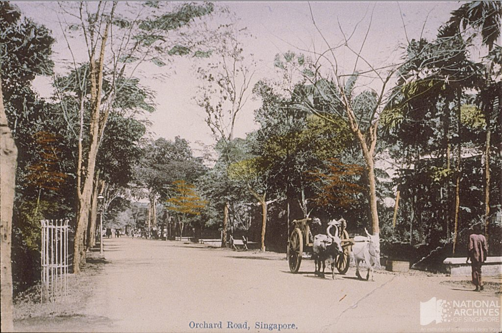
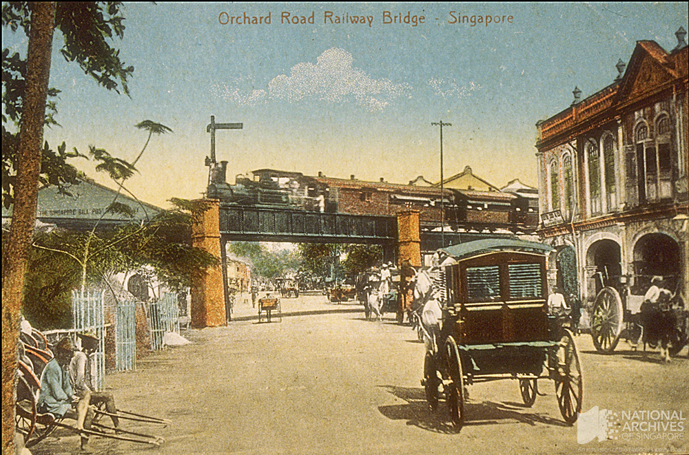
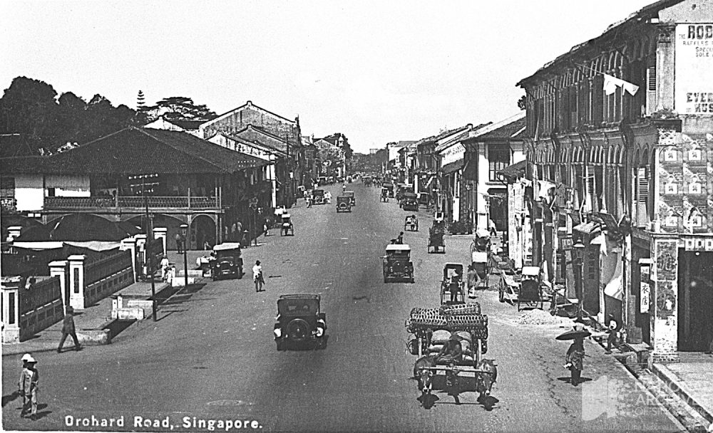
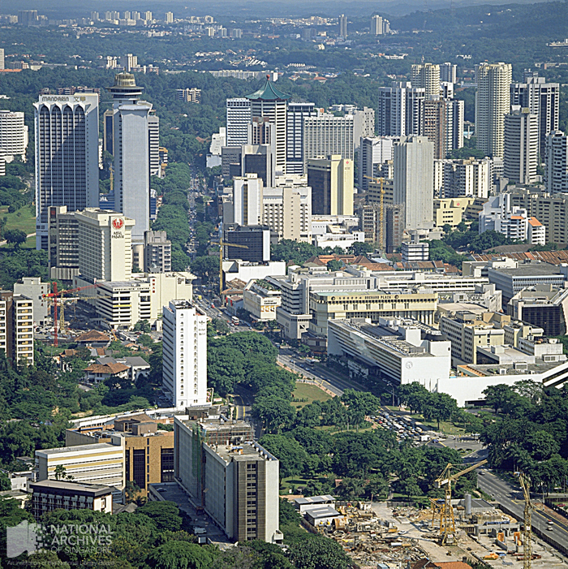
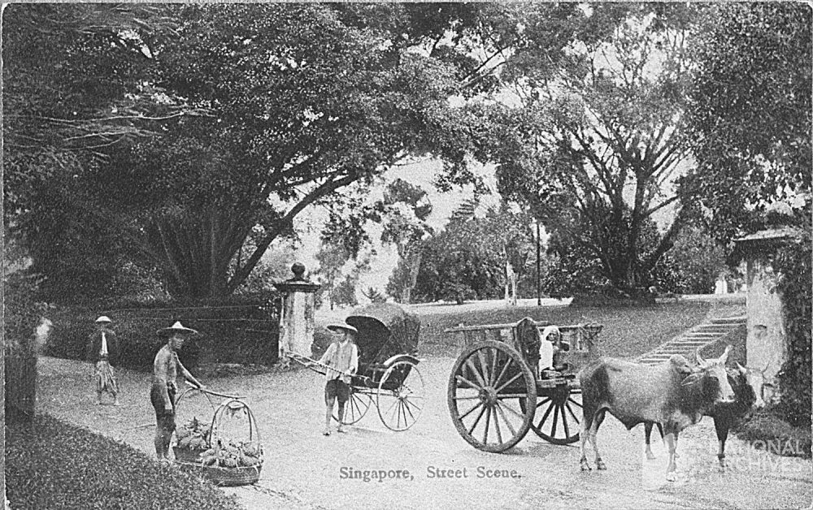
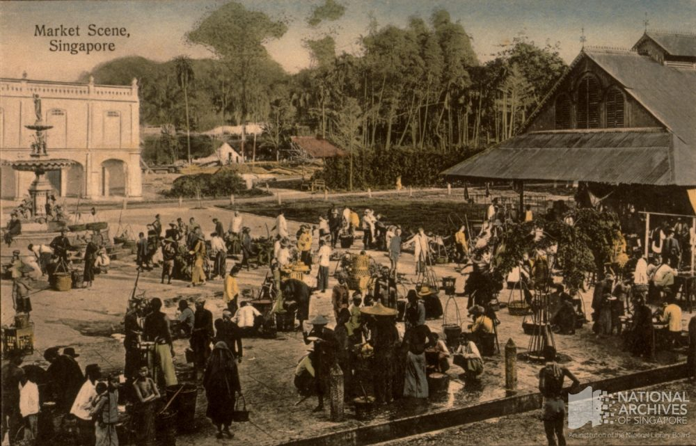
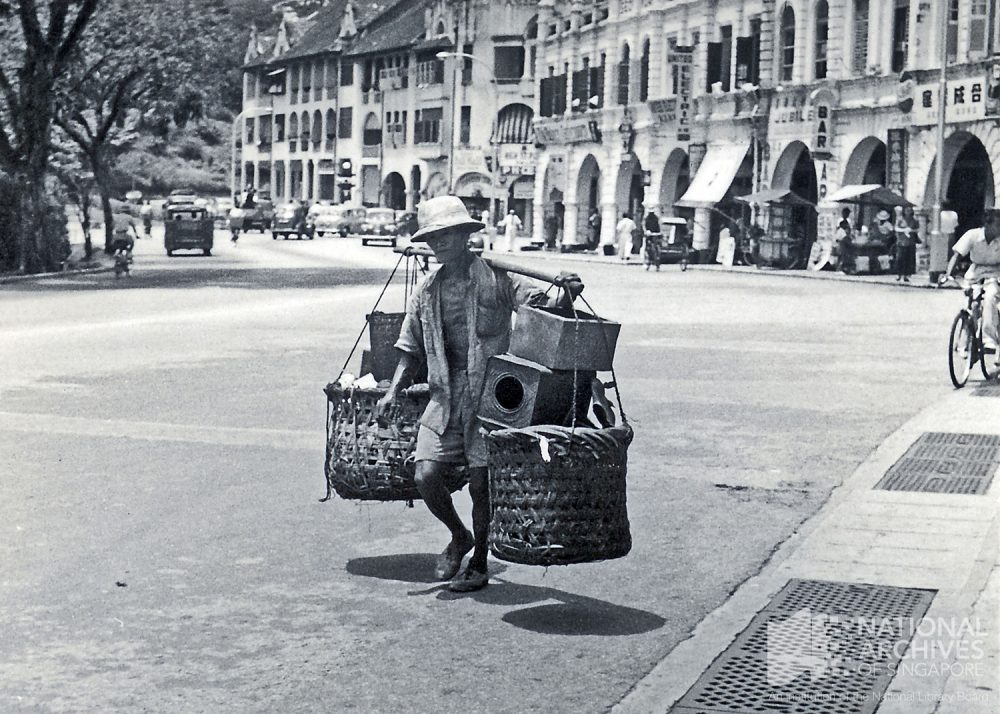
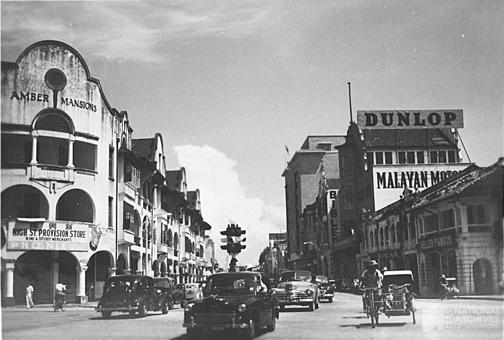
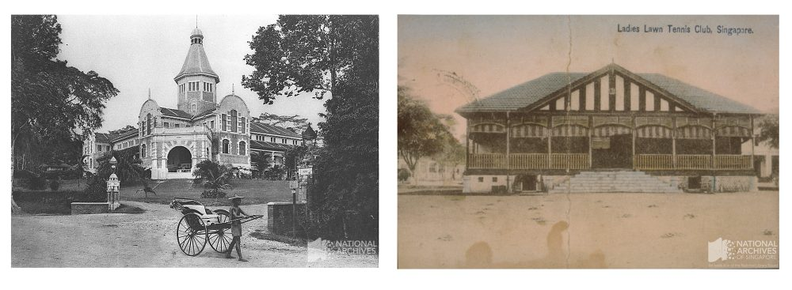
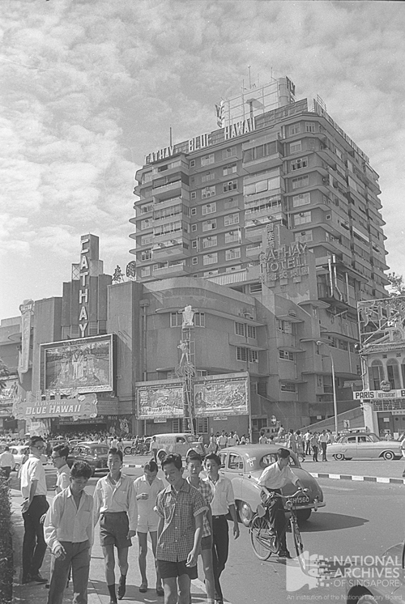

# I REMEMBER ORCHARD

Fiona Tan 3 years ago 7 min. read

***This was published as part of a series of posts based on irememberOrchard, an exhibition organised by the National Archives of Singapore at library@Orchard from 23 October 2014 to 26 April 2015.***

## I Remember Orchard

Hailed as New York’s Fifth Avenue, Paris’ Champs-Elysées and London’s Mayfair of the East, visitors go to Orchard Road for its megamalls, upscale fashion and luxury hotels. But to locals and residents, ‘Orchard’ means so much more!

This swanky shopping and entertainment paradise has its early beginnings in the 1800s, first as home to gambier and pepper plantations, and later as nutmeg and fruit orchards.

Orchard Road became fertile ground where myriad memories were born, where successive generations of Singapore residents witnessed the transformation of that sleepy plantation into the vibrant micropolis it is today.

irememberOrchard shares this rich legacy of personal recollections and stories behind this iconic street.

 

## From Spice Garden to City Scape

Beginning as a hilly suburban fringe sandwiched between the main commercial town area and Tanglin, Orchard Road is, now, arguably the most iconic street in Singapore.

The names of the streets allude to its past. Early settlers, attracted by the hilly area and excellent soil, first set foot here in the 1830s, and cultivated spices and a variety of fruits. That was how Orchard Road got its name, the land of fruit trees. The hills and roads flanking it were also named after these colonial settlers, such as Oxley Rise, Claymore Hill, and Cairnhill Road.

They remain an allusion to the past. In the 1850s, a rare plant disease decimated the plantations. From spices and fruit plantations, Orchard Road transformed into a residential area, with people setting up homes there because of its comfortable proximity to Commercial Square (now Raffles Place). Save for a few affluent locals, most of the early residents were the bourgeois Europeans.

Most of the structures survived the Japanese Occupation from 1942 to 1945. With the end of the Occupation and the expansion of commercial interests in the area, the landscape transformed once again. Permanent residences in the form of colonial bungalows gave way to temporary residences of hotels. Mega shopping malls now line the street. State-of-the-art entertainment outlets mushroomed. Today, Orchard Road is the doyen of shopping, eating and recreation.

The bustling urban metropolis it is today is almost unrecognisable from its previous 19th century incarnation as rural colonial plantations or its 20th century incarnation as a suburban residential and commercial street. All that remain to remind us of Orchard Road’s previous landscapes are the street names, and structures such as this Orchard Gateway link, which harkens to the railway bridge that possibly stood in its place.

Orchard Road was named after the fruit and nutmeg plantations which lined the dirt path trodden by horse-drawn carriages. Andrew Tan collection, courtesy of NAS Ref: [19980005107 – 0091](http://www.nas.gov.sg/archivesonline/photographs/record-details/34d65763-1162-11e3-83d5-0050568939ad)

By the 1910s, the settled population began building shophouses (Emerald Hill on the right). Railways were also introduced, and the trains which crossed Orchard Road by a bridge near Emerald Hill west of the Singapore Cold Storage. Courtesy of NAS Ref: [19980005117 – 0094](http://www.nas.gov.sg/archivesonline/photographs/record-details/362b7cba-1162-11e3-83d5-0050568939ad)

By the 1930s, motor cars had replaced carriages as the dominant form of transport. More shophouses continued to dotted the built landscape of Orchard Road.
Courtesy of NAS
Ref: 19980005492 – 0079

By the late 1980s, most low-rises had disappeared, replaced with tall hotels and malls. Orchard Road was now the undisputed shopping district of Singapore.
Ministry of Information and the Arts collection, courtesy of NAS
Ref: [19980000767 – 0090](http://www.nas.gov.sg/archivesonline/photographs/record-details/4581d651-1162-11e3-83d5-0050568939ad)

## 

## From Emporiums to Megamalls

Beneath the glitzy array of international brand-names which dot the commercial landscape of Orchard Road today, lies a layered and multi-faceted past of business activities.

Before the low-rises were replaced with skyscrapers, Orchard Road was home to a variety of small-scale businesses selling items ranging from sundry goods, tailor-made cheongsams, pianos and musical accessories, handcrafted furniture and antiques. Most of them were staples, serving the needs of residents.

The great transformation of Orchard Road’s marketplaces is evident from how grocery shopping has changed over the years. From itinerant roadside hawkers to those who congregated at the Orchard Road Market; from the galore of fresh produce at the Orchard Road Market to the array of frozen cuts and imported goods at Cold Storage or Fitzpatrick’s – grocery shopping along Orchard Road has surely changed a great deal.

While names such as Keller Piano and Ali Joo Fur have now been relegated to history, some others remain mainstays at Orchard Road, albeit in altered forms. Relinquishing its singular landmark status held from 1903 – 1980, Cold Storage is now a ubiquitous supermarket found in the basements of the many malls in Singapore today. One of the first departmental stores to move into Orchard Road in 1958, C. K. Tang, managed to shed its image as a budget curios store and morphed into one of Singapore’s most established local brands, Tangs. Though no longer a row of low-rise shophouses, home to Beethoven Music House and the nostalgic Heeren Beauty Salon, the name Heeren still remains.

From emporiums to mega malls, Orchard Road still is the place Singaporeans ‘go out’ to.

Itinerant street-side hawkers, such as this one selling fruits in front of the Teutonia Club (present day Goodwood Park Hotel), were a common sight in Orchard Road at the turn of the 20th century.
Courtesy of National Archives of Singapore
Ref: [19980005505 – 0030](http://www.nas.gov.sg/archivesonline/photographs/record-details/d389efa2-1161-11e3-83d5-0050568939ad)

Before the construction of brick façade of the Orchard Road Market (building on right) in 1909, hawkers also congregated in what was known as Koek’s Bazaar, at the junction of Orchard Road and Cuppage Road.
Courtesy of National Archives of Singapore
Ref: [19980006559 – 0119](http://www.nas.gov.sg/archivesonline/photographs/record-details/d421d453-1161-11e3-83d5-0050568939ad)

Itinerant street hawkers continued to dot the Orchard Road landscape in the 1950s.
George Tricker collection, courtesy of NAS
Ref: [20100000306 – 0039](http://www.nas.gov.sg/archivesonline/photographs/record-details/b3166c1e-1162-11e3-83d5-0050568939ad)

With more people settling in Orchard Road, functional buildings such as Amber Mansions (1922 – 1984), which had residences upstairs and shops downstairs, served both their tenants and shoppers from the vicinity.
Courtesy of National Archives of Singapore
Ref: [19980005592 – 0018](http://www.nas.gov.sg/archivesonline/photographs/record-details/b00b2c26-1161-11e3-83d5-0050568939ad)

 

## From Exclusive Entertainment to Recreation for All

With something for everyone, Orchard Road is the entertainment capital of Singapore.

It was not always so. Initially home to the affluent locals and influential European settlers, the recreational activities naturally catered to them. Exclusive clubs fulfilled to the social and recreational needs of their members. Close to the fringe of the forested areas in Tanglin, Orchard Road was not spared the occasional tiger sightings in the second half of the 1800s, which provided game for the European tiger hunters.

Movies, however, had potential to be a more inclusive form of entertainment. While the Pavilion (initially known as the Palladium) had screened mainly European movies since 1913, the opening of Cathay Cinema in 1939 offered alternative options to film-going audiences. With the addition of the Shaw Brothers who opened Lido Cinema in 1959 and the expansion of Cathay via its subsidiary, Orchard Cinema, in 1965, Orchard Road was the place of destination for movie-goers.

For those not satiated with onscreen action, Orchard Road was also the place to work out a sweat. From tea dances and bowling in the 1960s to discotheques and gymnasiums of the later period, Orchard Road offered places for people to expend their energy in a social setting at almost any time of the day. Those interested in nightlife were spoilt for options when a whole host of discotheques and nightspots emerged along Orchard Road in the late 1980s and 1990s, transforming the area into the street which does not sleep.

After working out, what better activity is there than eating. Before gourmet ice cream parlours such as Haagen Daz set foot in Orchard Road, milk bars such as the ever-popular Magnolia Milk Bar and Tong Lee Milk Bar & Confectionery began offering frozen treats to the public. Before international fast food chains began to penetrate the area, cafes such as Mont D’or, Bamboo House, Cosy Corner, Batik Inn and Fosters’ Steakhouse offered western culinary delights at affordable prices. While local food can be found in the food courts within shopping malls which line Orchard Road today, the outdoor eating places such as Glutton’s Square and the Koek Road hawker place still induce mouth-watering memories.

Similarly, for the complete shopping experience, whether a window shopper or discerning consumer, Orchard Road was the place to go. This shopping experience morphed over time, with one-stop lifestyle shopping malls becoming the default rather than exception. With the expansion of walkways creating a network of malls, Orchard Road’s reputation as the destination for leisure shopping was solidified.

Orchard Road’s entertainment facilities continue to evolve with time, maintaining its edge as the recreational centre of Singapore.

Colonial recreation was exclusive, as in the Ladies Lawn Tennis Club (left) and Teutonia Club (right), which previously offered exclusive recreation for the German community until it was turned into Goodwood Park Hotel in 1929.
Courtesy of National Archives of Singapore
Ref: [19980005112 – 0088 ](http://www.nas.gov.sg/archivesonline/photographs/record-details/d5465180-1161-11e3-83d5-0050568939ad)and [19980005032 – 0007](http://www.nas.gov.sg/archivesonline/photographs/record-details/adaffa4a-1161-11e3-83d5-0050568939ad)

Movies catered to all, and with the opening of Cathay in 1939 (pictured above in 1963) and Lido in 1959, Orchard Road was the popular haunt of film-goers.
Courtesy National Archives of Singapore
Ref: [19990003455 – 0074](http://www.nas.gov.sg/archivesonline/photographs/record-details/875143cf-1162-11e3-83d5-0050568939ad)