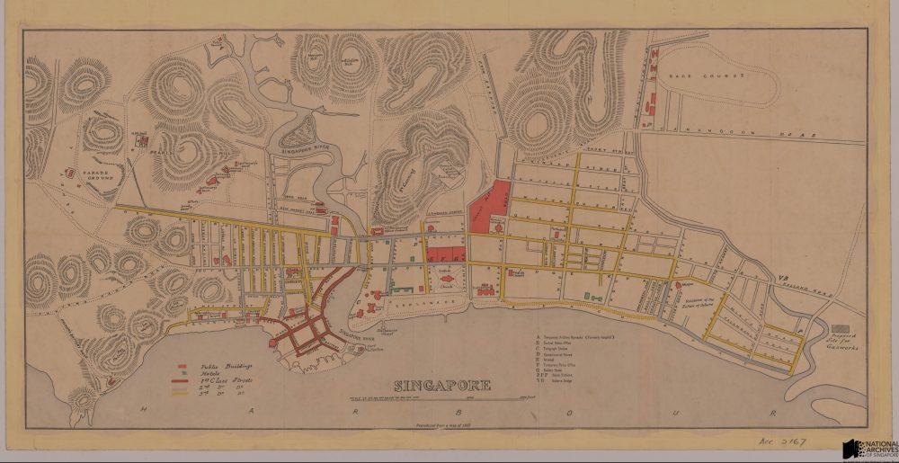

# Mapping Singapore: 1819–2014

Grace Ho 3 years ago 1 min. read

This fascinating essay detailing the history of mapping in Singapore between 1819 and 2014 was written by **Mr Mok Ly Yng**,  a Fellow of the Royal Geographical Society, one of Singapore’s leading map consultants and a regular visitor at the National Archives.The essay was published as a chapter in National Library Board’s “*Visualizing Space: Maps of Singapore and the Region*” (2015) publication. The full essay from the book  is shared here with the kind permission of Mr Mok and National Library Board:

[***Please click to read the a PDF copy of the essay***]:
[Visualising Space_Ch3. Mapping Singapore 1819 – 2014 by Mr Mok Ly Yng](http://www.nas.gov.sg/blogs/offtherecord/wp-content/uploads/2016/06/Visualising-Space_Ch3.-Mapping-Singapore-1819-2014-by-Mr-Mok-Ly-Yng.pdf)

A colored reproduction of a map of Singapore town, 1862. The map was drafted by Jules M. Moniot, who was the first Surveyor General of the Straits Settlements, appointed in 1855 (Source: URA, [Acc: SP006422](http://www.nas.gov.sg/archivesonline/maps_building_plans/record-details/fab8607c-115c-11e3-83d5-0050568939ad))