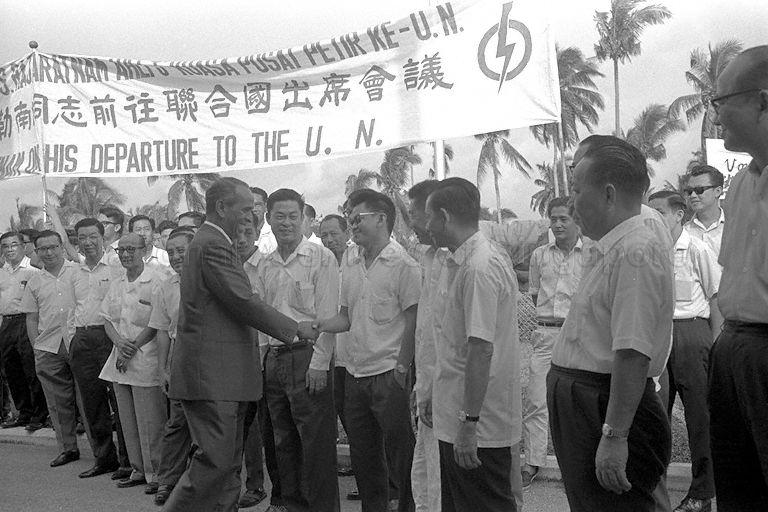

# A Foreign Policy Outlined: S Rajaratnam Speaks at Singapore’s Admission to the U.N.

Grace Ho 3 years ago 3 min. read

This legendary speech, given by S Rajaratnam to the United Nations (U.N.) General Assembly in 21 September 1965 on the occasion of Singapore’s admission into the U.N., was recently cited by Professor Kishore Mahbubani, Dean of the Lee Kuan Yew School of Public Policy, as a classic outlining the enduring principles of Singapore’s foreign policy. (“Can Singaporeans Read?”, The Straits Times, 14 Jan 2017)

Here is an excerpt from the speech:

> “For us [Singapore] the essentials of the [United Nations] Charter are the preservation of peace through collective security, promotion of economic development through mutual aid and the safeguarding of the inalienable right of every country to establish forms of government in accordance with the wishes of its own people…We stand by these ideals because we realize that the well-being, the security and integrity of my country can be assured only on the basis of these principles. It is practical self interest and not vague idealism which makes it necessary for my country to give loyal support to these essential elements in the U.N. Charter…
>
> World peace is a necessary condition for the political and economic survival of small countries, like Singapore. For one thing we want peace simply because we have not the capacity to make war on anybody. We are surrounded by bigger and more powerful neighbors…At the same time my country is well aware that it is situated in a region of the world which has traditionally been the battleground of big power conflicts. Singapore itself by virtue of its strategic location has attracted  the attention of nations who wished to dominate Southeast Asia. Under British colonialism Singapore was developed not only as the commercial hub of Southeast Asia but also as a military base for consolidating Western imperialism….
>
> It is obvious to us that given modern techniques of war, a [small] country…can never, on its own adequately secure its defense. Modern defense has to be collective in character especially for small nations…But until such time as the United Nations can really safeguard the security of small nations we shall have to find such temporary solutions as we can to assure our security…We want to live in peace with all our neighbors simply because we have a great deal to lose by being at war with them…We have no wish to interfere in the affairs of other countries or tell them how they should order their life…
>
> This is why my country has chosen the path of non-alignment. It simply means that we do not wish to be drawn into alliances dedicated to imposing our way of life on other countries. Friendship between two countries should not be conditional on the acceptance of common ideologies, common friends and common foes…However, Mr President, this does not mean that my country equates non-alignment with indifference to basic issues of right and wrong or that it will evade taking a stand on matters which it considers vital lest it displeases some member nations, including those with which it now has close ties. Non-alignment is only in regard to narrow power bloc interests and not in regard to the basic principles embodied in the U.N. Charter.
>
> My country…is aware that in the contemporary world a developing country must learn to cherish independence without denying the reality of interdependence of nations…In order to learn to live in peace with other countries there must be willing acceptance of the need for interdependence. The cultural and political development of my country has for decades been based on free intercourse and exchange of ideas drawn from many races, from many continents….The multi-racial and multi-cultural character of my country has made us somewhat skeptical of those who preach the superiority and exclusiveness of one culture and one race. In a multi-racial society one soon learns that no one people has a monopoly of wisdom and that one’s own culture is not without flaws. This not only breeds tolerance for different viewpoints but also a readiness to learn and borrow from the accumulated wisdom of other people….We shall therefore bring to the world of the United Nations the attitude and approaches of a multi-racial nation aware that independence and interdependence of peoples and nations are not incompatible goals to pursue.”

Read the [full speech here](http://www.nas.gov.sg/archivesonline/data/pdfdoc/PressR19650921.pdf)
 Other valuable speeches can be found at the National Archives of Singapore’s [Speeches & Press Releases Database](http://www.nas.gov.sg/archivesonline/speeches/).

 

S Rajaratnam greets supporters before leaving for the United Nations Conference, 16 Sept 1965