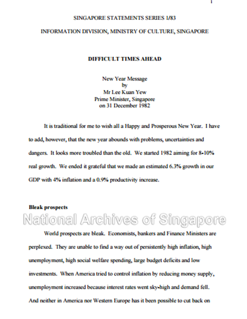

# PM’s New Year Message, 1982

Grace Ho 3 years ago1 min. read

      

**The first page of PM Lee’s 1982 New Year’s Day speech**

On the eve of New Year’s Day, 1982, Prime Minister Lee Kuan Yew gave this solemn speech to the nation. Singapore  faced serious challenges arising from a turbulent global economy which was in a major recession. In this speech titled “Difficult Times Ahead” PM Lee minced no words despite the New Year festivities and sought to rally the nation in a joint effect to tackle the problems head on. Many of the challenges he cites echo with those emerging today.

Read the full speech at the National Archives Government Speeches Database:

[ http://www.nas.gov.sg/archivesonline/data/pdfdoc/lky19830101.pdf](http://www.nas.gov.sg/archivesonline/data/pdfdoc/lky19830101.pdf)