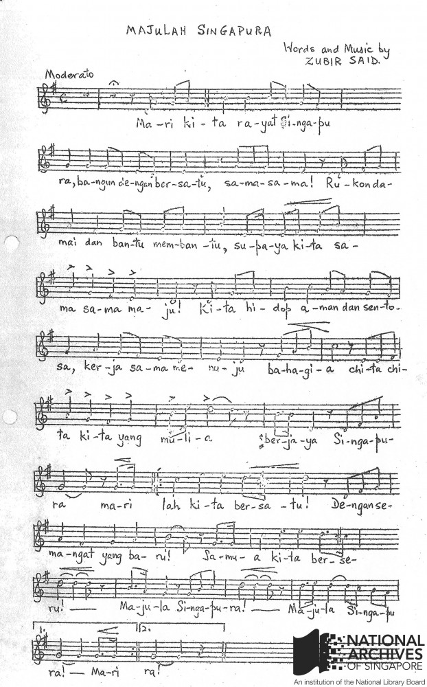

# Majulah Singapura – Composing a National Anthem

Fiona Tan 3 years ago 3 min. read

Score of City Council Song as presented to the Committee members involved in the Opening Performance of the Victoria Theatre on 6 September 1958
 Opening Performance: New Victoria Theatre. Ref: [7033/3](http://www.nas.gov.sg/archivesonline/government_records/record-details/0ec89ec7-115a-11e3-83d5-0050568939ad). Microfilm No.: PUB386

*Majulah Singapura*, meaning “Onward Singapore” was originally composed as a song for Singapore’s City Council in 1958 to commemorate the reopening of Victoria Theatre after a major restoration. We trace the origins of Singapore’s national anthem in this article.

Zubir Said, the composer of Singapore’s national anthem, was a prolific composer of film scores and well-known songs such as *Semogia Bahagia* (“May You Achieve Happiness”) sung by primary school children on Children’s Day. *Ministry of Information and the Arts collection, courtesy of NAS. Ref.: 19980005388 – 0076*

In his oral history interview in 1984, Encik Zubir Said explained how he composed *Majulah Singapura*: “[T]he difficulty is in such a short melody, I have to put in all the words …it must be very simple, understandable for all the races in Singapore… I consult also an author in Malay language so that I can do it in proper Malay language but not too deep and not too difficult”.[[1\]](http://www.nas.gov.sg/blogs/offtherecord/majulah-singapura/#_ftn1)

In 1958, Mr Ong Pang Boon, then Deputy Mayor of the City Council of Singapore wanted a theme song to play at the Council’s official events. He approached Zubir Said, then music composer for Cathay-Keris Film Company to compose it for the opening of the refurbished Victoria Theatre. The inaugural public performance of *Majulah Singapura* was performed by the Singapore Chamber Ensemble, conducted by Paul Abisheganaden.

### **From City Council Song to State Anthem**

When Singapore attained self-governing status in 1959, the search for a state anthem to replace the Colony’s anthem of ‘God Save the Queen’ began.

According to Dr Toh Chin Chye, then Deputy Prime Minister, the anthem should be in Malay, for it was

> “the indigenous language of the region, as English is not native to this part of the world… [the] Malay version of the national anthem would appeal to all races… it can be easily understood. And at the same time can be easily remembered…it must be brief, to the point; … and can be sung.”[[2\]](http://www.nas.gov.sg/blogs/offtherecord/majulah-singapura/#_ftn3)

Dr Toh found that they needed to look no further than Zubir Said’s existing *Majulah Singapura*.

However, he was concerned that the song was too long and requested for an abridged version. Zubir Said subsequently made changes to simplify the lyrics, removing eight bars in the verse, and tweaked the melody from the original City Council version into the version that became our state anthem. The state anthem, was inaugurated on 3 December 1959, together with the other state symbols of the new self-governing state of Singapore.

The recording of the 1959 State Anthem, as performed by the Band of the Singapore Military Forces and the Singapore Ministry of Education Choir, is available to listen at NAS’ ArchivesOnline portal [here](http://www.nas.gov.sg/archivesonline/audiovisual_records/record-details/47f36a7f-1164-11e3-83d5-0050568939ad).

### **A song for the nation**

When Singapore became an independent nation in 1965, the state anthem and state symbols became the new sovereign nation’s national anthem and national symbols.

*Majulah Singapura*, as it is sung today, has been rearranged by Cultural Medallion winner, Phoon Yew Tien, who introduced a grander and more inspiring arrangement and lowered the key to make the anthem more accessible and easier to sing.[[3\]](http://www.nas.gov.sg/blogs/offtherecord/majulah-singapura/#_ftn4)

 

------

[[1\]](http://www.nas.gov.sg/blogs/offtherecord/majulah-singapura/#_ftnref1) Oral History Interview with Zubir Said, by Liana Tan, 13 Sep 1984, National Archives of Singapore, Accession No. [000293/14](http://www.nas.gov.sg/archivesonline/oral_history_interviews/record-details/e3efd43b-115d-11e3-83d5-0050568939ad)

[[2\]](http://www.nas.gov.sg/blogs/offtherecord/majulah-singapura/#_ftnref3) Oral History Interview with Dr Toh Chin Chye, by Daniel Chew, 23 Aug 1989, National Archives of Singapore, Accession No. [001063/1](http://www.nas.gov.sg/archivesonline/oral_history_interviews/interview/001063)

[[3\]](http://www.nas.gov.sg/blogs/offtherecord/majulah-singapura/#_ftnref4) Tan Shzr Eee, [“It’s easier to sing now”](http://eresources.nlb.gov.sg/newspapers/Digitised/Article/straitstimes20010122-1.2.60.9.1.aspx), *The Straits Times*, 22 January 2001, p. L6