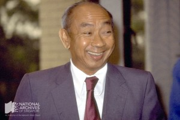

# Dr Goh Keng Swee’s Insights on Golfing

 Grace Ho 3 years ago 1 min. read

*A portrait of Dr Goh taken in 1984, when he was Singapore’s First Deputy Prime Minister and Minister for Education.* *MITA collection, courtesy of NAS. Ref: 19980006752 – 0098* 

In this extract from a humorous & insightful speech he gave at  the opening of the Tanah Merah Golf Club in 1984, Dr Goh Keng Swee, our  former Deputy Prime Minister and first cabinet member, shared with  guests why, in his view, many take to the game of golf:

> “The great issue I want to discuss is – ‘Why do we play  golf’?…A common reason given by a busy executive or harassed  professional is that it refreshes the mind and makes him more productive  when he returns to work. This reason can be rejected out of hand.  Better results can be achieved with less cost in time and money by, for  instance, transcendental meditation or yoga exercise.
>
> Then there is the health reason. Again this is easy to demolish…Why  not walk briskly for one-and-a-half hours? Better still, why not swim 20  lengths..?[It must be that we simply enjoy the game] but this is  manifestly untrue…how often as we go through the fairways, have we heard  cries of anguish from golfers, in a nearby green who had just missed a  two-foot putt? How often have we ourselves sliced a ball into ponds?…
>
> If rational reasons cannot account for why we play golf , we must  seek irrational explanations…I must confess that I wish my colleague Mr  Rajaratnam had taken to the game. He has much greater understanding of  abnormal psychology that I have and a keener sense of insight into why  people behave in irrational ways…”

You can read the rest of the speech online at the National Archive’s database: <http://www.nas.gov.sg/archivesonline/data/pdfdoc/GKS19840317.pdf>

​                                       Dr Goh taking a swing shot at Bukit Club, Sime Road, 1965. 
*Ministry of Information and the Arts collection, courtesy of NAS.* Ref: [19980000605 – 0030](http://www.nas.gov.sg/archivesonline/photographs/record-details/c3336aed-1161-11e3-83d5-0050568939ad)

 

