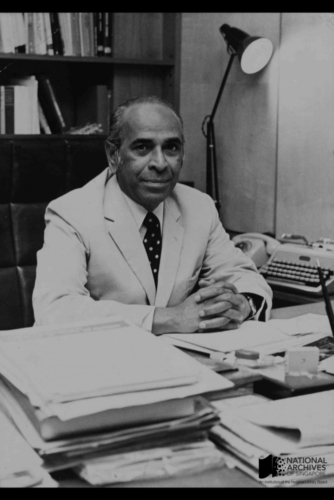
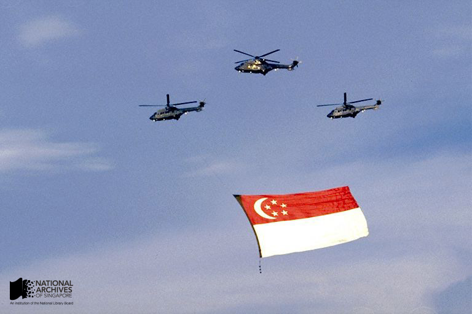

# S. Rajaratnam on Singapore’s State Symbols

Grace Ho 3 years ago 4 min. read

*S Rajaratnam, Minister for Culture, in his office, 1950s*

* Source: National Archives of Singapore, Ref: 20080000050-0094*

One of the Singapore government’s first aims after attaining full internal self-government from the British  in 1959, was to cultivate a common identity. Our state symbols which were unveiled in 1959 became an important way to rally Singaporeans from different backgrounds and communities to a common purpose.

In 1959, a new Ministry of Culture, headed by Mr S. Rajaratnam, was established with responsibility for instilling in Singaporeans of different races, creeds and classes ‘the will to be a nation’, striving towards creating a Malayan nation through a merger between the Federation of Malaya and Singapore.[[1\]](http://www.nas.gov.sg/blogs/offtherecord/singapores-state-symbols-their-meaning/#_ftn1)

Although Singapore became a republic only in 1965, our state symbols – the flag, anthem and crest – were first unveiled in 1959 when Singapore obtained self-government from Britain. Presenting the motion to establish state symbols to the Legislative Assembly on 11 November 1959, Minister for Culture Mr S. Rajaratnam explained their significance:

> *National flags, crests and anthems express symbolically the hopes and ideals of a people. The symbols by themselves may be meaningless … We respect not the flag as such or the State arms or the anthem but the sentiments and ideas they represent.   The possession of a national flag, anthem and crest is, for a people, symbols of self-respect. Through these a people acquire identity and a personality of their own.*  
>
> *The symbols we have had so far were symbols that emphasised our subjection to the will of others. They were symbols of dominance, of authority imposed from the outside. Now that Singapore is a self-governing State, it is right and proper that it should have its own symbols of authority and loyalty. Only through these new symbols can we express the spirit that today moves our people.*  
>
> *Therefore, in designing the new symbols, the Government has worked in close co-operation with Opposition Parties because we want these symbols to express the sentiments and aspirations, not of any particular group, Party or section, but of the people of Singapore as a whole.**[2]***

The proposed state symbols were unanimously accepted by the Legislative Council. At the same Legislative Assembly session on 11 November 1959, Minister Rajaratnam  explained in detail the symbolism of Singapore’s state symbols. We reproduce his discussion at length here:

>  *“Of course, Mr Speaker, symbols are a very tricky business. They can mean whatever a person wants them to mean … It is in order to prevent any too free a translation of the new symbols that we have taken the precaution of providing, as it were, an authorised translation of the symbols which our flag and State arms carry.*
>
> **The colour red** *stands for universal brotherhood and equality of man. Whatever the colour of our skin, the shape of our nose and eyes, the blood that gives us life is of one colour – even among those who claim to have blue blood.* 
>
> **The colour white** *signifies purity and virtue. So the two colours combined signify that we hope to achieve brotherhood and equality through purity and virtue.* 
>
> **The crescent moon** *signifies a country eternally young. This is expressive of one of the essential qualities of our people, for not only are our people physically young but they are also young in spirit and outlook.  This refutes the traditional picture which depicts Asian countries … as countries burdened with ancient and meaningless traditions.  This picture is not true of Asia today. It is a youthful, restless Asia. The new Singapore, like the new Asia, therefore, finds its inspirations in what it hopes to do in the future rather than what it has done in the past. Only the old, grown weak and complacent, hark nostalgically back to the past. It is only the youthful who are more conscious of the future waiting to unfold before them.* 
>
> *Sir, **the five stars** represent the ideals on which the new State of Singapore is founded – democracy, peace, progress, justice and equality. Those who would destroy these are our enemies. Those who would repudiate them are false prophets.* 
>
> *These symbols are also incorporated in the State arms, which also has a lion and a tiger. **The lion** represents Singapore and **the tiger** our links with the people of the Federation.* 
>
> *As for **the*** **state national anthem** *“Majulah Singapura”, it has already been tacitly accepted by the people as their song. It has been sung and played as Singapore’s anthem unofficially on many occasions.* 
>
> *Mr Speaker, Sir … The flag, the State arms and the anthem are new symbols of national pride. They are expressive of the new spirit of self-reliance and dedication which inspires our people today.* 
>
>  

*The flypast of Singapore’s State Flag during National Day Parade 1990 held at the Padang. The 1990 parade celebrated Singapore’s Silver Jubilee or 25th anniversary as an independent Republic. Source: Ministry of Information and the Arts Ref: 19980006514-0012*

 

*Singapore’s State Crest. Source: Prime Minister’s Office*

 

------

 

[[1\]](http://www.nas.gov.sg/blogs/offtherecord/singapores-state-symbols-their-meaning/#_ftnref1) *State of Singapore Annual Report*, 1959, p.12-13

[[2\]](http://www.nas.gov.sg/blogs/offtherecord/singapores-state-symbols-their-meaning/#_ftnref2) Address by Minister for Culture S Rajaratnam, “State Arms & Flag & State National Anthem”, Singapore Parliament Reports, 11 November 1959