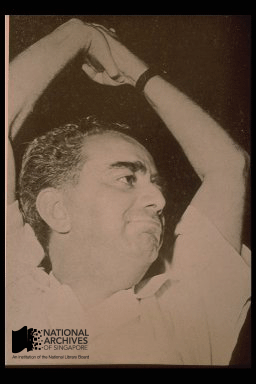
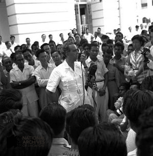
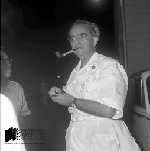

# David Marshall: Singapore’s First Chief Minister

Grace Ho 4 years ago 12 min. read

*A jubilant David Marshall, following his election as Chief Minister in 1955. Source: Singapore Press Holdings, Courtesy of National Archives of Singapore Ref: 19980002917 – 0096*

David Marshall (1908-1995), the celebrated Singaporean nationalist, politician, lawyer and diplomat,  was a key political leader in the history of post-war Singapore.  Born on the 12th of March 1908 into a Sephardic Jew family, Marshall rose to prominence in the late 1940s as a brilliant criminal lawyer whose eloquence and extraordinary legal understanding won him numerous court cases.

Marshall subsequently entered politics at the head of the Labor Front party and became Singapore’s first elected Chief Minister between 1955 and 1956. As Chief Minister, Marshall was a fearless opponent of British colonialism and led the early political struggles for Singapore independence. A socialist by inclination, he helped found the Singapore Worker’s Party (WP) in 1957 after he left the Labor Front and remained prominent in public affairs. He retired from politics in 1963, after his electoral defeat at Anson and returned to practicing law. In 1978, he was appointed Singapore’s ambassador to France, a post he held with distinction, which was later expanded to include the embassies of Portugal, Spain and Switzerland. He retired as Ambassador in 1993 and passed away on the 12 December 1995. David Marshall was, in short, a vital figure in Singapore’s post-war history.

Besides his achievements on the public stage, Marshall left a lasting impression on many prominent people who knew him privately. Professor Tommy Koh, Singapore’s Ambassador-at-large, studied under Marshall as a young lawyer and remembered him as “a gifted teacher… [who] brought both learning and enthusiasm to his classes… a truly an unforgettable person”.1 Professor Koh Kheng Lian, Emeritus Professor of Law at the National University of Singapore, recalled Marshall as “a man of great humanity and compassion, a man who lived life to the fullest, a man dedicated to his profession, his country and his people”.2 Marshall was regarded as by his admirers an exemplary person, both professionally and ethically.

In 1984, the National Archives of Singapore conducted an in-depth oral history interview with David Marshall containing valuable insight into his ethical beliefs and how they were formed. The rest of this article draws on this interview.

Reflecting on his youth in the interview, Marshall pointed to three experiences that were essential to shaping his ethical convictions – the racial discrimination he bore under British colonialism, his reading  of the Christian Bible, and his experience as a prisoner-of-war during the Japanese occupation.

## Racial Discrimination and Anti-colonialism

*David Marshall speaking to a crowd of attentive supporters at Empress Place in 1955. Marshall was famed for his extraordinary oratorical skills. Source: Singapore Press Holdings, Courtesy of National Archives of Singapore Ref: PCD0132 – 006*

When asked what drove him to join politics, Marshall replied, “Politics was an accident. I was thrust into politics by a sense of outrage, a deep sense of anger”.3 Marshall’s outrage was directed against the systematic racism he endured as an Asian Jew under British colonial rule. Colonialism was justified by the claim that white men were biologically and culturally superior to men of all other races. “I used to resent little pin-pricks [which] were, I thought… unfair about you know [the] ‘white man, brown man’ relationship,” he said. “Like you call me ‘Jowdy Jew, brush my shoe’, and next thing I know is I hit you on the nose… I wanted to break the sonic barrier against Asians and especially against Jews.”4 Marshall’s uncompromising stance against British colonialism correlated to his contempt for their racism.

Marshall’s revulsion at what he termed “the leprous concept of racial superiority”5 was reinforced by his study of the Christian Bible, which he read thrice as a youth. Although he was a Jew proud of his Jewish origins, Marshall was inspired by the stories of heroism and human community found in the Bible:

> *“Frankly, looking back, I consider that [reading the Bible] was perhaps the most formative aspect of my character. Because the King James’ version has an organ sonority of language which sank into me at a very impressionable age. And also the wonderful stories of [a] heroic global view of life and passionate dedication to human rights that you find in the Bible. It appealed to me very much.”*6

Of particular influence on the young Marshall were Biblical tales of men who struggled for justice against stronger adversaries, stories which reflected his own later struggles against British colonialism.

## The Japanese Occupation

In his interview, Marshall singled out his experience as a prisoner-of-war during the Japanese occupation as the decisive event that shaped his adult worldview. Marshall had volunteered as a British soldier in Singapore following the German invasion of Czechoslovakia in 1938, and was made a prisoner-of-war following the crushing defeat of the British military in Singapore and Malaya by the Japanese in 1941.7 Marshall recalled the terrible years that would reshape his thinking:

> *“[The Japanese Occupation] taught me humility… Three and a half years as a prisoner taught me humility… I realized [as a Japanese prisoner-of-war] that man is capable of cold-hearted cruelty. I can be angry, and I have no doubt I can be cruel for five, ten minutes. But the Japanese cruelty was cold-blooded, permanent and eternal. Man’s inhumanity to man in fact, in real life, made its presence really known to me when I became a prisoner, and saw it in action. Of course, I have known cruelty before. But wide-spread, long-term, cold-blooded, permanent cruelty, I’ve never experienced before, not even from the British Imperialists no matter how arrogant they were. That was a major shock, the feeling that here were human beings who were not on the same wavelength as me at all, who were not even human from my point of view.”8*

The war experience was to solidify Marshall’s political faith in socialism. It was during this period that Marshall’s belief in human community, his distaste for class-distinction and his faith in the common man’s capacity for goodness were more fully developed:

> *“The cohesion of disparate prisoners, from different parts of the United Kingdom, from different parts of Europe… was something touching.. There were some egoists who cracked under pressure. There were some who even committed suicide because they couldn’t take any more. But by and large, there was an unspoken… comradeship… It kept the humanity alive within me, and made me perhaps recognize more clearly that great qualities… qualities that I appreciated in human beings, were not necessarily confined to the wealthy or educated.. That the rough, semi-educated laborer, odd-jobs man had human qualities which were good and which felt good and which were of value to its fellow prisoners. Where, some of the educated and intelligent cracked up or went about whining…”9*

The war experience would also disenchant Marshall to the value of status symbols as accurate measures of human worth:

> *“Perhaps I learnt most of all the frailty of human beings, the absurdities of the status symbols of carrying a Captain’s star or a Major’s crown and turning out to be a long streak of piss. Whereas the cook who was the Lance-Corporal turned out to be a really worthwhile human being.”10*

Marshall’s brand of Socialism, which he briefly explained in the interview, was in many ways a reflection of the lessons he learnt as a Japanese prisoner:

> *“My… understanding of socialism, my own approach was an effort to create the foundations for the opportunity of all our people to attain the conditions of living compatible with human dignity. Why did I call it socialist? Because it moved away from the concept of wealth to the concept of human qualities and respect for the human individual, and not respect for his bank account.”11*

## Marshall as Loyal Critic of Singapore Society

*David Marshall taking a rest with his trademark smoking pipe outside the Singapore Legislative Assembly after a parliamentary session, 1961. Source: Singapore Press Holdings, Courtesy of National Archives of Singapore Ref: PCD0079 – 045*

Marshall’s critique of materialism and status anxiety, and his concern for human dignity and community which he considered to be universal ends, expressed themselves in several critical observations he made of Singapore society. In the interview, Marshall commented that there was a tendency in Singapore’s culture to devalue goods of utmost importance that could not be measured in utilitarian terms – like wisdom and culture. And conversely an inclination to overvalue goods that were quantifiable – like money and intelligence. This he thought encouraged a culture of selfish egotism which undermined national unity and bonds of trust between Singaporeans:

> *“I think it’s very important to make [the] distinction today [between intelligence and wisdom] when there is so much emphasis on the genetic inheritance of intelligence. I think it’s very dangerous to over-emphasize the value of intelligence… as a prisoner-of-war… I learnt a deep respect for the qualities of the humble. The innate wisdom, the loyalty, the decency which, from the point of view of intelligence, is possibly an aberration. Because, intelligence requires, seems to compel, an egoistic approach, an egocentric approach to life. And if you really look at that in the long term, egocentrism is very, very limited and very destructive in the long term. And we are, in my view, creating an ethos of egocentrism in Singapore and the concept that intelligence is the be all and end all of all virtues. Well, that’s totally wrong.*
>
> *The wisdom of centuries which are stored in the treasure house of religion and ancient philosophies of need for an understanding of the unity of humanity, cooperation with fellow beings. You know the lovely remark of Dostoevsky ‘God and the devil can live alone, but man needs his fellow man’… that we all have a duty to contribute to the common good. But we haven’t got any of that in Singapore. In Singapore you scramble for what you can achieve for yourself. And status symbols of Mercedes Benz, swimming pool, a string of women and horses and that is, those are the symbols of success. I think we are going through a dangerous phase.”12*

Marshall also expressed reservations about Singapore’s work culture:

> *“We [in Singapore] have the constant drum beat now for productivity. My criticism is that this is a little lop-sided. We work to live, we don’t live to work. And the [Singapore] approach is one that is [of] a purely productive animal… I think that [this] is now going beyond the bounds of reason… this constant driving and nagging about productivity and failing to recognize that people have a right to live as well as a need to work… we’re not seen to have any cultural existence. We’re not seen to be able to contribute to the finer graces of living. But we are viewed as economic animals with the same awe as we view robots… It’s a question of recognizing that work is an integral part of individual identity and essential for true enjoyment of living. But concurrently, to recognize that work is not the only element in living. That there are other elements to life. The joy of children. The joy of marriage. The pleasure of travel. The pleasure of study… Life is such a miracle, it is multi-faceted [in] the opportunities it gives for the uplift of the human spirit.*”13

But Marshall was not a blind critic, raging at the world. He held himself to standards he held others, recognized his own limitations, and paid tribute where it was due – even to his opponents. Commenting on his own leadership ability, he said:

> *“I don’t think I had leadership qualities.. for me a leader is a great administrator, organizer… I’ve been a vivid personality. But that doesn’t mean I have leadership quality. I had the fire of anger, the excitement of great ideas, emotional approach almost uninhibited, but not the intellectual organizational approach of great leaders. That I didn’t have, and don’t… frankly, I don’t think I would have been equal to the ramifications of running the country. Watching now from outside, the activities of the [Singapore government], all in all they deserve the highest praise: with no background, no real aid from outside to guide their infant steps, to have achieved so much stability, international respect and economic growth.”*14

Marshall also paid tribute to the personal qualities of Dr Goh Keng Swee, a leading member of his long time political adversary, the People’s Action Party:

> *“Keng Swee was a pragmatic top-notch civil servant, a genius as an administrator, a man of ‘sea-green’ integrity, a man of personal charm and warmth if you got close to him, very humble. Genuinely, no showmanship about it, genuinely humble… he speaks to the high as well as to the low… with the same approach. He had an extraordinary… total freedom from arrogance, from superiority, from any inferiority; he just was… a natural human being. And to me, a perfect human being… it’s so much part of the air he breathes… to serve his country and his fellow human beings. And never a lie from him, never any malice from him. Even when I was the black plague to the PAP…”*15

Marshall was a vocal critic of Singapore yet he remained a loyal Singaporean. His opinions were controversial, contestable and perhaps wrong-headed at times, but few people doubted his sincerity, his courage and personal integrity. He was always ready to stand up for what he thought was right, and it is the memory of his nobility that his friends and admirers celebrate on his birthday centenary.

*David Marshall in his later years. He possessed remarkable energy throughout his life, practicing law and representing Singapore as Ambassador to France, Portugal, Switzerland and Spain well into his mid-eighties. Source: Singapore Press Holdings, Courtesy of National Archives of Singapore Ref:20060000508 – 0073*

**Note**

To view the full transcript of this oral history interview and listen to some selected segments within it, visit our online website[http://www.nas.gov.sg/archivesonline/](https://href.li/?http://www.nas.gov.sg/archivesonline/) and key in “David Marshall”.

1     Professor Tommy Koh, “*The Rich Legacy of Singapore’s First Nationalist*“, Keynote address at the Symposium in Commemoration of the 100th Birthday of Mr David Marshall, 12 March 2008

2     Professor Koh Kheng Lian, “*A Man of Great Humanity and Compassion*“, The Straits Times, 13 March 2008

3     David Saul Marshall, Oral History Interview, Acc 000156, Reel 2

4     David Saul Marshall, Oral History Interview, Acc 000156, Reel 2

5     David Saul Marshall, Oral History Interview, Acc 000156, Reel 3

6     David Saul Marshall, Oral History Interview, Acc 000156, Reel 1

7     David Saul Marshall, Oral History Interview, Acc 000156, Reel 2 and 3

8     David Saul Marshall, Oral History Interview, Acc 000156, Reel 3

9     David Saul Marshall, Oral History Interview, Acc 000156, Reel 3

10   David Saul Marshall, Oral History Interview, Acc 000156, Reel 3

11    David Saul Marshall, Oral History Interview, Acc 000156, Reel 4

12    David Saul Marshall, Oral History Interview, Acc 000156, Reel 19

13    David Saul Marshall, Oral History Interview, Acc 000156, Reel 19

14    David Saul Marshall, Oral History Interview, Acc 000156, Reel 2

15    David Saul Marshall, Oral History Interview, Acc 000156, Reel 4